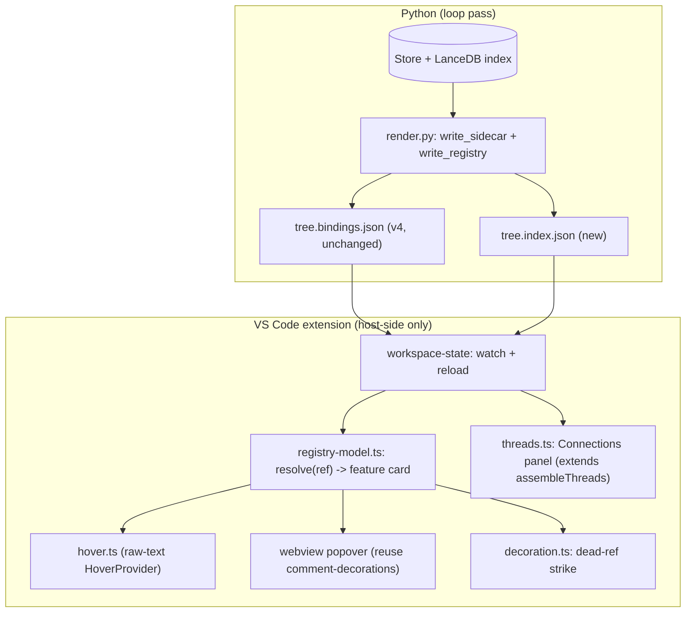
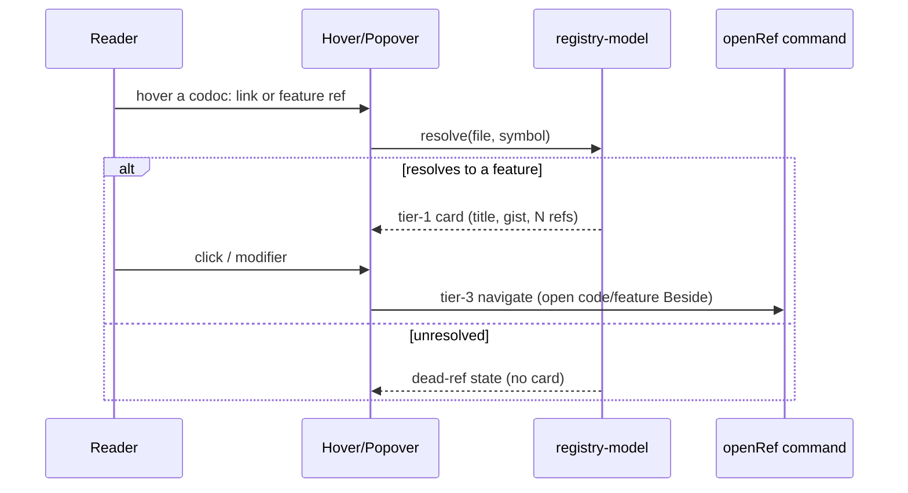

# feat: codoc cross-reference registry, hover-preview, and Connections panel

## Summary

Build the documentation *navigation substrate* for codoc as three dependency-ordered pieces: a machine-readable cross-reference **registry** sidecar that resolves and validates every inline `codoc:` reference; a **two-tier hover-preview** (card → navigate) that reads the registry host-side so a reader stops navigating back and forth; and one consolidated **Connections** view (Depends-on / Used-by / Bound code / Consult) that extends the dependency threads line already shipped by the 2026-06-09 UX redesign. Every new artifact is derived sidecar/decoration state — `tree.codoc` and `tree.doc.json` are untouched.

---

## Problem Frame

codoc renders an intent tree whose descriptions cite code inline as `[label](codoc:file#symbol)`, but those links can rot silently when code moves, there is no way to preview a linked section without opening it (the reader navigates away and loses their place), and the cross-feature relationship data the system already computes (`feature_edges`) is surfaced only as opacity-dimming and a partial inline threads line. Mature documentation systems solve this with a cross-reference registry (Sphinx `objects.inv`), progressive-disclosure hovers (Sourcegraph), and backlink panels (rustdoc "Implementors"). This plan ports those patterns onto codoc's existing derived-state architecture. It is the keystone spine from the ideation doc (idea #2 → #1 → #3): the registry unlocks both the hover and the validation, so it is built first.

---

## Requirements

### Registry and validation
- R1. Each loop pass emits a machine-readable cross-reference registry as derived state: every feature (id, title, parent) and every binding (file, symbol, owning feature). It is never written into `tree.codoc` text.
- R2. The registry resolves every inline `codoc:` reference found in feature descriptions to a target and records each as resolved or unresolved.
- R3. Unresolved (dead) `codoc:` links are surfaced to the IDE and decorated distinctly, honoring the `color = direction` / `shape = kind` convention (no new rainbow hue).

### Hover-preview
- R4. Hovering a `codoc:` link or a feature reference shows a tier-1 preview card — owning feature title, one-line gist, binding count — assembled host-side from on-disk sidecar/registry data, with no host→Python call.
- R5. The card escalates to navigation (open the code or feature) through the existing `codoc.openRef` path; a dead ref renders an explicit unresolved state instead of a card.
- R6. Hover works in the `Codoc Tree` webview (the default, primary reading surface) and in the raw-text `tree.codoc` editor.

### Connections
- R7. Each feature exposes one consolidated Connections view — Depends-on, Used-by (inverse edges), Bound code, and Consult (external links) — extending the shipped threads line, ranked by coupling weight and collapsible when large.

### Invariants
- R8. All new artifacts are derived sidecar/decoration state. The `tree.codoc` render→parse→diff round-trip stays a no-op and `renderTreeFromDoc` stays byte-identical to Python `render_tree`.

---

## Key Technical Decisions

- KTD1 — Registry as a new sibling sidecar (resolves the ideation's new-sidecar-vs-extend-bindings call-out). Ship the registry as a dedicated `tree.index.json` written next to `tree.bindings.json`, not folded into the bindings sidecar. The registry has a distinct cross-reference-index lifecycle and may grow (all refs, slugs, later line ranges); keeping it separate leaves the parity-tested `tree.bindings.json` schema and its TS model untouched. Cost is one extra watched glob, which research confirmed is near-zero. Write it via `codoc/loop/fsio.py:atomic_write_json` from both `render.py:write_tree` and `reconcile.py:safe_write_tree` (unconditionally, exactly like the sidecar) so it stays live even when the text render is held back.
- KTD2 — Validate-and-flag now; auto-repoint deferred (resolves the ideation's dead-ref-auto-repoint call-out). This plan detects and flags dead refs. Auto-repointing a relocated ref rewrites description *text*, which is a Loop B text-mutating concern, not a render-time one — deferred to follow-up (the relocation correspondence already exists in `loop_a.py:_detect_relocations` when that work is taken up).
- KTD3 — No line ranges in registry v1. Anchor resolution, dead-ref validation, and the feature-card hover need only symbol *existence*, which the index already provides. Line-anchored *code-snippet* hover is deferred: bindings carry no line range and chunks store only byte offsets (`reader.py:ChunkRow` has `start_byte`/`end_byte`), so it would require either deriving lines from bytes+source in `write_sidecar` or propagating `start_line` across the lang→chunk→binding layers. Neither is needed for the spine.
- KTD4 — Connections extends shipped code, not greenfield. `vscode-codoc/src/state/threads.ts:assembleThreads` already computes `{reads, usedBy, refs}` including the inverse used-by strand, and an inline threads line + on-demand peek shipped in the 2026-06-09 redesign (U4). This plan promotes that line into a fuller, ranked, collapsible panel and adds the Consult (external-link) strand — it does not rebuild backlinks.
- KTD5 — One shared host-side resolution helper. A single registry-resolution module (new `vscode-codoc/src/state/registry-model.ts`) feeds both the webview hover (reusing the `comment-decorations.ts` popover machinery) and a raw-text `vscode.HoverProvider`. No new host→Python path — content is assembled from on-disk JSON the extension already loads.
- KTD6 — Decorations/widgets only in the webview. New webview surfaces are sidecar-driven ProseMirror decorations or widgets; nothing enters `tree.doc.json`. Any programmatic doc mutation dispatches `REFLECT_META` + `addToHistory:false` so the authorship-stamp plugin does not re-stamp the whole doc.

---

## High-Level Technical Design

Derived-state flow — the loop emits two sidecars; the extension assembles all reading surfaces host-side:

Hover resolution is progressive disclosure (Sourcegraph pattern) — tier-1 card, then navigate — both reading the same registry:

---

## Implementation Units

Build order follows the keystone spine: registry → validation → hover → Connections.

### U1. Cross-reference registry sidecar (`tree.index.json`)
- Goal: emit the machine-readable registry of resolvable anchors each loop pass.
- Requirements: R1, R2, R8
- Dependencies: none
- Files:
  - `codoc/codoc_file/render.py` (add `_compute_registry(store)` near `_compute_feature_edges`; add `write_registry(store, codoc_dir)` modeled on `write_sidecar`; **call it from inside `write_sidecar`** so every existing call-site — `write_tree`, `safe_write_tree`, bootstrap, loop_b — emits the registry through one seam with no double-write; define `INDEX_FILENAME = "tree.index.json"` beside `BINDINGS_FILENAME`)
  - `codoc/loop/fsio.py` (reuse `atomic_write_json`)
  - `tests/codoc_file/test_registry.py` (new)
- Approach: build `{version, features: {fid: {title, parent_id}}, bindings: [{file, symbol_path, feature_id}], refs: [{feature_id, label, file, symbol, resolved}]}`. Reuse `parse.extract_refs` over each `feature.description`. **Resolution must mirror the existing leaf-matching in `extension.ts` `openRef` and `completion.ts:leaf`, not construct `file::symbol`:** authored refs carry the *leaf* symbol (`method`) while bindings store the qualified `symbol_path` (`file.py::Class.method`), so a strict `file::symbol` equality check would mark live nested-symbol refs dead. Resolve a ref when its leaf matches the leaf/suffix of any binding's `symbol_path` within the same `file`; a file-only ref (no `#symbol`) resolves on file presence. Write via `fsio.atomic_write_json`. (`slug` dropped — the feature `id` is already the stable anchor, consistent with KTD3's existence-only logic.)
- Patterns to follow: `render.py:write_sidecar` (dict-build → write), `render.py:_compute_feature_edges` (per-feature aggregation), `codoc/loop/status.py:write_status` (a `*_path()` + `write_*()` derived-file writer using fsio), `extension.ts`/`completion.ts` leaf-matching (the authoritative resolution rule).
- Test scenarios:
  - Registry lists every feature with id/title/parent and every binding with its owning feature.
  - A leaf-form ref (`method`) to a nested binding (`file.py::Class.method`) → `resolved: true` (leaf/suffix-matched, not `file::symbol` equality).
  - A ref to a symbol with no binding in that file → `resolved: false`.
  - A file-only ref (`codoc:file` with no `#symbol`) → resolved when the file is indexed, unresolved otherwise.
  - Empty tree → registry with empty maps, file still written.
  - After `write_registry`, `render → parse → diff` over `tree.codoc` is a no-op (Covers R8).
- Verification: a loop pass writes `.codoc/tree.index.json`; its `refs` array correctly partitions a fixture's live and dead refs.

### U2. Dead-ref flagging in the IDE
- Goal: surface unresolved `codoc:` links as a distinct decoration.
- Requirements: R3, R8
- Dependencies: U1
- Files:
  - `vscode-codoc/src/state/registry-model.ts` (new — types for `tree.index.json`; `loadRegistry`, `isRefResolved(file, symbol)`)
  - `vscode-codoc/src/state/workspace-state.ts` (add `**/.codoc/tree.index.json` to the watched globs; expose a `registry` getter; reload)
  - `vscode-codoc/src/providers/decoration.ts` (add a `deadRef` decoration type; in `applyDecorations`, mark ranges of `codoc:` links whose target is unresolved)
  - `vscode-codoc/src/test/registry-model.test.ts` (new)
- Approach: the TS registry model mirrors the Python registry shape (kept in lockstep). `decoration.ts` cross-checks each `codoc:` link in the buffer (existing `REF_RE`) against `isRefResolved`; unresolved → `deadRef` decoration (a static strike + theme-token color, `shape = kind`, no transition or animation — reduced-motion safe by construction). Missing registry file → no decorations (graceful, per `fsio` tolerant-read ethos).
- Patterns to follow: `decoration.ts:createDecorations` + `applyDecorations` (esp. `retireStrike`), `bindings-model.ts` loader shape, the existing `REF_RE` in `doc-links.ts`.
- Test scenarios:
  - `loadRegistry` parses a registry file; `isRefResolved` returns true/false correctly.
  - A ref with `resolved: false` → a decoration range is produced; `resolved: true` → none.
  - Missing/corrupt registry → no decorations, no throw.
  - A literal `codoc:` link inside a proposal hunk is not flagged (live nodes only).
- Verification: opening a `tree.codoc` with a known dead ref shows the strike; fixing the code clears it on the next pass.

### U3. Hover resolution helper + raw-text HoverProvider
- Goal: hovering a `codoc:` link or feature reference in the raw-text editor shows a tier-1 card; establish the shared resolution helper.
- Requirements: R4, R5, R6
- Dependencies: U1
- Files:
  - `vscode-codoc/src/state/registry-model.ts` (extend with `resolveCard(file, symbol): HoverCard | DeadRef` — owning feature title + first-sentence gist + binding count, from registry + sidecar)
  - `vscode-codoc/src/providers/hover.ts` (new `CodocHoverProvider implements vscode.HoverProvider`)
  - `vscode-codoc/src/extension.ts` (register the hover provider for `codocSelector`, after the inlay registration)
  - `vscode-codoc/src/test/hover.test.ts` (new — test `resolveCard`, the pure resolution path)
- Approach: mirror `doc-links.ts` `REF_RE` to detect the ref under the cursor; `resolveCard` looks up the owning feature via the registry, pulls title + first sentence of description (gist) + binding count from the sidecar, returns a `vscode.Hover` markdown card with an "open" link wired to `codoc.openRef` (tier-2 navigate). Define explicit `HoverCard {title, gist, bindingCount, resolved:true}` and `DeadRef {resolved:false, target}` types in `registry-model.ts` so U3 (markdown) and U4 (DOM) render one contract. Card states the implementer must not invent: empty/blank description → gist shows a muted "No description yet"; unrealized placeholder (`realized=false`, zero bindings) → suppress the count, show a "plan" marker (`shape=kind`); a file-only ref (`resolveCard` accepts `symbol?: string`) → the card enumerates the file's owning features from `by_file` ("used by N features") rather than naming one arbitrarily; dead ref → an unresolved-state hover showing the broken `file#symbol` target and a note that it is flagged in the Connections panel. No host→Python.
- Patterns to follow: `doc-links.ts:CodocDocumentLinkProvider` (regex + command dispatch), the provider-registration block in `extension.ts`, `bindings-model.ts:bindingsForFeature` (count), `bindings-model.ts:entriesForFile` (file-only-ref owners).
- Test scenarios:
  - Hover over a resolved code ref → card with owning-feature title, gist, ref count.
  - Hover over a feature-title reference → that feature's card.
  - Empty-description feature → gist shows the muted "No description yet" fallback.
  - Unrealized placeholder (`realized=false`, zero bindings) → count suppressed, "plan" marker shown.
  - File-only ref → card enumerates owning features ("used by N features"), names none arbitrarily.
  - Dead ref → unresolved-state hover showing the broken `file#symbol` target.
  - Hover off any ref → `null`.
  - `resolveCard` reads only sidecar/registry inputs (Covers R4 — assert no Python/process call in the path).
- Verification: hovering links in the raw `tree.codoc` editor shows cards; clicking the card's open link navigates.

### U4. Hover-preview in the webview
- Goal: bring the same tier-1 card to the webview, the primary reading surface, by reusing the comment popover machinery.
- Requirements: R4, R5, R6, R8
- Dependencies: U3
- Files:
  - `vscode-codoc/src/webview/tiptap/` (a hover handler on `codeRef` chips and feature-title links that calls into a card builder; reuse `comment-decorations.ts:showPopover` / `buildPopover` geometry + dismissal)
  - `vscode-codoc/src/providers/tree-editor.ts` (include the resolution inputs in `DocPayload` if not already present — registry/sidecar are host-side; pass what the webview needs)
  - `vscode-codoc/src/webview/tiptap/` card-builder unit (pure, testable)
  - `vscode-codoc/src/test/hover-card.test.ts` (new — the pure card-builder)
- Approach: on hover of a `codeRef` chip or feature link, build the same card content as U3 (consume the shared `HoverCard`/`DeadRef` types) and present it through the popover, respecting reduced-motion (`body.vscode-reduce-motion`). `showPopover`/`buildPopover`/`makeIcon` are module-private and comment-coupled — first **generalize them to take a content builder** (or render via a parallel popover reusing the geometry); do not assume a drop-in reuse. Card content is resolved from already-loaded sidecar/registry data host-side; the webview never calls Python; no content enters `tree.doc.json`. Dismissal: reuse the `makeIcon` mouseenter/leave delay; the card stays alive while the pointer is over it; dismiss only after the pointer leaves both the chip and the card; enforce a single visible card. Keyboard: a focused `codeRef` chip opens the card on Enter/Space (pinned), Escape dismisses — the primary surface stays keyboard-reachable.
- Patterns to follow: `comment-decorations.ts` (`showPopover`, `buildPopover`, `makeIcon` hover-timer — to generalize), `tree-editor.ts:buildPayload` (payload assembly), the `codeRef` chip rendering in the TipTap schema.
- Test scenarios:
  - Card builder returns title + gist + count for a resolved ref; unresolved state for a dead ref.
  - Hover on a `codeRef` chip shows the popover; pointer leaving both chip and card dismisses it; only one card visible at a time.
  - A focused chip opens the card on Enter/Space and Escape dismisses it (keyboard path).
  - Reduced-motion gating respected (no animated reveal under `vscode-reduce-motion`).
  - No card content is serialized into `renderTreeFromDoc` output (Covers R8).
- Verification: hovering a code citation or feature link in the `Codoc Tree` webview shows the card without leaving the line.

### U5. Connections panel (extend the shipped threads line)
- Goal: promote the inline threads line into one consolidated, ranked, collapsible Connections view, adding the Consult strand.
- Requirements: R7, R8
- Dependencies: U2 (dead-ref state can mark refs in the panel); reuses existing threads infra
- Files:
  - `vscode-codoc/src/state/threads.ts` (extend `assembleThreads`: add a `consult` strand, an explicit `weight`-based ranking, and a collapse flag; `ThreadsInput` gains a `links` field — see Approach)
  - `vscode-codoc/src/webview/protocol.ts` (extend `ThreadsData` with `consult` + optional `weight`/`collapsed` — required or `tsc` fails on the webview render side)
  - `vscode-codoc/src/providers/tree-editor.ts` (`buildPayload`: supply per-feature consult links and edge weights into `ThreadsInput`)
  - the webview detail-pane rendering of the threads line → a Connections panel section
  - `vscode-codoc/src/test/threads.test.ts` (extend)
- Approach: this is mostly an EXTENSION of shipped code — `assembleThreads` already returns `reads`/`usedBy` (the inverse strand) + `refs`, and a threads row + on-demand peek popover already exist; reuse them rather than rebuild. Net-new deltas: (1) a `consult` strand — `assembleThreads` is parse-free, so the caller (`buildPayload`) supplies external `https://` links via a new `ThreadsInput.links` field (sourced from U1's registry, which already extracts refs, or parsed from the description host-side); (2) explicit `weight` ranking — `feature_edges` weight must flow into `ThreadsInput.out/in` (today they carry only `{to}`); (3) a collapse flag. Collapse each strand independently beyond 5 visible rows (a "show N more" control reusing the existing peek pattern); ties in weight break by feature title (bound-code rows by file then `symbol_path`); render no panel when all strands are empty. Honor `color = direction` / `shape = kind`; the collapse toggle is a display swap with no transition (reduced-motion safe). Re-check how far the shipped peek went before extending (see Risks).
- Patterns to follow: `threads.ts:assembleThreads`, `bindings-model.ts:directedEdges`, the existing `peek-deps`/`deps-peek` protocol pair in `tree-editor.ts`.
- Test scenarios:
  - `assembleThreads` returns `reads`, `usedBy`, `refs`, and the new `consult` strand.
  - Used-by inverse is correct: if A depends on B, B's `usedBy` includes A.
  - Rows are ranked by weight; a feature exceeding the collapse threshold reports `collapsed: true`.
  - A feature with no edges and no refs → empty/`null` (no panel).
  - External `https://` links in a description appear in `consult`; `codoc:` links do not.
- Verification: selecting a feature shows one Connections panel with all four strands, ranked, collapsing on a heavily-coupled node.

---

## Scope Boundaries

### Deferred to Follow-Up Work
- Dead-ref **auto-repoint** (rewriting a relocated ref's `#symbol`) — a Loop B text-mutating pass; the correspondence exists in `loop_a.py:_detect_relocations` (KTD2).
- **Line-anchored code-snippet** hover (showing actual code lines on hover) — needs line ranges not present today (KTD3); the feature-card hover ships without it.
- Reconciling authored inline refs into authoritative **bindings** (attach ops) — a known standing follow-up, orthogonal to validation.
- **Tier-2 modifier-hover** (a modifier keypress expanding the card to full prose + immediate `feature_edges`) — the ideation named it; this plan ships tier-1 card + navigate only.
- Retiring/aligning the **raw-text-editor** scattered dependency surfaces (`focus.ts` dimming, `code-lens.ts`) against the webview Connections panel — the webview is the primary surface; raw-text consolidation can follow.

### Out of scope
- Any change to `tree.codoc` / `tree.doc.json` content or grammar (R8).
- A synchronous webview→Python query path (explicitly forbidden by the architecture).
- Cross-repo registry federation (intersphinx-style) — a future leverage item, not this plan.

---

## Risks & Dependencies

- The 2026-06-09 redesign's U4 peek/threads line is already shipped; **re-read `tree-editor.ts` + `threads.ts` to confirm exactly how far the peek and inline threads went before scoping U5** — over-claiming greenfield here is the main estimation risk.
- This plan keeps `tree.bindings.json` at v4 (the registry is a separate file per KTD1). The new registry's shape must be mirrored between `render.py:_compute_registry` and `registry-model.ts` — there is no automated sidecar-JSON parity test today (the parity test covers the *tree.codoc parser*, not the sidecar schema), so add a small registry-shape fixture asserted from both sides.
- Registry recomputation runs each pass (iterate features → `extract_refs` → symbol-set membership). Bounded and cheap, but confirm it does not read embeddings (`read_all_chunks(..., with_embeddings=False)` if the index is consulted).
- `renderTreeFromDoc` byte-identical contract is "the single highest-risk contract" — U4/U5 webview work must stay decoration/widget-only and use `REFLECT_META` for any doc mutation.

---

## Sources / Research

- `codoc/codoc_file/render.py` — `write_sidecar` (~line 253, v4 dict ~278–289, version literal ~279), `write_tree` (~296), `_compute_feature_edges` (~226, forward-only; invert for backlinks), `_changes_feed` (~164).
- `codoc/loop/reconcile.py:safe_write_tree` (~39) — writes sidecar unconditionally; new sibling files belong here too.
- `codoc/loop/fsio.py` — `atomic_write_json` (~28); `codoc/loop/status.py:write_status` (~52) as the derived-file-writer model.
- `codoc/codoc_file/parse.py` — `extract_refs` (~87), `_REF_RE` (~47, symbol optional), `Ref` (~56).
- `codoc/model/binding.py:Binding` — no line range today; `codoc/pipelines/indexing/reader.py:ChunkRow` carries `start_byte`/`end_byte` only (grounds KTD3).
- `codoc/loop/loop_a.py:_detect_relocations` (~29) — move/rename correspondence for the deferred auto-repoint.
- `vscode-codoc/src/state/threads.ts:assembleThreads` — already computes `{reads, usedBy, refs}` incl. inverse used-by (grounds KTD4).
- `vscode-codoc/src/state/bindings-model.ts` — `SidecarData`, `directedEdges` (out/in), `bindingsForFeature`, `FeatureEdge`.
- `vscode-codoc/src/providers/doc-links.ts` — `REF_RE`, `codoc.openRef` (the navigate tier); **no `HoverProvider` exists today** (confirmed).
- `vscode-codoc/src/webview/tiptap/comment-decorations.ts` — `showPopover`, `buildPopover`, `makeIcon` (the reusable hover-card machinery).
- `vscode-codoc/src/providers/decoration.ts` — `createDecorations`/`applyDecorations` (dead-ref decoration pattern, esp. `retireStrike`).
- `vscode-codoc/src/state/workspace-state.ts` — watched globs (~60–67), reload, `onDidChange`.
- Origin: `docs/ideation/2026-06-15-codoc-documentation-ideation.md` (ideas #1, #2, #3; hard constraints; build order).
- Constraints: `docs/plans/2026-06-09-001-feat-codoc-collaborative-doc-ux-redesign-plan.md` (no host→Python H1/KTD5; three-pane KEEP; color=direction/shape=kind; reduced-motion via `body.vscode-reduce-motion`).
