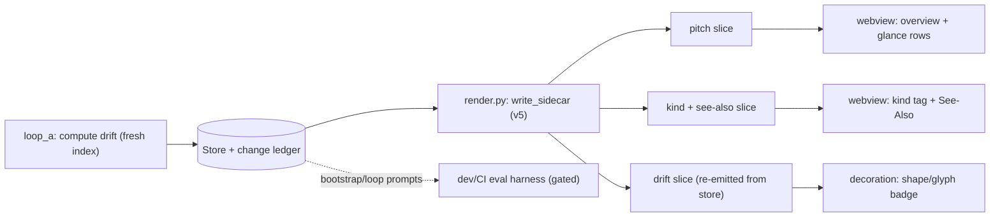
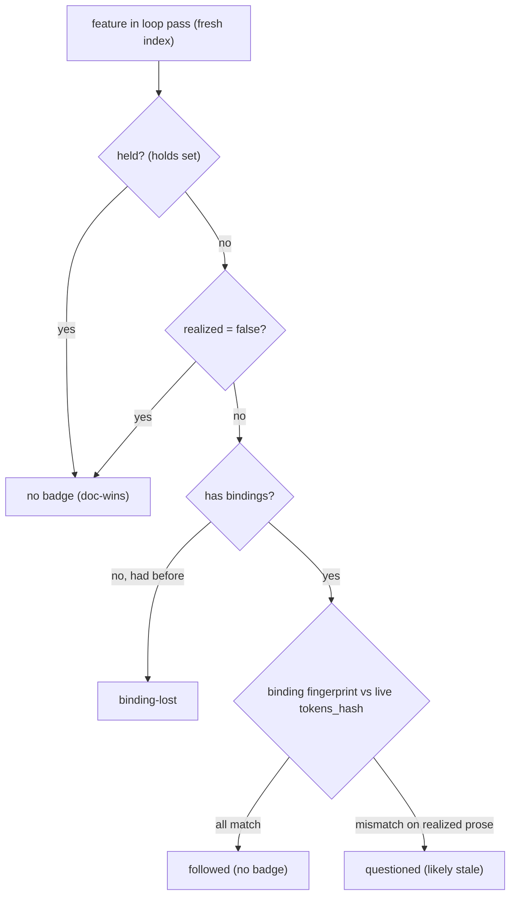

# feat: codoc reading experience and generation quality

## Summary

Improve how the codoc tree *reads* and how good its generated prose *is*, as four largely independent features: a derived one-line **pitch** per feature feeding a concept-first **overview** landing and a skimmable glance mode; **lightweight inferred structure** (a Diátaxis-lite kind hint + a See-Also list) offered as sidecar metadata over free prose; a per-feature **drift/trust** signal computed at render time and doc-wins-aware; and a gated **generation-quality eval harness**. Every reader-facing artifact is derived sidecar/decoration state — no `tree.codoc` text, no host→Python call.

---

## Problem Frame

A reader opening codoc lands in a flat, depth-first text dump with no overview, every node at equal visual weight, no signal for which descriptions are still trustworthy after code changed, and no measurable handle on whether generated descriptions are any good. The reference systems answer these with concept-first overviews + one-click depth (mathlib), inferred structure offered not imposed (Diátaxis), drift-as-signal (Swimm), and rubric-based quality evaluation (CodeWiki/CodeWikiBench). codoc already holds the raw inputs — org-pass theme parents, `feature_edges`, the change ledger, binding fingerprints — but spends none of them on the reader. This plan surfaces them while honoring codoc's deliberate free-prose default and "sidecar = derived state" architecture. The four features are independent and can be built in any order (the ideation doc's #4–#7); pitch (U1) is the one shared dependency, feeding the overview. Suggested order: ship U1 → U2 first (the cheapest reader-visible win), then the drift and inferred-structure slices, and the eval harness (U5 — no reader-facing payoff this cycle) last. If both plans are scheduled, Plan 001's registry/hover spine delivers reader navigation value first; sequence U5 after Plan 001 so its ref-validity dimension and U3's See-Also land against the registry/Connections panel rather than degraded.

---

## Requirements

### Reading experience
- R1. A derived one-line pitch per feature is emitted as sidecar state — the first sentence of the description, falling back to the title — with no new LLM call.
- R2. A concept-first overview renders at the top of the document pane from the top-level theme features, each showing its pitch and child count, plus a dependency diagram drawn only from real `feature_edges`. It is a decoration/widget, never tree text.
- R3. A glance mode collapses tree rows to their pitch so the whole tree is skimmable; expanding a row shows full prose.

### Generated-structure quality
- R4. A lightweight inferred-structure signal per feature — a Diátaxis-lite kind hint (e.g. overview / reference) and a See-Also list (top coupled features with their edge-kind rationale) — is emitted as sidecar metadata and rendered unobtrusively. Structure is offered, never mandated; free prose stays the default.
- R5. See-Also is not routed through the `> …` steering channel; it is derived sidecar metadata.

### Trust
- R6. A per-feature drift/trust signal is computed in the loop pass (which has the fresh index) from binding fingerprint vs live `tokens_hash`, gated by holds, and typed — followed / questioned / binding-lost — not a binary alarm.
- R7. The drift signal is doc-wins-aware: held features and unrealized placeholders are excluded.
- R8. Drift renders as a quiet per-feature badge encoded by shape/glyph (not hue — color stays reserved for direction); `followed` shows no badge, and the badge has no motion-heavy affordance.

### Quality measurement
- R9. A scriptable, gated generation-quality eval harness scores a generated tree against a rubric (coverage, non-duplication, description specificity, hierarchy balance, ref validity) and emits a report plus invariant checks usable in CI.

### Invariants
- R10. All new artifacts are derived sidecar/decoration state. The `tree.codoc` round-trip stays a no-op, `renderTreeFromDoc` stays byte-identical, and there is no host→Python path.

---

## Key Technical Decisions

- KTD1 — Pitch, kind, and See-Also are derived sidecar slices, not LLM-authored fields and not new `Feature` model columns. This honors the "sidecar = derived state" rule, the deliberate "no status taxonomy" on `Feature`, and the free-prose default (structure is *inferred and offered*, never written into the model or mandated in prose). Pitch = first sentence of the description; kind = a structural heuristic (binding-less-with-children → overview/theme; bound → reference); See-Also = top `feature_edges` neighbors. An LLM-authored variant of any of these is deferred.
- KTD2 — Drift computed in the loop, re-emitted by the sidecar (resolves the ideation's render-vs-persist call-out). `render.py:write_sidecar(store, codoc_dir)` reads only the store and has no live index at render time — it cannot compare `binding.fingerprint` against the live `tokens_hash` without a fresh `update_index` (which needs a `root_dir` it never receives, and would add an index read to every Accept/Reject and MCP-reflect write). So drift is computed in the loop passes that already re-index (`run_loop_a`/`reconcile_drift`) and persisted as a per-feature result the sidecar re-emits passively (mirroring how `changes`/`holds` reach the sidecar). This is a deliberate reversal of the ideation's "render-time, no Loop A state" framing, forced by index availability; interactive sidecar writes stay index-free and simply re-emit the last loop-computed drift.
- KTD3 — Eval harness is a dev/CI tool first (resolves the ideation's dev-tool-vs-user-facing call-out). It extends the `tests/bdd/e2e_report.py` pattern (bootstrap → checks → report). Only deterministic invariant checks gate the exit code; LLM-judged scored dimensions are report-only (printed, never asserted), so CI stays stable. Surfacing per-feature quality scores as IDE decorations is deferred — it risks badge-noise and is a separable concern from the measurement flywheel.
- KTD4 — See-Also via sidecar metadata, not the `> …` channel (resolves the ideation doc's own downside). Overloading `> …` collides with three known residuals: steer/see-also/comment grammar ambiguity, webview-settle dropping `> …` notes (`renderTreeFromDoc` knows nothing of them), and a literal `>` line in a description being re-parsed as a steering comment. Sidecar metadata sidesteps all three.
- KTD5 — Drift excludes held features and unrealized placeholders, and is typed into three states (followed / questioned / binding-lost). "refreshed" is dropped: a REFRESH op overwrites `binding.fingerprint` with the new hash, so a refreshed binding compares equal and is indistinguishable from `followed` by fingerprint alone (recovering it would need the capped `changes` feed's op-kind history — not worth the fragility). Change-ledger row 13 ("doc always wins") means a feature with a pending doc-ahead intent or queued directive is never flagged stale; `holds` and `realized=False` are the gates. Encoding is by shape/glyph, not hue (color stays reserved for direction per the 2026-06-09 convention), and `followed` shows no badge — the absence of a badge is the positive signal.
- KTD6 — Overview, glance rows, and drift badges are sidecar-driven decorations/widgets. Nothing enters `tree.doc.json`; any programmatic doc mutation dispatches `REFLECT_META` + `addToHistory:false`; reveals are reduced-motion gated (`body.vscode-reduce-motion`).

---

## High-Level Technical Design

Each feature is a derived slice computed Python-side and consumed host-side:

The drift signal's gating is the non-obvious logic — doc-wins exclusions first, then a typed treatment from the fingerprint comparison:

---

## Implementation Units

### U1. Derived pitch slice (sidecar)
- Goal: emit a one-line pitch per feature with no LLM call.
- Requirements: R1, R10
- Dependencies: none
- Files:
  - `codoc/codoc_file/render.py` (add a `pitch` to the per-feature meta in `write_sidecar`, or a `_compute_pitches(store)` slice; bump sidecar `version` 4 → 5)
  - `vscode-codoc/src/state/bindings-model.ts` (add `pitch` to `FeatureMeta` or a `feature_pitch` slice; update `SidecarData`)
  - `tests/codoc_file/test_pitch.py` (new), `vscode-codoc/src/test/bindings-model.test.ts` (extend for parity)
- Approach: flatten inline `codoc:` refs to their label first (reuse `parse._REF_RE`/`extract_refs`) so a citation-leading description does not yield raw `[label](codoc:…)` markdown as the pitch; then pitch = first sentence (split on sentence boundary, trim to one shared max length defined as a single constant used by both Python and the TS parity test), falling back to `feature.title` when the description is empty or the first sentence is only a citation. Pure derivation in the sidecar; no model/prompt change.
- Patterns to follow: `render.py:write_sidecar` per-feature meta build, `parse.extract_refs` (ref flattening), `bindings-model.ts:FeatureMeta`.
- Test scenarios:
  - Pitch is the first sentence of a multi-sentence description.
  - Empty description → pitch falls back to the title.
  - A multi-paragraph description → only the first sentence, not the whole first paragraph.
  - A description leading with a `[label](codoc:file#symbol)` citation → pitch is readable label/prose, not raw markdown.
  - A first sentence that is only a citation → pitch falls back to the title.
  - Sidecar version is bumped; Python and TS agree on the `pitch` value and the same trim length (parity).
- Verification: a pass writes `pitch` for every feature; the TS model surfaces it.

### U2. Concept-first overview landing + glance mode (webview)
- Goal: render an overview entry from top-level themes and let the tree collapse to pitches.
- Requirements: R2, R3, R10
- Dependencies: U1
- Files:
  - `vscode-codoc/src/providers/tree-editor.ts` (`buildPayload`: assemble overview data — top-level features with pitch + child count, and the `feature_edges` among them for the diagram)
  - `vscode-codoc/src/webview/tiptap/` (an overview widget/decoration above the doc; a glance-mode toggle that renders collapsed rows as pitch)
  - `vscode-codoc/src/test/overview.test.ts` (new — the pure overview-data builder)
- Approach: top-level features = those with no parent; each card shows title + pitch + child count; a grounded dependency diagram is drawn only from real `feature_edges` among the top themes (no invented arrows). The overview widget mounts ABOVE the TipTap editor (not inside the doc — preserving the byte-identical contract + scroll model), is dismissable per-workspace (state in `workspaceState`), and caps top-level cards at ~8 with a "show all" affordance; the Mermaid diagram is omitted when fewer than 2 top themes have connecting edges, else lives in a fixed-height scrollable container. Glance mode is a global tree-wide toggle (default off, persisted in `workspaceState`); when a row's pitch equals its title (fallback case) the row still collapses with no extra placeholder. Overview + glance rows are decorations/widgets — nothing enters `tree.doc.json`; reveals are reduced-motion gated.
- Patterns to follow: `tree-editor.ts:buildPayload` (`DocPayload` assembly), `bindings-model.ts:directedEdges` (edges for the diagram), the existing TipTap decoration extensions (`comment-decorations`, `activity-decorations`).
- Test scenarios:
  - Overview lists exactly the top-level (parentless) features with pitch + child count.
  - The diagram's edges are a subset of real `feature_edges` among top themes (no edge without backing data).
  - A tree with no parentless features (e.g. `organize=False` bootstrap) → overview hidden; glance still works per row.
  - Fewer than 2 connected top themes → Mermaid diagram omitted.
  - Glance toggle state is read from `workspaceState` on open; default off; expanding a row restores full prose.
  - No overview/glance content appears in `renderTreeFromDoc` output (Covers R10).
- Verification: opening the webview shows an overview landing; toggling glance mode makes the tree skimmable one line per feature.

### U3. Inferred structure: Diátaxis-lite kind + See-Also (sidecar)
- Goal: emit a derived kind hint and See-Also list per feature, rendered unobtrusively, never via `> …`.
- Requirements: R4, R5, R10
- Dependencies: none (U1 optional for richer See-Also rows)
- Files:
  - `codoc/codoc_file/render.py` (`_compute_kinds(store)` + `_compute_see_also(store)` from `_compute_feature_edges` output; into the v5 sidecar)
  - `vscode-codoc/src/state/bindings-model.ts` (types for `feature_kind` + `feature_see_also`)
  - the webview detail pane — kind tag as a chip below the title; See-Also as a collapsible section at the bottom of the detail pane (before bound-code refs). When Plan A's Connections panel lands, See-Also merges into it as the "Coupled features" subsection.
  - `tests/codoc_file/test_inferred_structure.py` (new), `vscode-codoc/src/test/...` (parity)
- Approach: kind heuristic over the full binding-less taxonomy so leaves are not mislabeled — retired feature → suppress the tag (or `retired`); binding-less + children + `realized=True` → `overview` (theme parents are binding-less by design, must NOT read as unrealized); binding-less leaf (no children, e.g. just-detached or pre-attach) → `unclassified` / no tag; bound feature → `reference`; a how-to heuristic is optional and may be deferred. See-Also = top-N (ranked + capped — it can be noisy on highly-coupled features) `feature_edges` neighbors with the edge kind (calls/imports) as the one-line rationale (NumPy See-Also-with-rationale). Emit as sidecar metadata only — explicitly not a `> …` line.
- Patterns to follow: `render.py:_compute_feature_edges` (neighbor source), the `apply.py:_mutate` ADD_NODE comment on theme-parent semantics (binding-less + realized), `model/feature.py` (`retired`/`realized` bits).
- Test scenarios:
  - A theme parent (binding-less, has children, realized) → kind `overview`, not `unrealized`.
  - A bound leaf feature → kind `reference`.
  - A retired feature → no kind tag (or `retired`), never `overview`/`reference`.
  - A binding-less leaf (no children, not a theme) → `unclassified` / no tag.
  - See-Also lists the top-N coupled features, each with an edge-kind rationale, ranked by weight and capped.
  - A feature with no edges → empty See-Also.
  - No `> …` line is emitted anywhere for See-Also (Covers R5).
- Verification: the detail pane shows a kind tag and a ranked See-Also list; no steering note is produced.

### U4. Per-feature drift/trust signal (loop-computed slice + badge)
- Goal: compute a typed, doc-wins-aware drift signal in the loop (where the index is fresh) and render it as a quiet, shape-encoded badge.
- Requirements: R6, R7, R8, R10
- Dependencies: none
- Files:
  - `codoc/loop/loop_a.py` (compute per-feature drift in `run_loop_a`/`reconcile_drift`, which already run `update_index` + `compute_changeset` — reuse the `_state_changeset` modified/lost logic; persist the result so render can re-emit it). Per KTD2, render has no fresh index, so drift is loop-derived, not render-time.
  - `codoc/codoc_file/render.py` (`write_sidecar` re-emits the persisted per-feature drift slice — a passive store read, no index access; mirror how `changes`/`holds` reach the sidecar; bump version)
  - `codoc/loop/edits.py` (reuse `hold_set` for the held-exclusion)
  - `vscode-codoc/src/state/bindings-model.ts` (types for `feature_drift`)
  - `vscode-codoc/src/providers/decoration.ts` (a `driftBadge` decoration via `renderOptions.after`, encoded by shape/glyph — NOT a new hue; `followed` emits nothing)
  - `tests/loop/test_drift.py` (new), `vscode-codoc/src/test/...`
- Approach: in the loop, for each realized, non-held feature with bindings, compare `binding.fingerprint` against the freshly-indexed `tokens_hash` (the `_state_changeset` "modified" logic) and classify into three states: all match → `followed`; mismatch on realized prose → `questioned`; lost last binding → `binding-lost`. ("refreshed" is dropped — a REFRESH overwrites the fingerprint so it compares equal to `followed`; see KTD5.) Exclude held features (`holds`) and unrealized placeholders (`realized=False`) per row 13. Render: `followed` shows no badge; `questioned`/`binding-lost` show a shape/glyph badge (no hue), reduced-motion safe. Validate on `test/requests` what fraction of a real tree lights `questioned`; if it is high, prefer a rolled-up tree-health count over a per-node badge on every drifted feature (a badge that fires on the common case stops being signal).
- Patterns to follow: `loop_a.py:_state_changeset` / `_has_modified_realized` (the fingerprint-vs-live comparison, already index-fresh), `loop/edits.py:hold_set`, `render.py:_changes_feed` (a capped derived feed re-emitted from the store — the re-emission shape, not a per-feature shape), `decoration.ts:amendInline` (the `renderOptions.after` badge pattern — shape, not color).
- Test scenarios:
  - Bound chunk fingerprint matches the freshly-indexed `tokens_hash` → `followed` → no badge emitted.
  - Fingerprint mismatch under a realized feature with prose → `questioned`.
  - Feature whose last binding was removed → `binding-lost`.
  - A held feature → excluded (no badge), even with a fingerprint mismatch (Covers R7).
  - An unrealized placeholder → excluded.
  - Mixed bindings → the worst-case treatment wins.
  - An interactive `safe_write_tree` (Accept/Reject, MCP reflect) with no fresh index re-emits the last loop-computed drift unchanged — it does not recompute against a stale index.
- Verification: editing bound code and running a loop pass lights a `questioned` badge; a held feature stays unbadged; an Accept click does not change badges without a loop pass.

### U5. Generation-quality eval harness (dev/CI)
- Goal: a scriptable, gated harness that scores a generated tree against a rubric and emits a report + invariant checks.
- Requirements: R9
- Dependencies: none (ref-validity dimension reuses Plan A's registry when present; degrades gracefully without it)
- Files:
  - `tests/bdd/eval_report.py` (new, modeled on `tests/bdd/e2e_report.py`)
  - `.claude/skills/codoc-ux-tester/evals/evals.json` (encode the rubric dimensions as scored cases)
  - `tests/eval/test_eval_rubric.py` (new — unit tests of the scoring functions on a fixture tree)
- Approach: mirror `e2e_report.py` (bootstrap a small repo → run bootstrap → compute checks → print a report). Encode the rubric from `codoc-ux-tester` (Layout / Verbosity / Duplicates / Binding-quality / Missing-coverage / Subtree) plus coverage (every chunk bound), non-duplication (no duplicate titles), hierarchy balance, and ref validity (reuse Plan A's `tree.index.json` resolved flag when present; skip the dimension gracefully when absent). Gating: ONLY deterministic invariant checks affect the exit code / CI gate; LLM-judged scored dimensions are report-only (printed, never asserted). The script self-gates its LLM calls on `OPENAI_API_KEY` (skips LLM dims, exits 0 on no invariant failure) — the `pytest.mark.skipif` in `test_e2e_userflows.py` only gates the test-runner path, so `python -m tests.bdd.eval_report` needs its own guard.
- Execution note: characterize the existing `e2e_report.py` invariant checks first, then extend — reuse `_no_dup_titles` / `_coverage` rather than reinventing them.
- Patterns to follow: `tests/bdd/e2e_report.py` (`tree_report`, `_no_dup_titles`, `_coverage`, the `OPENAI_API_KEY` gate), `tests/bdd/world.py` (deterministic `propose` injection for the non-LLM unit tests), `codoc-ux-tester` `evals.json` shape.
- Test scenarios:
  - Deterministic invariant checks (no duplicate titles, full chunk coverage) pass on a clean fixture tree and fail on a seeded-bad one.
  - Each rubric dimension produces a score on a fixture; the report aggregates them.
  - LLM-judged dimensions do not influence the exit code (only invariant failures do).
  - `python -m tests.bdd.eval_report` exits 0 with no `OPENAI_API_KEY` when invariants pass (the script self-gates, not just the pytest marker).
  - Ref-validity dimension flags a known dead ref when a registry is present; is skipped (not errored) when absent.
- Verification: `python -m tests.bdd.eval_report` prints a scored report with a non-zero exit on invariant failure; the scoring unit tests pass without an API key.

---

## Scope Boundaries

### Deferred to Follow-Up Work
- LLM-authored pitch / kind / See-Also (a model + prompt change) — the derived path ships first (KTD1).
- One-tap "re-steer from current code" off a drift badge — authors a `> …` STEER note and collides with the open `> …` channel residuals; revisit after the blockquote-node fix.
- Surfacing eval quality scores as IDE decorations (flagging thin nodes in the webview) — deferred to avoid badge-noise (KTD3).
- A how-to Diátaxis kind beyond the structural heuristic; audience lenses (newcomer/reviewer/agent views) — both heavier, separable.

### Out of scope
- Any change to `tree.codoc` / `tree.doc.json` content or grammar (R10).
- Re-introducing a status taxonomy on `Feature` (drift/kind/pitch stay derived sidecar slices).
- A synchronous webview→Python query path.

---

## Risks & Dependencies

- Sidecar version bump (v4 → v5) for the pitch/kind/see-also/drift slices must update the Python writer and the TS `bindings-model.ts` in lockstep — add the new slices as OPTIONAL fields (the TS reader keys on field presence, not the version literal, so old sidecars keep parsing; also correct the stale `version: 3` literal/docstring in `bindings-model.ts` while bumping). Plan A does NOT bump the bindings sidecar (it writes a separate `tree.index.json`), so this plan owns the sole v4 → v5 bump; the only Plan-A coordination is that its `write_registry` hook inside `write_sidecar` still compiles once the v5 fields land.
- The kind heuristic must treat binding-less-with-children theme parents as `overview`, not `unrealized` — mislabeling them is the main correctness risk (KTD5 / `apply.py:_mutate` semantics).
- Drift recomputation reads the live index each pass; confirm `with_embeddings=False` and scope to bound files to keep it cheap.
- The eval harness's LLM-judged dimensions are non-deterministic; keep them separate from the deterministic invariant checks so CI gating stays stable, and keep the whole harness gated on `OPENAI_API_KEY`.
- See-Also derived from `feature_edges` can be noisy on highly-coupled features — rank and cap.

---

## Sources / Research

- `codoc/codoc_file/render.py` — `write_sidecar` (~253, v4 dict ~278–289, version literal ~279), `_compute_feature_edges` (~226, neighbor source for See-Also + overview diagram), `_changes_feed` (~164, per-feature derived-feed shape for drift).
- `codoc/loop/loop_a.py` — `_state_changeset` (~593) and the `amend_on_change` trigger / `_has_modified_realized` (~197): the fingerprint-vs-live comparison drift reuses.
- `codoc/loop/edits.py:hold_set` (~212) — the held-feature exclusion (doc-wins).
- `codoc/model/feature.py` — `realized` / `retired` are the only lifecycle bits ("no status taxonomy" — grounds KTD1); `apply.py:_mutate` (~111–133) — theme parents are binding-less + `realized=True` (grounds the kind heuristic).
- `codoc/agent/bootstrap_agent.py` (`propose_file_features`, `propose_organization`) + `codoc/prompts/{bootstrap_file.txt,bootstrap_org.txt}` — the per-file + org-pass generation architecture the eval measures; `bootstrap_hier.py:_feature_coupling` (~147) — coupling lines that also ground the overview diagram.
- `tests/bdd/e2e_report.py` — `tree_report`, `_no_dup_titles` (~113), `_coverage` (~119), `OPENAI_API_KEY` gate (the eval-harness model); `tests/bdd/world.py` — deterministic `propose` injection.
- `.claude/skills/codoc-ux-tester/` — `SKILL.md` audit dimensions (the rubric to encode) + `evals/evals.json` (scored-case shape).
- `vscode-codoc/src/state/bindings-model.ts` — `SidecarData`, `FeatureMeta` (where pitch/kind/drift types attach), `directedEdges`.
- `vscode-codoc/src/providers/tree-editor.ts:buildPayload` — overview/glance payload assembly; `vscode-codoc/src/providers/decoration.ts:amendInline` — the `renderOptions.after` badge pattern for drift.
- `vscode-codoc/src/webview/tiptap/author-plugin.ts` (REFLECT_META), `whole-doc-editor.ts` (setDoc skip-reload), `src/state/doc-serialize.ts` (renderTreeFromDoc byte-identical) — the webview gotchas U2/U4 honor.
- Residuals: `docs/residual-review-findings/feat-steering-emphasis-links-sdk.md` (#3/#5/#7 — why See-Also avoids the `> …` channel, KTD4).
- Origin: `docs/ideation/2026-06-15-codoc-documentation-ideation.md` (ideas #4–#7; hard constraints; free-prose default).
- Constraints: `docs/codoc-change-ledger.md` (row 13 doc-wins — KTD5); `docs/plans/2026-06-09-001-…` (color=direction/shape=kind; reduced-motion; three-pane KEEP).
