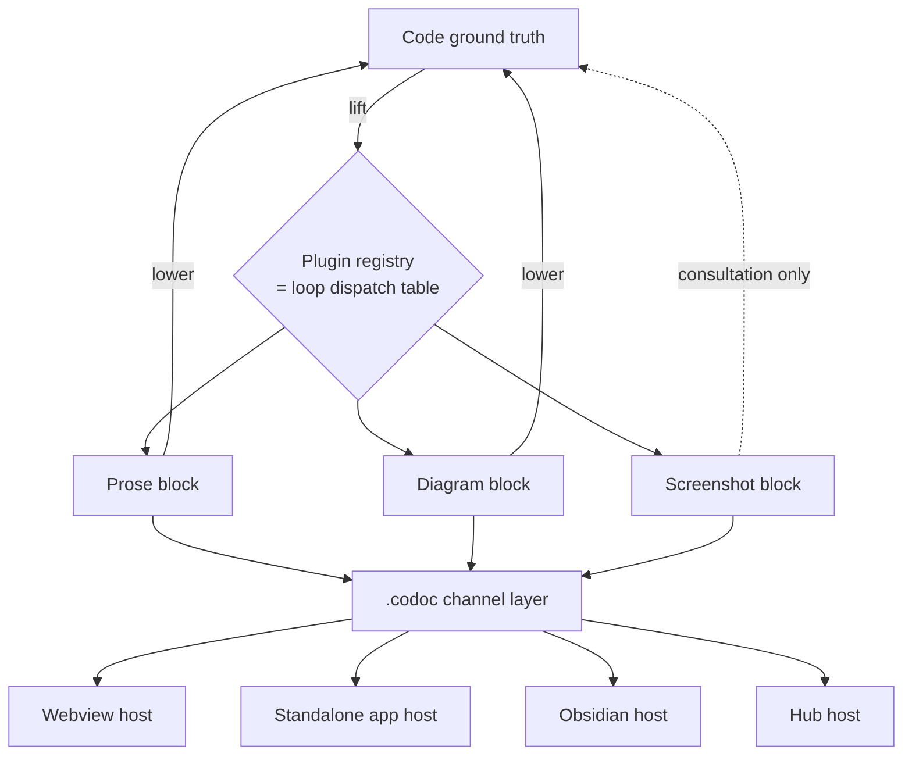

# Agent-Native Notebook Protocol

## Summary

Generalize codoc's unit of intent from a prose feature-node to a typed, bindable, lifecycled **block**, where each block is backed by a **plugin** that defines a bidirectional codec between its medium and the code: `lift` (code → block) and `lower` (block → code directive). The block + plugin contract lives at the `.codoc` channel layer, so multiple hosts (the TipTap webview, a future standalone app, Obsidian, the hub) consume one protocol. The two loops generalize into a plugin-dispatch over blocks — the plugin registry *is* the dispatch table.

## Problem Frame

codoc's actual contribution is the bidirectional binding between a doc surface and code structure: a user knows which code a paragraph owns, edits intent and the code follows, and reads a tree diff to see where code changed. Today that binding is demonstrated through one medium (prose) on effectively one rich host (the VS Code webview). R2 scored the work a 2, and the weakness the review exposes is that the contribution *reads* as a bespoke editor feature rather than a general mechanism.

The generalization is the rebuttal. The binding is not about prose or about VS Code — it is about a stable correspondence between human-authored intent and code, with identity and a reflective loop. If the same correspondence holds across *media* (diagrams, screenshots, formulae, transliterated code) and across *surfaces* (any host that speaks the protocol), then the contribution is a protocol, not a tool. The substrate for this already exists: `.codoc/` is a file-channel protocol with two independent clients today (the webview and the `codoc serve` hub), and the webview is already a block editor (TipTap/ProseMirror).

## Key Decisions

- **The block is the generalized feature node.** A block carries a kind, an optional binding to code chunks, a provenance (human-authored vs agent-derived), and a lifecycle (persistent vs transient). The current prose feature-node becomes "plugin-zero" — the text block — so the model is backward-compatible, not a replacement.
- **A plugin is a bidirectional codec, and that is the platform kernel.** Each plugin declares `lift` and `lower`, plus a dispatch mode (a deterministic codec, or an agent-contract: a prompt telling the agent how to comprehend/surface the medium). This is a generalization of the two loops, not a rewrite.
- **Protocol-first, multi-host.** The contract is declared at the `.codoc` channel layer; hosts are pluggable consumers. No working surface (webview, hub) is rebuilt — each becomes a host that implements the host contract.
- **Transient/persistent reuses an axis codoc already has.** The `> …` steering channel is consumed on the next render; that is the transient lifecycle. Persistent blocks live in the doc body and are refreshed in place; transient blocks (a bug screenshot) live in a comment thread, are consumed by realization, and are discarded.
- **The platform contract is extracted from reference plugins, not declared API-first.** Even though the platform is the goal, v1 ships a small proof set and lets the contract fall out of real plugins.

## Actors

- A1. **Doc author** — edits blocks (prose, diagrams, attached media) to read and steer the codebase.
- A2. **Coding agent** — runs `lift` to refresh blocks from code and `lower` to realize block edits into code; reads ambient blocks as consultation.
- A3. **Plugin author** — defines a block kind's codec and lifecycle (deterministic or agent-contract).
- A4. **Host** — a surface (webview, standalone app, Obsidian, hub) that renders blocks and routes edits through the protocol.

## Requirements

**Block model**

- R1. A block is the unit of intent, carrying: kind, binding (0..n code chunks), provenance (human-authored vs agent-derived), and lifecycle (persistent vs transient).
- R2. The existing prose feature-node is expressed as the text block ("plugin-zero"); existing trees remain valid without migration of authored intent.
- R3. A block with zero bindings is **ambient**: it is never realized, but is available to the agent as consultation context.

**Plugin contract (the codec)**

- R4. Each plugin declares `lift` (re-surface the block when its bound code changes) and `lower` (turn a human edit to the block into a realize directive).
- R5. Each plugin declares a dispatch mode: a deterministic codec, or an agent-contract (a declared prompt the loop hands to the agent).
- R6. Ambient (non-bindable) media feed realization as a consultation source — a richer form of the existing `Consult:` external-link mechanism — and are read multimodally where the agent supports it.
- R7. A `lower` that is lossy or ambiguous routes through the existing draft / hand-off proposal gate (confirmation), never a silent code apply.

**Loop generalization**

- R8. Loop A dispatches `lift` to each affected bound block's plugin per changed code chunk, replacing the current "re-derive prose" step.
- R9. Loop B dispatches `lower` per edited block; the plugin registry is the loop's dispatch table.
- R10. Persistent blocks live in the doc body and are refreshed in place; transient blocks live in the comment/steering channel, are consumed on the next render, and are not persisted to the doc.

**Protocol and hosts**

- R11. The block + plugin contract is declared at the `.codoc` channel layer (extending the sidecar, `edits.json`, and `inbox.json`), format-versioned and presence-keyed so older sidecars still parse.
- R12. A minimal **host contract** defines what a surface must do to be a valid host: render blocks, proposals, and lifecycle state; route block edits to `lower`; write the verdict/edit channels; reflect live updates.
- R13. Existing hosts (the webview and the hub) remain valid by implementing the host contract for at least the text block.

**v1 proof set**

- R14. v1 ships three reference plugins that together exercise both codec directions and the lifecycle split: prose (plugin-zero), diagram, and transient bug-screenshot.
- R15. The diagram plugin derives `lift` from the existing code dependency graph (`graph/extract.py`, `graph/query.py`); `lower` turns a diagram edit (add/remove edge or node, rename) into a restructure directive.
- R16. The screenshot plugin demonstrates the transient lifecycle: a bug screenshot dropped in a comment thread is consumed by realization and not persisted as a doc block.

## Key Flows

- F1. **Persistent block refresh (lift)**
  - **Trigger:** Loop A detects a change in code chunks bound to a persistent block.
  - **Actors:** A2
  - **Steps:** Identify affected blocks → dispatch each block's plugin `lift` → replace the block content in place (or emit a proposal if the change is structural).
  - **Covers:** R8, R10

- F2. **Block-driven code change (lower)**
  - **Trigger:** A1 edits a block (drags a diagram edge, edits transliterated code, bolds intent).
  - **Actors:** A1, A2
  - **Steps:** Host routes the edit to the block's plugin `lower` → directive built → queued to realization (or held at the draft gate if ambiguous) → agent implements → Loop A reflects back.
  - **Covers:** R4, R7, R9

- F3. **Transient consumption**
  - **Trigger:** A1 drops a bug screenshot into a comment thread on a block.
  - **Actors:** A1, A2
  - **Steps:** Agent reads the screenshot as consultation, realizes the fix on the bound code, and the screenshot is discarded on the next render — never promoted to a doc block.
  - **Covers:** R3, R6, R10

## Visualization

One code ground truth, many media projections, many hosts — the fan-out the protocol makes uniform:

## Acceptance Examples

- AE1. **Persistent screenshot replaced on change.** Given a UI-state screenshot block bound to a view's code, when that code changes, then `lift` replaces the screenshot in place rather than appending a new one. **Covers R8, R10.**
- AE2. **Transient screenshot not persisted.** Given a bug screenshot in a comment thread, when the agent realizes the fix, then the screenshot is discarded on the next render and never becomes a doc block. **Covers R10, R16.**
- AE3. **Ambient block is consultation, not noise.** Given a video block with no binding next to a feature spec, when the agent realizes that feature, then it may read the video as consultation but never attempts to "realize" the video. **Covers R3, R6.**
- AE4. **Ambiguous lower is gated, not silent.** Given a diagram edit whose code mapping is ambiguous, when `lower` runs, then it produces a held proposal requiring confirmation rather than a silent code apply. **Covers R7.**

## Scope Boundaries

**Deferred for later**

- Notion as a first-class host — its cloud/block-API model cannot carry real-time inline overlay + accept/reject without degrading it; revisit as a read-mostly host.
- Rust↔Python (general cross-language round-trip) as a shipped plugin — kept as a vision-frame; it embeds an unsolved problem unfit for a v1 proof.
- Plugin marketplace, third-party plugin distribution, and a plugin sandbox/security model.
- A standalone (non-VS-Code) notebook shell — reachable later by lifting the webview, not built greenfield in v1.

**Outside this product's identity**

- A general note-taking app divorced from code binding. The product is intent↔code correspondence across media and surfaces; knowledge management with no code ground truth is a different product.

## Dependencies / Assumptions

- The agent has multimodal capability sufficient to read ambient media (screenshots, video, diagrams) as consultation context. Where it does not, ambient blocks degrade to inert human context.
- The existing code dependency graph (`graph/`) is sufficient to drive the diagram plugin's `lift`.
- The existing draft / hand-off gate and `> …` steering channel are reusable as the substrate for the lossy-`lower` gate (R7) and the transient lifecycle (R10).
- The TipTap webview serves as host v0; the host contract is validated against it first.

## Outstanding Questions

**Resolve before planning**

- **Block-level binding identity.** How does the `UNIQUE(file, symbol_path)` constraint generalize when several media-blocks (a diagram and a prose block) legitimately bind the same code chunks? This is the one genuinely new hard problem and it shapes the data model.
- **R2 headline framing.** Is the star "binding generalizes across media *and* surfaces — here's the protocol," or the heterogeneous-media codec itself? The choice changes what v1 must prove.
- **Reference-plugin set.** Confirm prose + diagram + transient-screenshot is the right proof set, or whether a diagram-in-comment is a cleaner transient proof than a screenshot.

**Deferred to planning**

- Exact `.codoc` channel schema extensions, versioning, and presence-keying for the block + plugin contract.
- The format of an agent-contract dispatch (prompt shape) and the boundary between deterministic and agent dispatch per plugin.
- A host-conformance / parity harness analogous to the existing TS-parser-vs-`parse.py` parity tests.
- How `lower` directives merge into the existing `realize.md` / `realize.json` queue.
