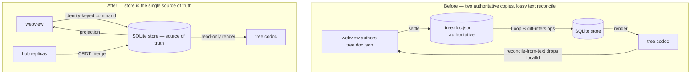

# Store-Authoritative Coordination for the codoc Tree

## Summary

Unify codoc's local VS Code path onto the store-authoritative projection model the `codoc serve` hub already uses. The SQLite store becomes the single source of truth for authored intent; the webview becomes a pure projection of it and emits identity-keyed edit commands instead of persisting a parallel authoritative document; `tree.codoc` becomes a read-only render. Tracked-change marks, comment anchors, and uncommitted drafts move into the store so the projection carries them. A CRDT merge layer is added at the hub's multi-user boundary, where independent replicas actually diverge.

## Problem Frame

codoc holds the feature tree in two files locally that each behave as a source of truth: `tree.doc.json` (host-owned ProseMirror doc the webview authors) and `tree.codoc` (daemon-owned text render). The single-writer design intended `tree.doc.json` to lead and the daemon to derive, but the two diverge and the divergence is self-sustaining.

Three confirmed defects drive it. Node identity (`localId`) is dropped when the host re-sources the doc from `tree.codoc` text in `vscode-codoc/src/state/doc-reconcile.ts`, so new nodes lose identity and `codoc/codoc_file/diff.py` re-mints them as fresh features on every Loop B pass. The `docAhead` gate in `vscode-codoc/src/providers/tree-editor.ts` clears only on exact text equality, which is unreachable once the files differ, so the webview pins to its stale doc and discards the daemon's render. And `buildPayload`'s side-effect re-persist overwrites a just-deleted node back into `tree.doc.json` from `tree.codoc` text before `codoc/loop/doc_presence.py` can detect the deletion. Observed in a live workspace: deletions resurrect, a single authored node duplicates into 3–5 features (15→23 feature count), and VS Code raises "content of the file is newer" save conflicts because the daemon rewrites `tree.codoc` on every pass.

The structural cause is two authoritative copies of one logical tree reconciled by lossy text-diffing. The fix already half-exists: `codoc/codoc_file/doc_render.py` projects the store into the `tree.doc.json` shape, and `codoc/serve/payload.py` uses it so the hub serves from the store with no editor attached. The local path is the only consumer that inverts this. The work is to finish that migration locally, not to invent a model.

## Key Decisions

- **The SQLite store is the single source of truth (Option C).** The CRDT is a merge/transport layer, not persisted truth. Loop A/B, bindings, the dependency graph, proposals, lifecycle, and the HLC all stay on the store unchanged. This keeps the existing intent-vs-index split intact and reconciles "store is authoritative" with "use a CRDT where replicas diverge."
- **The webview is a pure projection + command emitter.** It renders the store's projection and never persists a parallel authoritative document. Every edit is an explicit identity-keyed command (rename feature, set description, move under parent, retire) — never a whole-doc diff the daemon must re-infer. This removes the inference that produced the re-mint.
- **Identity is owned end-to-end by the store.** `fid` is minted once by the store and echoed in every projection; `localId` is the correlation token for the round-trip, never re-minted. A node already minted is never re-added.
- **Rich state is promoted into the store.** Tracked-change marks, comment-thread anchors, and uncommitted drafts become first-class store data the projection carries back. No host-owned authoritative file survives.
- **`tree.codoc` becomes a read-only export.** It is a derived render, not editable as text inside VS Code, and is never round-tripped for identity. This closes the "content is newer" conflict at the source.
- **The CRDT earns its place only at the hub's multi-user boundary.** Locally there is one author plus gated agents — no independently diverging replicas — so local concurrency uses the existing diff/review surface plus an HLC version gate. The CRDT merge layer applies where remote contributors genuinely diverge.
- **The CRDT is Yjs, via `pycrdt` on the Python side (spike-validated).** `pycrdt` (Project Jupyter, built on the `yrs` Rust port of Yjs) shares Yjs's binary update protocol, and JupyterLab's real-time collaboration ships exactly this Python-server↔browser-Yjs topology in production — the existence proof for codoc's daemon↔webview boundary. The webview is TipTap, whose Collaboration extension is already Yjs-native. Automerge was rejected: thinner Python binding, weaker ProseMirror story, no comparable cross-runtime proof.

## Actors

- A1. **Doc author** — edits the tree in the webview; expects edits to persist and never duplicate or resurrect.
- A2. **Coding agent** — amends descriptions via Loop A (code→tree) and realizes edits via Loop B; its amends surface to the author as reviewable diffs.
- A3. **Daemon** — owns the store, applies commands, and emits projections; sole writer of `tree.codoc`.
- A4. **Remote contributor (hub)** — one of several users co-editing through `codoc serve`; the source of genuinely concurrent edits the CRDT merges.

## Requirements

**Source of truth and projection**

- R1. The SQLite store is the single source of truth for authored intent (titles, descriptions, structure) and for derived attribution (bindings, graph, proposals, lifecycle).
- R2. The webview renders a projection of the store and holds no authoritative parallel document. When the store and any prior local view disagree, the projection wins.
- R3. The local path uses the same store→doc projection the hub already uses (`codoc/codoc_file/doc_render.py`), so a hub-rendered and an editor-rendered doc are indistinguishable to the rest of the pipeline.

**Identity and commands**

- R4. Each authored edit is an explicit command keyed by stable identity; the daemon applies it without inferring operations from a text or document diff.
- R5. `fid` is minted once by the store and carried in every projection; an already-minted node is never re-added on a subsequent pass.
- R6. A newly authored node carries a `localId` that round-trips through the projection until its minted `fid` is echoed back, after which `localId` remains the stable correlation token.
- R7. A delete is an explicit command against the store; no code path re-introduces a deleted node from `tree.codoc` text.

**Rich state in the store**

- R8. Tracked-change marks (agent-vs-human authorship ink on descriptions) are stored and carried in the projection.
- R9. Comment-thread anchors are stored and survive projection round-trips without re-anchoring from text.
- R10. Uncommitted drafts (in-progress edits not yet committed) are represented in the store so a reload restores them.

**`tree.codoc` as read-only export**

- R11. `tree.codoc` is a derived, read-only render of the store; it is not editable as a text document inside VS Code and not round-tripped for identity.
- R12. The author never sees a VS Code text-document save conflict for `tree.codoc`.

**Local concurrency**

- R13. Agent description amends surface to the author on the existing diff/review surface; the redesign does not change that behavior.
- R14. A returning projection never overwrites newer optimistic local edits; ordering is enforced by a version gate built on the existing HLC, replacing the `docAhead` text-equality check.

**Hub multi-user merge**

- R15. Concurrent edits from independent hub replicas converge through a CRDT merge layer and land in the authoritative store without losing either contributor's change.
- R16. The merge layer is scoped to the hub's multi-user boundary; the local single-author path does not carry a CRDT.
- R17. Merge results are expressed as store state, so all downstream consumers (Loop A/B, bindings, projection) see one converged tree.

**Removed machinery**

- R18. The text→doc reconcile path, the `docAhead` flag, and `buildPayload`'s side-effect re-persist are removed; their roles are replaced by R2 (projection) and R14 (version gate).

## Source-of-truth fan-out (before / after)

The picture shows the inversion: the cyclic text reconcile that loses identity is replaced by a single authoritative store that both the webview and `tree.codoc` derive from, with the CRDT feeding the store only at the multi-user edge.

## Key Flows

- F1. **Author edits a feature.** **Trigger:** the author renames a feature or edits its description in the webview. The webview applies the edit optimistically, emits an identity-keyed command, and the daemon applies it to the store and emits a projection. The version gate (R14) discards the projection if the author has typed further since. **Covers R2, R4, R14.**
- F2. **Author deletes a feature.** **Trigger:** the author removes a node. A delete command lands against the store; the node is retired and never re-introduced from `tree.codoc`. Reload and ⌘S both show it gone. **Covers R7, R11.**
- F3. **Agent amends a description.** **Trigger:** Loop A reflects a code change into a description. The amend surfaces to the author as a reviewable diff; accept/reject is unchanged. **Covers R13.**
- F4. **Two hub contributors edit concurrently.** **Trigger:** two remote users edit different features (or the same feature's structure) at once. The CRDT merges their changes and the converged result lands in the store; both edits survive. **Covers R15, R17.**

## Acceptance Examples

- AE1. **Covers R5, R6.** Author adds a node, then the daemon runs N Loop B passes with no further authored change → exactly one feature exists for that node; the feature count does not grow per pass.
- AE2. **Covers R7.** Author deletes a node and reloads the window (or presses ⌘S) → the node stays deleted in both the webview and `tree.codoc`.
- AE3. **Covers R12.** The daemon rewrites `tree.codoc` while the editor is open → no "content of the file is newer" dialog appears.
- AE4. **Covers R8, R10.** Author makes an uncommitted edit with agent-authored ink present, reloads → the draft and the authorship marks are both restored from the store.
- AE5. **Covers R15.** Two hub replicas concurrently edit the same feature's description and a sibling's title → both changes are present in the converged store; neither is silently dropped.

## Scope Boundaries

**Deferred for later**
- Character-level prose co-editing locally — the local path keeps the diff/review surface; same-paragraph character merge is not built locally.
- Any local CRDT — local stays single-author with a version gate.

**Outside this product's identity**
- Replacing SQLite, the bindings model, or the dependency-graph pipeline — these remain the derived index the store owns; the redesign changes coordination, not the persistence or attribution substrate.

## Dependencies / Assumptions

- The store→doc projection (`codoc/codoc_file/doc_render.py`) is the canonical projection for both hub and local paths; it must carry the rich state of R8–R10, which it does not today.
- The hub CRDT layer uses Yjs across TypeScript (webview, via TipTap's Yjs-native Collaboration) and Python (daemon, via `pycrdt`/`yrs`). Cross-runtime interop is **spike-validated** against JupyterLab's production Python↔browser Yjs stack, not assumed. Residual integration risk (not feasibility): mapping codoc's node attrs and authorship marks onto Yjs shared types, and reconciling TipTap's Yjs undo with codoc's custom undo/`localId` re-mint behavior.
- Local command application assumes the daemon is reachable; when `watch` is not running, commands queue on the file channel and apply on the next daemon start or `codoc sync` (consistent with today's file-channel model).
- The HLC in `codoc/model/` is sufficient as the version-gate ordering primitive for R14.

## Outstanding Questions

**Resolve before planning**
- _(none — the CRDT interop blocker is resolved: Yjs via `pycrdt`, spike-validated against JupyterLab's production Python↔browser stack.)_

**Deferred to planning**
- The store schema for rich state (R8–R10): what marks, comment anchors, and draft representations the store must hold, and how the projection serializes them.
- Whether the local fix and the hub CRDT layer ship as one change or as a sequenced pair — the local fix alone closes all three reported bugs and could land first; bundling couples a low-risk change to the Yjs integration work.
- Command granularity and the exact command set (rename / set-description / move / retire / add) and how optimistic local apply rebases on the version gate.
- The Yjs integration details flagged as residual risk: node-attr/mark mapping onto Yjs shared types, and TipTap Yjs-undo vs codoc's `localId` re-mint behavior.

## Sources / Research

- Root-cause investigation (this session): confirmed re-mint, resurrection, and save-conflict chains against live workspace state and code.
- `codoc/codoc_file/doc_render.py`, `codoc/serve/payload.py` — the store→doc projection the hub already uses (the model to unify on).
- `vscode-codoc/src/providers/tree-editor.ts`, `vscode-codoc/src/state/doc-reconcile.ts` — the host-authoritative doc, `docAhead` gate, and reconcile-from-text path being removed.
- `codoc/codoc_file/diff.py`, `codoc/loop/doc_presence.py`, `codoc/loop/loop_b.py` — the diff-inference, deletion detection, and Loop B apply paths that change under identity-keyed commands.
- `codoc/model/` (HLC) — the ordering primitive for the version gate.
- Prior brainstorms: `docs/brainstorms/2026-06-16-codoc-collaborative-editing-model-requirements.md`, `docs/brainstorms/2026-06-18-codoc-insitu-suggesting-mode-requirements.md`, `docs/brainstorms/2026-06-22-agent-native-notebook-protocol-requirements.md`.
- CRDT interop spike (this session): [pycrdt (PyPI)](https://pypi.org/project/pycrdt/) — Jupyter, `yrs`-based, v0.14.1 Jun 2026; [jupyter-collaboration](https://github.com/jupyterlab/jupyter-collaboration) — production Python↔browser Yjs sync; [TipTap Collaboration](https://tiptap.dev/docs/editor/extensions/functionality/collaboration) — Yjs-native; [automerge-py](https://github.com/automerge/automerge-py) — evaluated and rejected.
