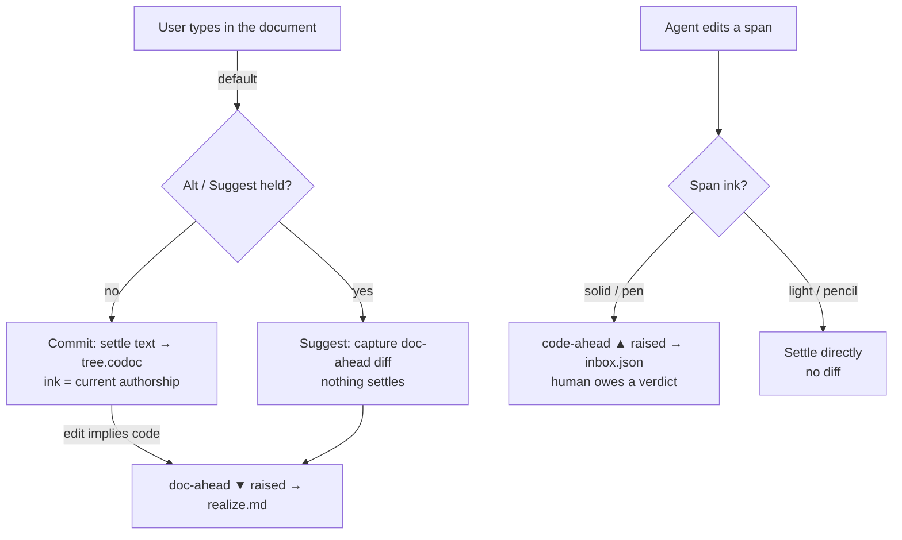
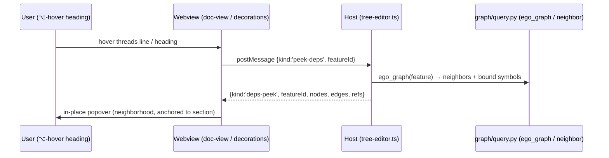

# feat: codoc collaborative-doc UX redesign

> **Design read:** an IDE-embedded collaborative document for developers maintaining
> code with an AI partner — calm, editorial, *Notion-meets-Linear*, built entirely on
> VS Code theme tokens, one structural accent, restrained and purposeful motion. We
> **keep the three-pane topology** (tree · document · TOC rail) and concentrate the
> boldness where the pain is: a single self-explaining interaction model, one unified
> "disagreement" grammar that kills the color rainbow, and dependencies made
> first-class *inside* the document.

---

## Summary

codoc's `Codoc Tree` webview is conceptually elegant (the document *is* the feature
tree; two clean axes — authorship and agreement) but the rendered experience buries
that elegance under chrome: the hierarchy is drawn three times, two toolbars stack ~16
affordances, pending changes are color-coded by *operation type* into a six-hue
rainbow, and dependencies are scattered across four disconnected surfaces. This plan
**keeps the three-pane layout** and delivers a coherent visual + interaction redesign
in six implementation units: a design-system token foundation (U1), collapsing the
pen/pencil × editing/suggesting 2×2 into one "stance" the text expresses itself (U2),
one tracked-change grammar where **direction = color, kind = shape** (U3),
**inline dependencies + an on-demand local graph peek** (U4), a single de-cluttered
header with contextual structure actions (U5), and navigator/TOC-rail polish (U6).
The work is a targeted refactor of `vscode-codoc/src/webview/` (CSS + a handful of TS
files) on the existing TipTap stack — no framework migration, no editor rewrite. The
artifact also includes the feature→architecture map and the full design-system spec
the user asked for.

---

## Problem Frame

The user's brief — *"a bit difficult to follow, the layout, the visual cluttering, the
dependencies a bit scattered and hard to navigate"* — maps to five concrete,
evidence-backed problems in the current webview.

**P1 — The hierarchy is drawn three times.** The left tree pane
(`vscode-codoc/src/webview/doc-view.ts` `renderTree`), the center document headings
(`whole-doc-editor.ts`), and the right TOC rail (`whole-doc-editor.ts` `rebuildRail`)
are three parallel projections of one structure — even though the conceptual model
(`docs/codoc-collaborative-editing-model.md`) states *"the document **is** the tree."*
*Per the confirmed scope we keep all three panes*, but each must earn its place with a
**distinct role** rather than re-drawing the same outline.

**P2 — The interaction model is a flat 2×2 of abstract toggles.** The editor toolbar
(`whole-doc-editor.ts:313`) carries **two segmented controls** — pen/pencil
(`:259-271`) and Editing/Suggesting (`:294-305`) — plus four mark buttons and four
structure buttons (`＋ ⇥ ⇤ ~`), ~16 affordances in two stacked rows. The user must
mentally compose authorship × mode into a 2×2 with zero signposting; the conceptual
doc itself admits *"conflating them was the original mistake."*

**P3 — Color encodes operation-type (a rainbow), not meaning.** `doc-view.css:9-14`
defines six accent colors (refs, purple-plan, yellow-amend, red-retire, blue, green-add)
that double as add/move/retire/amend/unrealized signals across tree rows
(`:181-187`), four colored badge dots (`:162-169`), and five-color TOC ticks
(`:245-251`). Current tracked-changes best practice (CKEditor 5, MS Word, Google Docs)
is the inverse: **color encodes *who*/direction; decoration shape encodes *what kind***.

**P4 — Dependencies have four disconnected homes.** `ce-deps` chips under headings
(`suggestion-decorations.ts:150-162`), legacy `xrefs` "see also" footnotes
(`doc-view.css:360-370`), the `N refs` binding pill (`doc-view.ts:306-311`), and — in
the *other* editor — `focus.ts` dimming plus source-file CodeLens. A user cannot answer
*"what does this feature touch / what depends on it"* from one place. There is no graph
or neighborhood peek.

**P5 — Accessibility + theme gaps.** Reduced-motion is gated on
`@media (prefers-reduced-motion)` (`doc-view.css:460`) which **does not fire reliably
in VS Code webviews** (VS Code relays the preference as `body.vscode-reduce-motion`).
There is no high-contrast theme handling, and heavy reliance on 4–9% `color-mix` tints
vanishes / fails contrast under high-contrast themes. No `vscode-using-screen-reader`
handling.

**Goal.** A *smooth human-AI collaborative document for codebase maintaining*: a calm,
legible surface where a developer and an AI agent co-edit one living document, where the
text itself tells you whose intent it carries and whose turn it is to act, and where
"what connects to what" is answerable without leaving the page.

---

## Current Feature → Architecture-Flow Map

The named-deliverable inventory: every user-facing surface, the loop / data-flow it
serves, where it renders, and the redesign verdict. (Surfaces in the *raw-text* editor
are listed for completeness but are **out of scope** — see Scope Boundaries.)

| Surface (what the user sees) | Architecture flow it serves | Renders in | Redesign verdict |
|---|---|---|---|
| **Lifecycle status** (status-bar item + webview toolbar dot) | `status.json` ← Loop A/B (`in_sync`/`code_drift`/`tree_dirty`/`awaiting_impl`/`realizing`) | `state/workspace-state.ts`; `doc-view.ts` toolbar | Unify into **one status language**; stop using amber for 3 distinct states (U5) |
| **Tree pane** (left navigator: rows, drag `⋮⋮`, disclosures, badges, pills, ✓/✗) | Feature tree structure from the store (sidecar) | `doc-view.ts` `renderTree`/`appendRow` | **Keep as navigator**; strip duplicated proposal signals, adopt unified grammar; calmer density (U6) |
| **Whole-doc editor** (center: headings = features, body = description) | `tree.doc.json` ↔ `tree.codoc`; Loop B authoring round-trip | `webview/tiptap/whole-doc-editor.ts` | Core surface — keep; re-home toolbar (U5), apply design system (U1) |
| **Structure gestures** (rename=AMEND, indent=MOVE, new=ADD, retire=RETIRE) | Loop B structural ops via `renderTreeFromDoc` → parse→diff→apply | `tiptap/structure-commands.ts` | Move from toolbar buttons to **contextual** affordances (block handle / keys) (U5) |
| **Authorship ink** (pen/pencil opacity + role tint) | `tree.doc.json` `author` marks (U6 model) | `tiptap/author-plugin.ts`, css `:525-535` | Promote to the **primary** stance signal; drop the toolbar instrument toggle (U2) |
| **Editing / Suggesting** (settle vs capture diff) | doc-ahead capture → `realize.md`; settle → `tree.codoc` | `whole-doc-editor.ts` settle logic; `state/suggestion-model.ts` | Collapse into a **gesture** (hold-⌥ to suggest) + transient indicator (U2) |
| **Suggestion diff cards** (inline, beneath heading) | code-ahead → `inbox.json` verdicts; doc-ahead → `realize.md` | `tiptap/suggestion-decorations.ts`, css `:635-667` | Become the **single** disagreement grammar for prose *and* structure (U3) |
| **Tree ghost rows / badges** (ADD/MOVE/amend/retire) | Sidecar `proposals` map | `doc-view.ts` `appendGhostRow`; css `:162-187` | Fold into the unified grammar; color→direction, kind→shape (U3) |
| **"N refs" binding pill** | Bindings (sidecar `by_feature`) | `doc-view.ts:306-311` | Merge into the inline dependency **threads line** as a 3rd strand (U4) |
| **Dependency chips** `↳/↰` (`ce-deps`) | `feature_edges` (graph layer) | `suggestion-decorations.ts:150-176` | Merge with bindings + xrefs into one inline threads surface + **graph peek** (U4) |
| **"See also" xrefs** (legacy read-view footnotes) | `feature_edges` | `doc-view.css:360-370` | **Delete** (duplicate of `ce-deps`); subsumed by U4 |
| **TOC rail** (22px scroll-spy minimap) | Heading sequence | `whole-doc-editor.ts` rail; css `:612-625` | Keep but make it a **real minimap** (legible ticks, marker, hover labels) (U6) |
| **Accept/Reject** (inline per-change + Accept-all/Reject-all) | `inbox.json` verdicts (Loop A) | `doc-view.ts` toolbar; `suggestion-decorations.ts` | One consistent action pair per direction across all surfaces (U3) |
| **Agent activity** (pulsing dot / gutter / file badge) | `activity-model` (`activeWrite`/`activeRead`) | `doc-view.ts`; `providers/agent.ts`, `file-decoration.ts` | Keep; route motion through `vscode-reduce-motion` (U1); align color (U3) |
| *(raw-text providers: decoration/inlay/codelens/focus)* | `tree.codoc` text | `providers/*.ts` | **Out of scope** — deferred parity pass |

---

## The Big Idea — "One document, two inks, whose turn it is"

Three pillars, each attacking one named pain, plus the design system that ties them
together. The novelty is not a new layout (we keep the three panes) — it is a new
*language* spoken within them, so the conceptual model finally becomes legible at a
glance.

### Pillar 1 — The Stance, not the toggle *(addresses P2)*

Replace the pen/pencil × editing/suggesting 2×2 (four toolbar buttons) with **one model
the text expresses itself**, plus a single momentary gesture:

- **Ink = authorship + commitment** (carried by the text's own appearance, not a mode):
  - *solid ink* — your committed intent (pen). Full opacity, no decoration.
  - *light ink* — "AI, take this over" (pencil). Faded + dotted underline, role-tinted.
  - *AI text* — rendered in the agent's role tint at reduced opacity (the established
    "ghost-text = 70% opacity muted" convention from Copilot / Plate.js).
- **Turn = who is behind** (carried by a margin mark + one diff card):
  - *doc-ahead ▼* — you changed intent; the **agent** owes code (your suggestion awaits
    implementation).
  - *code-ahead ▲* — the agent changed code or proposed; **you** owe a verdict.
- **Editing vs Suggesting collapses to a gesture.** You just write — that commits. Hold
  **⌥/Alt while typing** to suggest instead. A small, clearly-secondary "Suggest" pill
  remains for discoverability and non-keyboard users; a transient banner confirms the
  active stance. No persistent 2×2 to memorize.

This is not invented from scratch — it *promotes* the `author` mark model that already
exists (`author-plugin.ts`, css `:525-535`) from a buried decoration to the primary
signal, and demotes the toolbar toggles to a single gesture.

### Pillar 2 — One disagreement grammar *(addresses P3)*

Every pending change — prose insert/delete/replace **and** structural
add/move/retire/amend — renders in **one** tracked-change vocabulary:

- **Direction = color** — exactly two hues: code-ahead (review-blue) vs doc-ahead
  (awaiting-green). This already exists for diff cards (`css:642-643`); the redesign
  makes it the *only* color axis for pending state.
- **Kind = decoration shape, never color** — insert = underline, delete = strikethrough,
  replace = both, add = a `+` lead affordance, retire = strike, move = a relocation
  chip. Yellow-amend, red-retire-as-color, blue-move-as-color, purple-unrealized all
  **retire as colors** and become shapes.
- **One card, one action pair, everywhere** — code-ahead → `Reject / Accept`; doc-ahead
  → `Withdraw / Apply`. Identical in the document body and the tree pane.

Net palette change: from six accent colors doing double duty → **one structural accent**
(focus/active/selection) + **two directional hues** (pending state) + **role tints**
(scoped strictly to authorship ink).

### Pillar 3 — Dependencies live in the document *(addresses P4)*

Collapse the four dependency homes into **one in-flow surface plus an on-demand peek**:

- Under each heading, a single quiet **threads line**:
  `↳ reads X, Y · ↰ used by A, B · ⟢ N code refs`. This merges `ce-deps`, the legacy
  `xrefs`, and the `N refs` binding pill into one consistent component.
- **⌥-hover (or click) → a local graph peek** — a small in-place popover showing the
  immediate neighborhood (this feature + its direct reads / used-by + bound code
  symbols), anchored to the section, so *"what does this touch / what depends on it"* is
  answered without leaving the page or hunting four surfaces.

---

## Design System

The named deliverable. Everything maps to VS Code theme tokens (validated by 2026
research: `@vscode/webview-ui-toolkit` is archived; raw `--vscode-*` tokens are the
correct, future-proof foundation — codoc already does this).

### Type

- **One ramp, two families.** Document headings + body in the **UI sans**
  (`--vscode-font-family`) for an editorial document feel; **code refs, symbols, and the
  binding rail** in mono (`--vscode-editor-font-family`). Today titles use mono
  (`css:135`, `:270-274`), which reads like a code listing, not a document.
- **Heading scale** (keep the strong existing ramp at `css:581-593`, two fixes):
  L0 `1.6rem/750`, L1 `1.24rem/680`, L2 `1.04rem/640`, L3 `0.95rem/650`, L4 `0.85rem/600`.
  **Kill the all-caps L3 eyebrow** (`css:584-587`) — an "eyebrow on every section" tell;
  depth is already carried by size + weight + position.
- **Body** `13.5px/1.7`, measure capped at `70ch` (already `css:603`). Numbers / counts
  use `font-variant-numeric: tabular-nums`.

### Color

| Role | Token source | Usage |
|---|---|---|
| Structural accent | `--vscode-focusBorder` (fallback `--vscode-charts-blue`) | focus ring, active section tick, selection bar, current-heading marker |
| code-ahead (review) | `--vscode-charts-blue` | pending changes **you** resolve |
| doc-ahead (awaiting) | `--vscode-charts-green` | pending changes the **agent** resolves |
| role: human | `--vscode-charts-blue` | authorship ink tint only |
| role: claude-code / codex / gemini / cursor | charts purple / green / yellow / fg | authorship ink tint only |
| surfaces | `--vscode-editor-background`, `…-input-background` | flat; cards only for diffs |
| hairline | `color-mix(--vscode-foreground 12%)` | dividers |

Retire/amend/move/unrealized **no longer own colors** — they are decoration shapes.
One accent locked per concern; no color used for two meanings.

### Spacing, surface, shape

- **8px base grid**; vertical rhythm in multiples (`4 / 8 / 12 / 16 / 24`).
- **Cards only where elevation = real hierarchy** — diff cards, the graph-peek popover.
  Everything else groups with dividers + space (per redesign discipline).
- **One radius scale**: `4px` controls, `6px` cards/popovers, pill = full. No mixed
  systems.
- Shadows tinted to background hue, only on true overlays (popover, `@`-menu).

### Motion (purposeful only)

- Allowed: scroll-spy marker glide, diff enter/resolve, agent-activity pulse,
  section-arrival flash. Each communicates state change — nothing decorative.
- **Route every animation through `body.vscode-reduce-motion`** (the webview-correct
  signal) **in addition to** `@media (prefers-reduced-motion)`; honor
  `body.vscode-using-screen-reader` (suppress non-essential motion + the scroll-spy
  auto-select).
- Spring-ish easing already present (`--ease`); keep durations ≤ 320ms.

### Accessibility & theming

- Target all four theme classes: `vscode-light`, `vscode-dark`, `vscode-high-contrast`,
  `vscode-high-contrast-light`. Under high-contrast, **raise tint floors** (replace
  4–9% `color-mix` washes with borders / solid low-contrast fills) so pending state
  never relies on a tint that HC erases.
- Real `:focus-visible` rings on every interactive element (rows, chips, diff buttons,
  ticks). Keyboard parity for the stance gesture (a command + when-clause, not ⌥-only).
- CSP-safe: all color values live in the stylesheet reading `--vscode-*`; avoid runtime
  inline `style="color:…"` on decorations (only layout custom-props like `--d`/`--depth`).

---

## High-Level Technical Design

Directional guidance for review — not implementation specification.

### The Stance model (Pillar 1)

The two axes stay orthogonal in the *data model* (`author` mark + `Suggestion`
direction) — the redesign only changes how they are **surfaced**: ink in the text,
turn in the margin, mode as a gesture.

### The disagreement grammar (Pillar 2) — decision matrix

Color is a function of **direction**; shape and actions are a function of **kind**.

| Direction → color | Kind | Shape (decoration) | Actions |
|---|---|---|---|
| code-ahead → review-blue | amend (prose) | underline ins / strike del inline | Reject · Accept |
| code-ahead → review-blue | add | `+` ghost heading at parent | Reject · Accept |
| code-ahead → review-blue | move | relocation chip at destination | Reject · Accept |
| code-ahead → review-blue | retire | struck heading | Reject · Accept |
| doc-ahead → awaiting-green | amend (prose) | underline ins / strike del inline | Withdraw · Apply |
| doc-ahead → awaiting-green | add/move/retire | same shapes, green | Withdraw · Apply |

One renderer, one `kind → shape` map, one `direction → {color, actions}` map. Replaces:
tree ghost rows + 4 badge colors + amend-inline + retire-strike + diff cards as separate
visual systems.

### Dependency graph-peek data flow (Pillar 3)

Reuses the existing graph layer (`codoc/graph/query.py`); the threads line itself is fed
by the `deps` already in `DocPayload` (`protocol.ts:82`) — only the *peek* needs a new
message round-trip.

---

## Requirements

- **R1** — Keep the three-pane topology (tree · document · TOC rail); no pane is removed.
- **R2** — Collapse pen/pencil × editing/suggesting into one stance: ink in the text +
  one gesture; remove the two segmented toolbar controls.
- **R3** — Render every pending change in one grammar: direction = color (2 hues),
  kind = shape; one action pair per direction, identical in body and tree pane.
- **R4** — Reduce the pending-state palette from 6 accent colors to 1 structural + 2
  directional + role-tints-for-ink-only.
- **R5** — Merge the four dependency homes (`ce-deps`, `xrefs`, `N refs`, dimming-in-doc)
  into one inline threads line + an on-demand local graph peek.
- **R6** — One de-cluttered header; structure actions (new/indent/outdent/retire) move to
  contextual affordances; one consistent status language (no amber-for-3-states).
- **R7** — TOC rail and tree pane each carry a distinct, legible role (minimap vs
  navigator), not a third/fourth re-draw of the outline.
- **R8** — Accessibility: reduced-motion via `body.vscode-reduce-motion`; all four theme
  classes incl. high-contrast tint floors; `:focus-visible` everywhere; keyboard parity
  for the stance gesture.
- **R9** — No regressions to the settle / suggest / verdict round-trip; the vitest
  parity + roundtrip suites stay green; no framework migration.

---

## Key Technical Decisions

**KTD1 — Pure `--vscode-*` tokens; do *not* adopt `@vscode/webview-ui-toolkit`.**
The toolkit was archived 2025-01-06 with no official successor (research §1). codoc's
existing token approach is correct and future-proof. *If* VS Code-native chrome
components are ever wanted, `@vscode-elements/elements` is the live community option —
noted as a deferred possibility, not adopted here.

**KTD2 — Stance surfaced as text appearance + one gesture; data model unchanged.**
Keep `author` marks (`pm-doc`) and `Suggestion.direction` exactly as they are — the
redesign is presentation-only at the model layer, so the loops, `inbox.json`,
`realize.md`, and the parity tests are untouched (de-risks R9). Rationale: the two axes
are genuinely orthogonal and correct in data; only their *UI conflation* was the problem.

**KTD3 — Color by direction, shape by kind (CKEditor/Word convention).**
Research §2–3 confirms the durable convention: color = who/direction, decoration = kind.
This is what lets six colors collapse to two without losing information.

**KTD4 — Reduced-motion via `body.vscode-reduce-motion`, not (only) the media query.**
The current `@media (prefers-reduced-motion)` (`css:460`) is unreliable in webviews
(research §1). Keep it as a fallback, add the body-class selector as the authoritative
gate. This is a latent-bug fix, not just polish.

**KTD5 — Threads line from existing `deps` payload; graph peek adds one message.**
The inline threads line needs no new transport (`DocPayload.deps` exists). Only the
on-demand peek adds a `peek-deps`/`deps-peek` round-trip backed by `graph/query.py`,
keeping the always-on cost zero and the richer view lazy.

**KTD6 — Raw-text editor parity is deferred.** The confirmed scope is the webview (the
named "Notion-like doc"). Dragging the `providers/*.ts` stack in doubles the surface and
risk; defer a parity pass so both editors eventually speak the new grammar.

---

## Implementation Units

Dependency order: **U1 → U2 → U3 → U4 → U5 → U6.** U1 is foundational; U3 and U4 both
touch `suggestion-decorations.ts` so they sequence rather than parallelize.

### U1. Design-system token foundation

- **Goal** — Establish the token layer (type ramp, scoped color, 8px spacing, radius,
  motion, theme/a11y hooks) every other unit builds on. Fix the reduced-motion bug.
- **Requirements** — R4, R8, partially R6.
- **Dependencies** — none.
- **Files** — `vscode-codoc/src/webview/doc-view.css` (token `:root`, motion gates,
  theme-class blocks); `vscode-codoc/src/webview/doc-view.ts` (ensure body theme classes
  are present/observed if not injected); `vscode-codoc/src/providers/tree-editor.ts`
  (webview HTML `<head>`: CSP + meta, confirm `--vscode-*` availability).
- **Approach** — Rewrite the `:root` block: replace the 6 free-floating accents with
  `--accent` (structural), `--dir-review`, `--dir-await`, and role-tint vars scoped to
  `.codoc-author`. Add `--space-*` and `--radius-*` scales. Add
  `body.vscode-reduce-motion` selectors mirroring the existing `@media` block
  (`css:460-467`). Add `body.vscode-high-contrast`/`-light` overrides that swap low-%
  `color-mix` washes for borders / solid fills. Switch heading + title font-family from
  mono to `--vscode-font-family`; remove the L3 all-caps eyebrow.
- **Patterns to follow** — existing `color-mix(in srgb, var(--vscode-*) …)` idiom; the
  existing `--ease` cubic-bezier; the existing `@media (prefers-reduced-motion)` block as
  the template for the body-class version.
- **Technical design** — directional: `:root{ --accent: var(--vscode-focusBorder,
  var(--vscode-charts-blue)); --dir-review: var(--vscode-charts-blue);
  --dir-await: var(--vscode-charts-green); --space-2:8px; --radius-card:6px; }` then
  `body.vscode-reduce-motion *{ animation:none!important; transition:none!important }`.
- **Test scenarios** —
  - DOM: mounting under a simulated `body.vscode-reduce-motion` yields computed
    `animation-name: none` on `.toc-marker` and `.section.entering` (guards KTD4).
  - DOM: under `body.vscode-high-contrast`, the pending-state indicator resolves to a
    border/solid fill (non-zero alpha), not a sub-10% wash.
  - Visual snapshot (manual, recorded in PR): light + dark + high-contrast render of a
    sample tree — no orphaned rainbow colors, headings in sans.
  - `Test expectation: none — pure-token/visual` for the spacing/radius scale itself
    (covered by downstream unit visual checks).
- **Verification** — `npm run build` clean; `vitest run` green; manual screenshots in
  all four themes attached to the PR; reduced-motion verified by toggling VS Code
  "Reduce Motion".

### U2. The Stance — collapse the 2×2 into ink + gesture

- **Goal** — Remove the pen/pencil and Editing/Suggesting segmented controls; make the
  text's ink the primary authorship signal and "suggest" a held gesture + secondary pill.
- **Requirements** — R2; supports R6.
- **Dependencies** — U1.
- **Files** — `vscode-codoc/src/webview/tiptap/whole-doc-editor.ts` (toolbar assembly
  `:259-318`, keymap `:91-113`, `settleNow` mode branch `:217-242`);
  `vscode-codoc/src/webview/tiptap/author-plugin.ts` (ink application — unchanged logic,
  confirm the single-affordance path still stamps); `vscode-codoc/src/webview/doc-view.css`
  (ink styles `:525-535`, new stance pill + transient banner).
- **Approach** — Delete `modeSeg`/`seg` segmented controls from the toolbar; keep the
  `AuthorController` and `mode` state but drive `editing↔suggesting` from a held modifier
  (read `ev.altKey` in the keymap / a transient state) plus one secondary "Suggest" pill.
  Surface the active stance as a brief banner (reuse the `data-editmode` attribute and the
  `css:631-633` suggesting tint, demoted to transient). Keep `setEditMode`/`setMode` as
  internal API so the settle logic (`diffDocsToSuggestions`) is untouched (de-risks R9).
- **Patterns to follow** — existing `wrap.dataset.editmode` / `dataset.mode` hooks; the
  existing transient `markSaving` save-state pattern for the stance banner.
- **Execution note** — Start from a characterization test on the current settle/suggest
  branch (`settleNow`) so the gesture refactor provably preserves doc-ahead capture.
- **Test scenarios** —
  - Suggesting via gesture: with the "suggest" stance active, an edit to a settled
    feature produces a `doc-ahead` `Suggestion` via `diffDocsToSuggestions` and does
    **not** settle text (mirror existing `suggestion-model.test.ts`).
  - Default commit: an edit with no suggest-stance settles (`onSettle` fires); structural
    edits (indent/new/retire) always settle regardless of stance (guards the
    `headingSignature` structural override at `:226-227`).
  - Ink: typing under human/pen applies the `author` mark with `mode:pen`; the
    secondary affordance switching to pencil applies `mode:pencil` (assert mark attrs).
  - Toolbar: the two segmented controls are absent from the rendered toolbar DOM; the
    "Suggest" pill is present and `aria`-labeled.
  - Keyboard parity: a registered command toggles the suggest stance (not ⌥-only).
- **Verification** — round-trip + suggestion vitest suites green; manual: hold-to-suggest
  produces a green doc-ahead card; releasing returns to commit; ink visibly distinguishes
  pen vs pencil vs AI.

### U3. One disagreement grammar

- **Goal** — Render all pending changes (prose + structural) in one vocabulary:
  direction = color, kind = shape, one action pair per direction — across the document
  body and the tree pane.
- **Requirements** — R3, R4.
- **Dependencies** — U1, U2.
- **Files** — `vscode-codoc/src/webview/tiptap/suggestion-decorations.ts` (the diff
  widget `makeWidget` `:58-113`); `vscode-codoc/src/webview/doc-view.ts` (tree
  `appendGhostRow` `:229-242`, badges `:300-304`, amend-inline `:296-298`);
  `vscode-codoc/src/webview/doc-view.css` (kill the rainbow: `:162-187`, `:245-251`,
  consolidate `:635-667`); new pure helper `kindToShape(kind)` /
  `directionToStyle(direction)` co-located in `suggestion-decorations.ts` or a small
  `state/` module for unit-testability.
- **Approach** — Introduce a total `kind → shape` map and a `direction → {colorVar,
  actions}` map. Re-point tree ghost rows + badges + amend-inline to consume them so a
  tree-pane proposal and a document diff card read identically. Remove per-op color
  classes (`row.proposal.add/move`, `badge.amend/retire`, amend-yellow, TOC per-kind
  colors) in favor of direction color + shape. Keep the verdict transport
  (`postVerdict`, `eventIds`) exactly as-is.
- **Patterns to follow** — existing `.ce-diff.code-ahead`/`.doc-ahead` left-border
  convention (`css:642-643`) is the seed — extend it to be the *only* color axis.
- **Test scenarios** —
  - `kindToShape` is total: every `SuggestionKind` (`amend/add/move/retire`) maps to a
    defined shape; unknown kind throws (guards future drift).
  - `directionToStyle('code-ahead')` → review color + `[Reject, Accept]`;
    `('doc-ahead')` → await color + `[Withdraw, Apply]`.
  - Overlay parity: `overlay-parity.test.ts` still passes (Python↔TS proposal mapping
    unaffected — this is render-only).
  - Tree vs doc consistency: a single `add` proposal yields the same color token in the
    ghost row and (if surfaced) the doc card.
  - No rainbow: rendered DOM for a mixed proposal set contains only `--accent`,
    `--dir-review`, `--dir-await` color tokens (no `charts-yellow`/`-red`/`-purple` on
    pending-state nodes).
- **Verification** — `vitest run` green incl. overlay parity; manual: a doc with an
  amend + a retire + an add shows two hues max, distinguished by shape; accept/reject
  still writes `inbox.json`.

### U4. Inline dependencies + local graph peek

- **Goal** — One inline threads line per feature (reads / used-by / code refs) replacing
  `ce-deps` + `xrefs` + the `N refs` pill; an on-demand local graph peek popover.
- **Requirements** — R5.
- **Dependencies** — U1, U3.
- **Files** — `vscode-codoc/src/webview/tiptap/suggestion-decorations.ts`
  (`DependencyDecorations` `:142-200` → render the unified threads line);
  `vscode-codoc/src/webview/doc-view.ts` (drop the standalone `refs-pill` `:306-311`,
  route bindings into the threads model); `vscode-codoc/src/webview/doc-view.css`
  (delete `.xrefs` `:360-370`; new `.threads` + `.deps-peek` popover);
  `vscode-codoc/src/webview/protocol.ts` (add `peek-deps`/`deps-peek` messages; a
  `DepsPeek` neighborhood type); `vscode-codoc/src/providers/tree-editor.ts` (host
  handler calling the graph layer); `vscode-codoc/src/state/doc-layout.ts` (assemble the
  neighborhood from `deps` + bindings if a host-side helper is cleaner than a Python
  round-trip).
- **Approach** — Build a `threadsFor(featureId)` model merging `deps` (`FeatureDep[]`) +
  bindings (`UINode.bindings`) into `{ reads, usedBy, refs }`. Render one quiet line
  under each heading (replacing both `ce-deps` and `xrefs`). On ⌥-hover/click, post
  `peek-deps`; host answers with the ego-graph neighborhood (reuse
  `codoc/graph/query.py` `ego_graph`/`neighbor_feature`); render an anchored popover
  (card surface, `--radius-card`). Lazy: no peek cost until invoked.
- **Patterns to follow** — existing `DependencyDecorations` plugin structure
  (`:178-200`); existing webview↔host `postMessage` contract in `protocol.ts`; the
  `@`-popup positioning (`css:537-549`) as the popover model.
- **Test scenarios** —
  - `threadsFor`: a feature with 2 depends + 1 usedby + 3 bindings yields
    `{reads:2, usedBy:1, refs:3}`, deduped, stable order; empty feature yields an empty
    (omitted) line.
  - Merge correctness: a symbol that is both a binding and a dep edge is not
    double-counted.
  - Protocol: `peek-deps` produces a `deps-peek` reply keyed to the same `featureId`;
    stale replies for a different feature are ignored.
  - Legacy removal: rendered DOM contains no `.xrefs` and no standalone `.refs-pill`
    (subsumed); the threads line carries all three strands.
  - Navigation: clicking a `used by` thread scrolls the editor to that feature (reuse
    `scrollToFeatureInternal`).
- **Verification** — `vitest run` green; manual: every feature shows one threads line;
  ⌥-hover opens the neighborhood peek; clicking a thread navigates; no duplicate
  dependency surfaces remain.

### U5. Chrome de-clutter + status language

- **Goal** — One calm header instead of two stacked toolbars; structure actions move to
  contextual affordances; one consistent status language (kill amber-for-3-states).
- **Requirements** — R6; supports R2.
- **Files** — `vscode-codoc/src/webview/tiptap/whole-doc-editor.ts` (toolbar `:259-318`:
  remove the structure button cluster, keep marks; surface structure via a block handle /
  slash affordance / keymap which already exists at `:91-113`);
  `vscode-codoc/src/webview/doc-view.ts` (outer toolbar `:185-215`: merge status +
  accept-all into one line, keep `⇄ text`); `vscode-codoc/src/webview/doc-view.css`
  (toolbar `:30-71`, status dot `:44-53`); `vscode-codoc/src/state/workspace-state.ts`
  (status-bar item `:137-175`: distinct glyph/color per state, reserve background-color
  emphasis for the one state that needs attention).
- **Approach** — Collapse the editor toolbar to: stance pill (from U2) · marks
  (`B I H ❝`) · save-state. Remove `＋ ⇥ ⇤ ~` buttons; expose new-feature via Enter-on-
  empty / a `+` block handle on hover, indent/outdent via Tab/Shift-Tab (already bound),
  retire via a block-handle menu or the unified grammar. Define a single `statusLanguage`
  map (state → {glyph, label, emphasis}) shared in spirit between the status bar and the
  webview dot so they never disagree.
- **Patterns to follow** — the existing keymap (`makeKeymap` already implements
  Tab/Shift-Tab/Enter); the existing `statusLabel` (`doc-view.ts:69-79`) as the seed for
  one shared status language.
- **Test scenarios** —
  - `statusLanguage(state)` returns a distinct `{glyph,label}` for each of
    `in_sync/code_drift/tree_dirty/awaiting_impl/realizing/not-initialized`; at most one
    state carries `emphasis:'warning'`.
  - Toolbar DOM: structure buttons (`ce-new/ce-indent/ce-outdent/ce-retire`) absent;
    Tab/Shift-Tab still indent/outdent (keymap intact); Enter on a heading still drops to
    description (`:99-109`).
  - Webview dot and status-bar item derive the same label for the same state (one source
    of truth).
- **Verification** — `vitest run` green; manual: a single header row; new/indent/outdent/
  retire reachable by keyboard + block handle; status reads consistently in bar and
  webview.

### U6. Navigator + TOC-rail polish

- **Goal** — Give the tree pane and TOC rail each a distinct, legible role; calm the
  navigator density; make the rail a real minimap.
- **Requirements** — R1, R7.
- **Dependencies** — U1, U3.
- **Files** — `vscode-codoc/src/webview/doc-view.ts` (`appendRow` density: badges now
  speak the unified grammar from U3; drag affordance); `vscode-codoc/src/webview/tiptap/
  whole-doc-editor.ts` (rail `rebuildRail`/`updateSpy` `:346-389`);
  `vscode-codoc/src/webview/doc-view.css` (tree `:79-198`, rail `:610-625`).
- **Approach** — Navigator = jump + structure + pending-state-at-a-glance (using the U3
  grammar, not its own colors); de-emphasize the always-present drag handle (reveal on
  hover only, already partial at `css:111`). Rail = a legible minimap: thicker ticks, a
  visible current marker, hover-label tooltips (titles already set at `:358`), raise the
  0.5 base opacity so it's discoverable. Ensure the two never show identical information
  in identical form (navigator = labeled rows; rail = unlabeled position map).
- **Patterns to follow** — existing rail tick + scroll-spy (`whole-doc-editor.ts:346-389`);
  existing `.toc-marker` glide (`css:253-259`).
- **Test scenarios** —
  - Rail rebuild: N headings → N ticks with correct depth `--d`; retired/unrealized ticks
    carry the U3 shape/role treatment, not a unique color.
  - Scroll-spy: scrolling marks exactly one tick `.active` and calls `onActiveFeature`
    once per settle (guards the `muteSpy` race at `:333-345`).
  - Navigator: a pending proposal on a row renders the U3 direction color + shape (no
    legacy `badge.amend/retire` colored dots).
  - `Test expectation: none — visual` for density/opacity tuning (manual snapshot).
- **Verification** — `vitest run` green; manual: tree and rail feel distinct and legible;
  rail is discoverable; navigator is calmer.

---

## Scope Boundaries

**In scope.** The `Codoc Tree` webview (`vscode-codoc/src/webview/**`) — its visual
system, interaction model, dependency surfacing, and the status-bar language
(`workspace-state.ts`). Keeps the three-pane topology.

**Out of scope / Deferred to Follow-Up Work.**
- **Raw-text `.codoc` editor parity** (`providers/decoration.ts`, `codoc-tree-lens.ts`,
  `code-actions.ts`, `inlay.ts`, `code-lens.ts`, `focus.ts`) — a later pass to teach the
  raw-text surface the same grammar (KTD6).
- **Adopting `@vscode-elements/elements`** for native chrome — viable (KTD1) but not
  needed; revisit only if hand-rolled controls prove insufficient.
- **The comment → LLM "higher-level edit" channel** (`❝`) — kept as a mark; wiring it to
  produce diffs is a separate feature (Phase 2 in the conceptual doc).
- **Restructuring the three panes into one surface** — explicitly declined for this round
  (the user chose "polish the 3-pane"); the design system here would also make a future
  single-surface move cheaper if ever pursued.
- **Python/loop changes** — none; this is presentation-only (KTD2).

---

## Risks & Dependencies

- **Risk: stance gesture is less discoverable than a toggle.** Mitigation: keep a
  secondary "Suggest" pill + a transient banner + a keyboard command + first-run
  affordance; the ink in the text continuously signals state. (R2/R8)
- **Risk: removing per-op colors loses information.** Mitigation: kind is fully preserved
  as *shape* (decision matrix), and the `kindToShape` totality test prevents silent
  collapse. (R3)
- **Risk: graph-peek round-trip latency / host coupling.** Mitigation: the always-on
  threads line uses only the existing `deps` payload; the peek is lazy and degrades to
  the threads line if the host is slow/unavailable. (R5/KTD5)
- **Risk: high-contrast theme regressions from the color refactor.** Mitigation: explicit
  HC tint-floor overrides + a manual four-theme screenshot gate in U1's verification. (R8)
- **Risk: webview reduced-motion behavior is environment-specific.** Mitigation: gate on
  both `body.vscode-reduce-motion` and the media query; DOM test asserts the body-class
  path. (KTD4)
- **Dependency:** the TipTap stack and the `tree.doc.json ↔ tree.codoc` round-trip stay
  as-is; all parity/roundtrip vitest suites (`src/test/`) must remain green (R9).

---

## Sources & Research

- **VS Code webview theming (2026).** `@vscode/webview-ui-toolkit` archived 2025-01-06,
  no official successor → pure `--vscode-*` tokens are correct (validates existing
  approach). Reduced-motion in webviews must use `body.vscode-reduce-motion` (the
  `@media` query is unreliable) — *load-bearing for KTD4/U1*. Four theme classes incl.
  `vscode-high-contrast-light`. CSP: color in stylesheet, not runtime inline styles.
  (VS Code Webview API docs; Theme Color Reference; toolkit issue #561.)
- **Tracked-changes UX.** CKEditor 5 / MS Word convention: **color = who/direction,
  decoration = kind** — *validates KTD3/U3*. Google Docs monochrome-per-pending works
  only with one suggesting party; codoc's two-party model needs the two-hue directional
  scheme it already half-implements (`css:642-643`). Tiptap `reason` field is a natural
  slot for AI "why." (CKEditor, Tiptap, ProseMirror track-changes docs.)
- **Document-state-in-appearance.** Copilot / Plate.js ghost text = ~70% opacity muted +
  `pointer-events-none` — *validates the pencil/AI ink convention (Pillar 1)*. Cursor's
  gutter-arrow = a margin "there's a change here" signal without showing the diff —
  *validates the margin-mark for turn*. (VS Code AI-suggestions docs; Plate.js.)
- **Internal grounding.** `docs/codoc-collaborative-editing-model.md` (the two-axis
  conceptual spec this redesign makes legible); current rendering in
  `vscode-codoc/src/webview/doc-view.css`, `doc-view.ts`, `whole-doc-editor.ts`,
  `suggestion-decorations.ts`, `author-plugin.ts`, `protocol.ts`, `suggestion-model.ts`.
- **Design discipline.** `~/.claude/skills/design-taste-frontend` (one accent, kill
  per-section eyebrows, real states, motivated motion, theme lock) and
  `~/.claude/skills/redesign-existing-projects` (audit-first, work with the existing
  stack, targeted not rewrite) — applied throughout.
