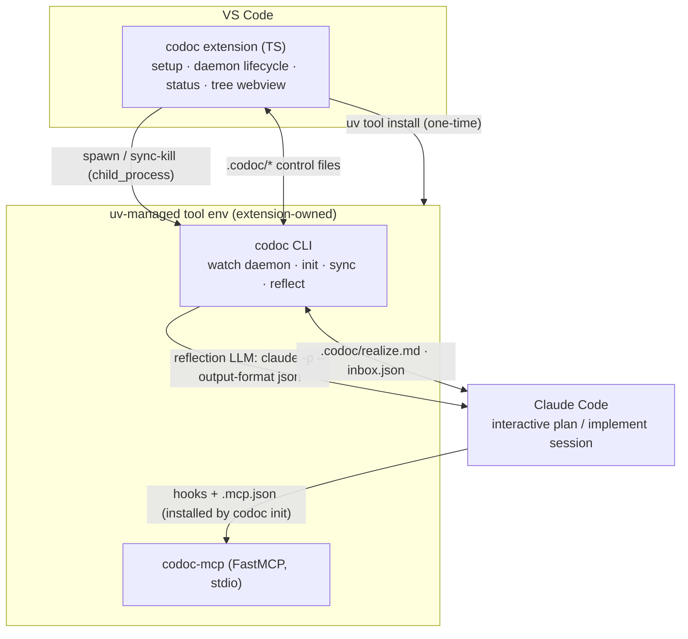
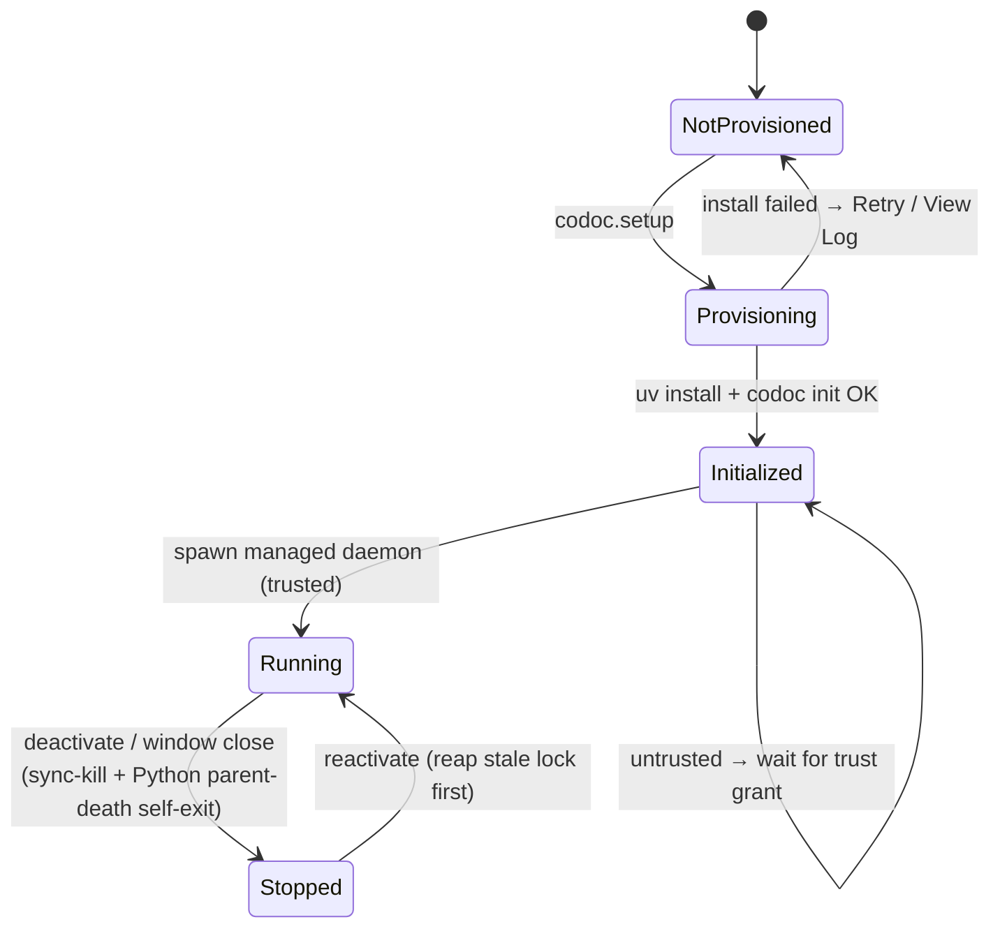

# feat: One-click VS Code setup for codoc

## Summary

Today a new codoc user must: install Python 3.11+, `pip install -e .` (pulling torch / sentence-transformers / lancedb / cocoindex), export `OPENAI_API_KEY` + `CODOC_*` env vars, run `codoc init`, **and** keep a `codoc watch` daemon running in a terminal — all before the VS Code extension is useful. This plan collapses that into **install the extension → click "Set up codoc"**.

The extension provisions the existing Python core into an isolated `uv`-managed tool environment (no manual `pip`, no system-Python assumptions), runs `codoc init` (which already wires the Claude Code plugin: hooks, MCP, skill, commands), routes codoc's *own* reflection LLM calls through the user's **existing Claude credentials** (no separate OpenAI key in the common case), and **owns the `watch` daemon's lifecycle** so the user never starts or stops it. The Python core, the tree format, and both loop algorithms are unchanged.

**In scope:** extension-driven provisioning + onboarding, a `claude` LLM provider for reflection, extension-managed daemon lifecycle, credential bootstrap, packaging the wheel into the VSIX, and the docs rewrite.

**Out of scope (unless explicitly requested later):** porting the Python core to TypeScript; changing the tree format, the two-loop algorithms, or the MCP/hook contracts; publishing codoc to PyPI as a hard dependency; full offline bundling of heavy deps (torch).

---

## Problem Frame

codoc's value (the synced feature tree) is gated behind a multi-tool, multi-process install that reads as "developer-grade setup," not "install an extension." The friction has four distinct sources, each addressed by this plan:

1. **The Python core must be installed** — heavy deps, system-Python variance. → uv-managed provisioning (U2, U3).
2. **Two credentials are required** — an OpenAI-compatible key for codoc's reflection loops *and* Claude for plan/implement. → single Claude auth for reflection, OpenAI as fallback (U1, U5).
3. **A daemon must be run by hand** — `codoc watch` in a terminal, forever. → extension-managed daemon lifecycle (U6).
4. **No in-editor entry point** — the extension never offers to set anything up; it only activates if `.codoc/` already exists. → `codoc.setup` command + Walkthrough (U4, U7).

The architecture is favorable: the extension already talks to the Python side **purely through `.codoc/*` files** (no HTTP server, no port) and already shells out for `codoc.sync`. So "wrap it in the extension" is an *orchestration + provisioning* problem, not a rewrite.

---

## Requirements

- **R1** — A user with only the VS Code extension installed can reach a working codoc (`status.json` = `in_sync`) via a single "Set up codoc" action, with no manual terminal commands.
- **R2** — Setup requires no system Python and no manual `pip`; the Python core runs in an isolated, version-pinned environment the extension provisions and can repair/re-run.
- **R3** — In the common case the user provides **no separate LLM API key**; codoc's reflection calls reuse the user's existing Claude credentials. When that is unavailable, the user is guided to a clear fallback.
- **R4** — The user never manually starts/stops `codoc watch`; the extension manages the daemon and cleans it up on close (no orphaned processes, no multi-window duplicates).
- **R5** — All process-spawning / install behavior is gated behind Workspace Trust and degrades safely (read-only tree navigation) in untrusted/restricted workspaces.
- **R6** — Setup is idempotent and re-runnable; failures surface with logs and a retry path, never a silent broken state.
- **R7** — The existing Python test suites and the loop algorithms remain green and unchanged in behavior.

---

## Key Technical Decisions

**KTD1 — Keep the Python core; the extension provisions it via `uv`.** (Locked with user.) The core is deterministic algorithm code (cocoindex/LanceDB indexing, tree-sitter, embeddings, both loops, the store). `uv tool install` gives an isolated env with a pinned CPython and exposes the `codoc` + `codoc-mcp` console scripts on a discoverable bin dir. *Alternative rejected:* porting the core to TS — months of work, real correctness risk, no user-visible benefit over invisible provisioning.

**KTD2 — Route codoc's reflection LLM through `claude -p`, not the `anthropic` SDK.** A new `CODOC_PROVIDER=claude` shells out to `claude -p --output-format json --max-turns 1 --allowedTools ""` and returns the `.result` text (reusing codoc's existing `parse_solution` JSON extraction — no prompt-contract change). Rationale from research: the subscription OAuth token in the Claude keychain is **not** a general API key the `anthropic` SDK can use; only the `claude` binary resolves that auth. Constraints baked into the implementation: **do not** pass `--bare` (it disables subscription auth), and **scrub `ANTHROPIC_API_KEY`** from the child env (if set, it silently overrides the subscription and bills the wrong account). *Dependency:* subscription billing for headless `claude` is documented to begin **2026-06-15** — see Risks. *Alternative rejected:* `claude_agent_sdk.query()` one-shot — async, agent-loop-shaped, no JSON envelope; heavier than needed for a single completion.

**KTD3 — Keep the warm `watch` daemon, but the extension owns its lifecycle.** The user's instinct ("we don't need watch") is reframed: they shouldn't have to *run* it. The daemon holds expensive warm state (index load, embeddings model, LanceDB) that a per-save cold spawn would re-pay every change-batch. The extension spawns `codoc watch` **non-detached** on activation (trusted + initialized), sync-kills it in `deactivate()`, and the Python daemon additionally **self-exits on parent death** (the belt-and-suspenders against orphaned processes that `deactivate()` alone can't guarantee). A PID/owner lockfile (`watch.py` already writes `.codoc/watch.pid`) enforces single-owner across windows. *Alternative rejected:* per-change one-shot `codoc reflect` driven by the extension's file watcher — simpler lifecycle but re-pays warm-state cost per save. The existing daemon-free fallbacks (Stop-hook reflect, UserPromptSubmit inbox drain) remain the safety net when no daemon is running.

**KTD4 — Setup is extension-driven and deterministic, not a Claude-launched slash command.** The extension runs provisioning + `codoc init` via `child_process` (exit codes, captured logs) wrapped in `window.withProgress`, surfaced through a native **Walkthrough**. This is more reliable than the Atelier-style "launch Claude in the terminal" model (which gives no completion/exit signal) and works *before* Claude is authed. `codoc init` already installs hooks/MCP/skill/commands, so no separate Claude-driven setup step is needed. *Secondary option retained:* a `vscode://codoc.codoc/setup` URI handler + an optional first-run "try it with Claude" nudge.

**KTD5 — Bundle the codoc wheel in the VSIX; fetch heavy deps from PyPI.** The VSIX ships `codoc-<ver>-py3-none-any.whl` and installs it with `uv tool install <wheel>` — pins codoc's version exactly and needs no PyPI publish of codoc itself. Transitive deps (torch via sentence-transformers, lancedb, cocoindex) still resolve from PyPI. *Alternative rejected:* full offline wheelhouse — the cross-platform torch wheel matrix makes it fragile and large.

**KTD6 — Gate all spawning behind Workspace Trust; do not default-on `--auto-realize`.** Declare `capabilities.untrustedWorkspaces: "limited"`; register spawn/install code paths on `workspace.isTrusted` / `onDidGrantWorkspaceTrust`. The managed daemon runs **without** `--auto-realize` (which lands code unattended and has known residuals — no liveness timeout, no Consult-URL allowlist); realization stays in the user's interactive Claude session.

**KTD7 — OpenAI-fallback key: `SecretStorage` is the source of truth, mirrored to a gitignored `.env`.** Because hooks/MCP/daemon are separate processes (and the hooks/MCP are spawned by *Claude Code*, not the extension), an env injected only into the extension's child can't reach them. codoc already calls `load_dotenv(override=True)`, so the extension writes the fallback key into a repo-root `.env` (ensured present in `.gitignore`) and holds the canonical copy in `SecretStorage`. The keyless Claude path (KTD2) avoids this entirely in the common case. *Tradeoff (accepted):* `.env` is plaintext-on-disk in the user's own repo — matches codoc's current documented behavior.

---

## High-Level Technical Design

### Component view — what the extension wraps



The only new runtime edges are **extension → uv/CLI** (provisioning + daemon lifecycle) and **CLI → `claude -p`** (reflection auth). Everything else already exists.

### Setup sequence

```mermaid
sequenceDiagram
  actor U as User
  participant E as Extension host
  participant uv as uv
  participant C as codoc CLI
  U->>E: Click "Set up codoc" (workspace trusted)
  E->>uv: bootstrap uv if absent (standalone installer, UV_NO_MODIFY_PATH=1)
  E->>uv: uv python install 3.11
  E->>uv: uv tool install <bundled codoc wheel>
  uv-->>E: resolve codoc / codoc-mcp paths (uv tool dir --bin); cache in globalState
  E->>C: codoc init (child_process + withProgress)
  C-->>E: .codoc/* created; hooks/MCP/skill/commands wired; status.json written
  E->>E: probe `claude` auth → CODOC_PROVIDER = claude (else OpenAI fallback)
  E->>C: spawn `codoc watch` (managed, non-detached)
  E-->>U: status bar → in_sync; walkthrough step auto-completes
```

### Extension + daemon lifecycle



---

## Output Structure

New/changed files (repo-relative). Per-unit `**Files:**` are authoritative.

```
vscode-codoc/
  bundled/
    codoc-<ver>-py3-none-any.whl     # NEW — shipped in VSIX (U3)
  media/
    walkthrough/setup.md             # NEW — walkthrough step content (U4)
  src/
    setup/
      provision.ts                   # NEW — uv bootstrap + tool install + path resolve (U2)
      credentials.ts                 # NEW — claude-auth probe + OpenAI fallback / SecretStorage (U5)
      paths.ts                       # NEW — cached resolved codoc/codoc-mcp/uv paths (U2)
    daemon/
      daemon-manager.ts              # NEW — spawn/kill, lockfile, trust gating (U6)
    extension.ts                     # MOD — register codoc.setup, URI handler, lifecycle (U4,U6)
    state/workspace-state.ts         # MOD — not-provisioned status, completion context key (U7)
  package.json                       # MOD — walkthroughs, untrustedWorkspaces, commands (U4,U6)
codoc/
  config.py                          # MOD — `claude` provider (U1)
  loop/watch.py                      # MOD — parent-death self-exit (U6)
```

---

## Implementation Units

### U1. `claude` LLM provider in `codoc/config.py`

**Goal:** Let codoc's own reflection/bootstrap completions run on the user's existing Claude credentials, keyless.

**Requirements:** R3, R7.

**Dependencies:** none.

**Files:**
- `codoc/config.py` (modify — add provider branch + `_complete_claude`)
- `tests/agent/test_config_claude_provider.py` (new)
- `README.md` env-var table + `docs/getting-started-claude-code.md` (touched in U8)

**Approach:**
- At the dispatch switch (`complete()`, around `codoc/config.py:70-75`) add `elif config.provider in ("claude", "anthropic"): response_text = _complete_claude(prompt, config)`.
- `get_llm_config()` reads `CODOC_PROVIDER`; when `claude`, default `model` to a Claude alias (e.g. `sonnet`) and ignore `OPENAI_API_KEY`.
- `_complete_claude(prompt, config)`:
  - Discover the `claude` binary (reuse the existing discovery in `codoc/loop/autorealize.py:find_claude`).
  - Build the child env from `os.environ` **minus `ANTHROPIC_API_KEY`** (KTD2); run from a neutral cwd to avoid loading unrelated project context.
  - `subprocess.run([claude, "-p", prompt, "--output-format", "json", "--max-turns", "1", "--allowedTools", ""], capture_output=True, text=True, env=...)`. **Do not** pass `--bare`.
  - Parse stdout JSON; return `payload["result"]` (free-form text) so codoc's existing `parse_solution` (tags/fences/bare JSON) handles extraction unchanged.
  - Detect failure via non-zero exit, `payload["subtype"] != "success"`, or a billing/rate-limit `subtype`; raise a clear, actionable error (which the caller already tolerates).
- Keep `_complete_openai` / `_complete_ollama` intact. The embedder path is untouched (defaults to local sentence-transformers — already keyless).

**Patterns to follow:** the existing provider branch structure in `codoc/config.py`; binary discovery in `codoc/loop/autorealize.find_claude`; the SDK import-guard / failure-tolerance style in `codoc/loop/sdk_realize.py`.

**Test scenarios:**
- Happy path: provider=`claude` → `_complete_claude` invoked; a stubbed `subprocess.run` returning `{"result": "<solution>{...}</solution>", "subtype": "success"}` yields the inner string and `parse_solution` recovers the JSON.
- Env scrub: a preset `ANTHROPIC_API_KEY` is absent from the env passed to the stubbed subprocess; `--bare` never appears in argv.
- Unknown provider still raises `ValueError` (regression on existing branch).
- Failure: non-zero exit / `subtype="error_max_turns"` / billing subtype → raises an actionable error, not a silent empty string.
- `claude` binary not found → raises a clear "claude CLI not on PATH" error.

**Verification:** `python3.11 -m pytest tests/agent/test_config_claude_provider.py` green; existing `tests/` suite unchanged.

---

### U2. uv-based provisioning module (extension)

**Goal:** Install the Python core into an isolated, version-pinned uv tool env with zero manual steps, and cache the resolved executable paths.

**Requirements:** R2, R5, R6.

**Dependencies:** U3 (the bundled wheel to install).

**Files:**
- `vscode-codoc/src/setup/provision.ts` (new)
- `vscode-codoc/src/setup/paths.ts` (new — typed accessors over cached paths in `globalState`)
- `vscode-codoc/src/test/provision.test.ts` (new — pure path/parse logic)

**Approach:**
- `ensureUv()`: probe `uv` (`command -v uv` / `where uv`); if absent, run the standalone installer (`curl -LsSf https://astral.sh/uv/install.sh | sh`, PowerShell variant on Windows) with `UV_NO_MODIFY_PATH=1`; then use the known install path (`~/.local/bin/uv`) directly — **never** rely on PATH being refreshed in the running extension host.
- `provisionCodoc()`: `uv python install 3.11` → `uv tool install --python 3.11 <bundledWheelPath>` (use `'codoc[sdk]'` form against the wheel so the realize SDK engine is available). Wrap in `window.withProgress({location: Notification, cancellable: true})`; pipe stdout/stderr to a `codoc` `OutputChannel`; `child.kill()` on cancellation.
- `resolvePaths()`: capture `uv tool dir --bin` → `codoc` + `codoc-mcp` absolute paths; persist in `context.globalState`; **re-validate with `fs.existsSync` on each activation**, re-resolving if stale.
- Gate the whole module behind `workspace.isTrusted` (caller's responsibility, enforced in U4).
- All shell-outs use `child_process` with explicit `env`; no untrusted input flows into argv.

**Patterns to follow:** Ruff's "managed location + cached absolute path + re-validate" model; `window.withProgress` cancellable pattern; `Memento` (`globalState`) for *resolved* state (never settings.json).

**Test scenarios:**
- Path parsing: given canned `uv tool dir --bin` output, `resolvePaths()` produces correct `codoc`/`codoc-mcp` paths per-platform (Unix vs Windows `.exe`).
- Stale-cache: a cached path failing `existsSync` triggers re-resolution.
- uv-absent branch selects the correct installer command for `process.platform`.
- Cancellation mid-install kills the child and leaves state `NotProvisioned`.
- `Test expectation: none` for the thin `withProgress` wiring (covered by U4 integration/manual run).

**Verification:** `npx vitest run` green for `provision.test.ts`; manual: on a machine without uv, "Set up codoc" provisions and caches both paths (visible in OutputChannel).

---

### U3. Bundle the codoc wheel into the VSIX

**Goal:** Ship a version-pinned codoc wheel inside the extension so U2 can install codoc offline (deps from PyPI).

**Requirements:** R2.

**Dependencies:** none (unblocks U2).

**Files:**
- `vscode-codoc/esbuild.config.mjs` or a new `vscode-codoc/scripts/bundle-wheel.mjs` (modify/new — build wheel, copy to `bundled/`)
- `vscode-codoc/.vscodeignore` (modify — ensure `bundled/*.whl` is *included*, `src`/tests excluded)
- `vscode-codoc/package.json` `scripts` (modify — `prepackage` builds the wheel)
- `vscode-codoc/bundled/.gitkeep` (new)

**Approach:**
- Add a build step that runs `uv build --wheel` (or `python -m build --wheel`) on the repo root and copies the resulting `codoc-<ver>-py3-none-any.whl` into `vscode-codoc/bundled/`. The wheel includes `codoc/plugin/**` (already package-data per `pyproject.toml:45-46`), so hooks/MCP/skill/commands ride along.
- `paths.ts`/`provision.ts` locate the wheel via `context.extensionUri` + `bundled/`.
- Document the deps-from-PyPI tradeoff (KTD5) inline and in U8.

**Patterns to follow:** existing `vscode-codoc/esbuild.config.mjs` build flow; `pyproject.toml` setuptools wheel build.

**Test scenarios:** `Test expectation: none — build/packaging wiring.` Verification is a successful `vsce package` whose VSIX contains exactly one `bundled/codoc-*.whl`.

**Verification:** `npm run build && npx @vscode/vsce package` produces a VSIX containing the wheel; `unzip -l` lists `extension/bundled/codoc-<ver>-py3-none-any.whl`.

---

### U4. `codoc.setup` command + Walkthrough onboarding

**Goal:** A single in-editor entry point that orchestrates provision → init → daemon and teaches the flow.

**Requirements:** R1, R5, R6.

**Dependencies:** U2, U5, U6.

**Files:**
- `vscode-codoc/src/extension.ts` (modify — register `codoc.setup`, `registerUriHandler`, "no `.codoc/` → offer setup" notification)
- `vscode-codoc/package.json` (modify — `contributes.walkthroughs`, `commands` entry for `codoc.setup`, `capabilities.untrustedWorkspaces: "limited"`)
- `vscode-codoc/media/walkthrough/setup.md` (new)
- `vscode-codoc/src/test/setup-orchestration.test.ts` (new — orchestration ordering with mocked steps)

**Approach:**
- `codoc.setup` command (guarded by `workspace.isTrusted`, else prompt to trust): `ensureUv()` → `provisionCodoc()` (U2) → run `codoc init` via the resolved console script (`child_process` + progress; init wires the plugin and writes `status.json`) → `bootstrapCredentials()` (U5) → `startDaemon()` (U6).
- `contributes.walkthroughs` with 2–3 verb-titled steps; each step's button is a `command:codoc.setup`/`command:codoc.openTree` link. Drive step completion via a **context key** set only after `status.json` reports a real state (`onContext:codoc.ready`), not `onCommand` (which would tick even on failure).
- On activation, if the workspace has no `.codoc/` and no cached provisioning, surface a one-line "Set up codoc" notification and open the walkthrough.
- `registerUriHandler` maps `vscode://codoc.codoc/setup` → `codoc.setup` (validate path; never forward URI params to a shell — argument-injection guard).
- Failures: `showErrorMessage(msg, 'Retry', 'View Log')` → re-run or reveal the OutputChannel.

**Patterns to follow:** VS Code Walkthrough UX guidelines (few steps, each actionable, SVG/theme-aware media); the existing command-registration block in `vscode-codoc/src/extension.ts`; `status.json` as a completion beacon (the extension already watches it via `workspace-state.ts`).

**Test scenarios:**
- Orchestration order: with U2/U5/U6 mocked, `codoc.setup` calls provision → init → credentials → daemon in order; a thrown provision step aborts before init.
- Untrusted workspace: `codoc.setup` short-circuits to a trust prompt and spawns nothing.
- No-`.codoc/` activation surfaces the setup notification exactly once (not on every reload).
- Failure path returns to `NotProvisioned` and offers Retry/View Log.

**Verification:** `npx vitest run` green; manual: fresh repo + only the extension → click Setup → walkthrough completes and status bar shows `in_sync`.

---

### U5. Credential bootstrap — single Claude auth + fallback

**Goal:** Default to keyless Claude reflection; fall back gracefully to an OpenAI key when Claude isn't usable.

**Requirements:** R3, R6.

**Dependencies:** U1 (provider exists), U2 (env/`.env` plumbing target).

**Files:**
- `vscode-codoc/src/setup/credentials.ts` (new)
- `vscode-codoc/src/test/credentials.test.ts` (new)
- `.gitignore` (modify — ensure `.env` is ignored if not already)

**Approach:**
- `probeClaudeAuth()`: detect the `claude` binary and a working login cheaply (e.g. presence + a fast `claude -p` capability check, or `claude` config presence). On success, write `CODOC_PROVIDER=claude` (and a Claude model default) into the repo-root `.env` (codoc reads it via `load_dotenv`).
- Fallback: if Claude isn't usable, `showInputBox({password: true, ignoreFocusOut: true, validateInput})` for an OpenAI key → store in `SecretStorage` (canonical) **and** mirror to `.env` as `CODOC_PROVIDER=openai` + `OPENAI_API_KEY=…` (KTD7), because hooks/MCP/daemon are separate processes that read `.env`, not the extension's child env.
- Surface the **2026-06-15** subscription-billing caveat and credit-exhaustion behavior in the Claude path's messaging (link to the support article).
- `onDidChange(secrets)` → rewrite `.env` and signal the daemon to restart (U6) so a key change takes effect.

**Patterns to follow:** "best key is no key — reuse the CLI's auth" (the `gh auth token` model); `SecretStorage` over settings/state; pass secrets via env/file, never argv.

**Test scenarios:**
- Provider selection: Claude usable → `.env` gets `CODOC_PROVIDER=claude`, no key prompt.
- Fallback: Claude unusable + user enters key → SecretStorage stores it, `.env` gets `openai` + key, `.gitignore` contains `.env`.
- Empty/malformed key rejected by `validateInput` before store.
- Key change via `onDidChange` rewrites `.env` and requests a daemon restart.

**Verification:** `npx vitest run` green; manual: with a logged-in Claude, setup writes the `claude` provider and codoc reflection runs with no OpenAI key.

---

### U6. Extension-managed daemon lifecycle (retire manual `codoc watch`)

**Goal:** The extension starts/stops `codoc watch` so the user never does, with no orphaned processes or multi-window duplicates.

**Requirements:** R4, R5.

**Dependencies:** U2 (resolved `codoc` path).

**Files:**
- `vscode-codoc/src/daemon/daemon-manager.ts` (new)
- `vscode-codoc/src/extension.ts` (modify — start on activate/trust, sync-kill on deactivate)
- `codoc/loop/watch.py` (modify — parent-death self-exit; extend `.codoc/watch.pid` with owner metadata)
- `tests/loop/test_watch_parent_death.py` (new)
- `vscode-codoc/src/test/daemon-manager.test.ts` (new)

**Approach (TS):**
- `startDaemon()`: if trusted + initialized and no live owner in the lockfile, `child_process.spawn(codocPath, ['watch', '--root', root], {detached: false, env})`; pipe stdio to the OutputChannel; record owner (window id + PID) in `.codoc/watch.pid`.
- `stopDaemon()` / `deactivate()`: **synchronously** send `SIGTERM` (don't rely on async cleanup completing during host teardown).
- On activate, reap a stale lock (dead PID) before spawning; refuse to spawn if another live window owns it.
- Do **not** pass `--auto-realize` (KTD6).

**Approach (Python):**
- In `codoc/loop/watch.run_watch`, record the parent PID at start (env or `os.getppid()`) and, in the watch loop, **self-exit when the parent dies** (parent PID gone / reparented to init) — the robust defense the research flags, independent of `deactivate()` running.
- Extend the existing `.codoc/watch.pid` write to include owner metadata for the TS lockfile coordination.

**Patterns to follow:** the existing `.codoc/watch.pid` ownership write in `codoc/loop/watch.py`; non-detached spawn + sync-kill + parent-death self-exit + lockfile (the four-part orphan defense from research).

**Test scenarios:**
- Python: a daemon whose parent PID disappears exits its loop within one poll interval (simulate via injected parent-liveness probe).
- Python: `watch.pid` carries owner metadata and is reaped when the recorded PID is dead.
- TS: `startDaemon` is a no-op when a live owner exists; spawns after reaping a stale lock.
- TS: `deactivate` sends SIGTERM synchronously.

**Verification:** `python3.11 -m pytest tests/loop/test_watch_parent_death.py` + `npx vitest run` green; manual: kill VS Code hard → no lingering `codoc watch` process; open two windows on the same repo → one daemon.

---

### U7. Status & first-run UX surfacing

**Goal:** Make provisioning/not-initialized states legible and the walkthrough self-completing.

**Requirements:** R1, R6.

**Dependencies:** U4, U6.

**Files:**
- `vscode-codoc/src/state/workspace-state.ts` (modify — status-bar states + `codoc.ready` context key)
- `vscode-codoc/src/test/status-states.test.ts` (new)

**Approach:**
- Add status-bar states ahead of the existing `status.json`-driven set: `$(rocket) Set up codoc` (no `.codoc/`, not provisioning) and `$(cloud-download) Setting up codoc…` (provisioning).
- Set the `codoc.ready` context key true once `status.json` first reports a valid state, so the Walkthrough step's `onContext:codoc.ready` completes only on verified success.
- Add a `codoc.repair`/re-run command alias to `codoc.setup` for recovery.

**Patterns to follow:** the existing `_updateStatusBar()` in `vscode-codoc/src/state/workspace-state.ts`.

**Test scenarios:**
- No `.codoc/` → status bar shows "Set up codoc"; during provisioning → "Setting up…"; after init → existing `status.json`-driven label.
- `codoc.ready` flips true only after a valid `status.json` is observed (not merely on `codoc.setup` invocation).

**Verification:** `npx vitest run` green; manual: status bar transitions match the lifecycle state machine.

---

### U8. Docs & README rewrite for the one-click flow

**Goal:** Replace the manual quick-start with the extension-first flow and document the new auth/provisioning model.

**Requirements:** R1, R3 (discoverability of the new contract).

**Dependencies:** U1–U7.

**Files:**
- `README.md` (modify — quick-start: install extension → Setup; new `CODOC_PROVIDER=claude` row; uv/auth notes)
- `docs/getting-started-claude-code.md` (modify — extension Setup section; **fix the stale v3 sidecar reference to v4** noted by research)
- `vscode-codoc/README.md` (modify — marketplace-facing setup + Workspace Trust note)

**Approach:** Document: extension install + Setup, the keyless Claude path with the 2026-06-15 caveat + OpenAI fallback, the auto-provisioned uv env (no manual pip), that the daemon is managed (no manual `codoc watch`), and the Workspace-Trust requirement. Keep the CLI path as the "advanced / no-IDE" route.

**Test scenarios:** `Test expectation: none — documentation.`

**Verification:** A new reader can go from "install extension" to a synced tree using only the README; no stale v3 reference remains.

---

## Risks & Mitigations

- **Subscription billing for headless `claude` lands 2026-06-15 (the day after this plan).** The keyless-Claude promise (R3/KTD2) depends on it; before/if unavailable the user hits `billing_error`. **Mitigate:** runtime capability probe (U5) with automatic OpenAI fallback; surface a clear message; re-verify the support article on/after launch before shipping `claude` as the *default* provider. Treat U1 as shippable independent of the default (it's opt-in via `CODOC_PROVIDER`).
- **`claude -p` cold-start latency × frequent reflection calls.** Non-`--bare` startup loads context every call; bootstrap makes one call per file. **Mitigate:** measure on a real repo; consider keeping bootstrap on OpenAI when a key is present while reflection uses Claude (Open Question); the keyless win may justify the latency for steady-state reflection.
- **Claude credit exhaustion mid-month → silent failures.** **Mitigate:** detect billing/rate-limit subtypes in `_complete_claude` and surface, don't swallow.
- **Orphaned daemon / multi-window duplicates.** **Mitigate:** the four-part defense in U6 (non-detached + sync-kill + Python parent-death self-exit + owner lockfile).
- **First-run download weight (torch/sentence-transformers/lancedb + the embedding model).** **Mitigate:** cancellable `withProgress` + OutputChannel; uv's parallel resolver + shared cache; set expectations in docs.
- **Arbitrary code execution via spawn/install.** **Mitigate:** Workspace Trust gating + `untrustedWorkspaces: "limited"` (KTD6, R5); never forward URI params to a shell.
- **`uv tool dir` layout edge-cases across versions / PyPI dep drift.** **Mitigate:** always resolve paths via the uv CLI + re-validate (U2); pin Python and bundle the codoc wheel (U3).
- **Known realize residuals** (no liveness timeout; realize-queue TOCTOU; Consult-URL trust) — see `docs/residual-review-findings/feat-steering-emphasis-links-sdk.md`. **Mitigate:** keep `--auto-realize` off by default (KTD6); realization stays interactive.

---

## Open Questions (resolve during implementation)

- Exact `claude -p --output-format json` envelope fields and `subtype` values on the shipping CLI version — verify `.result` vs `.structured_output` and the truncation/billing markers (do **not** assume; confirm against the installed `claude`).
- Should bootstrap (per-file, many calls) default to OpenAI-when-available while steady-state reflection uses Claude, to dodge cold-start cost? Decide after measuring.
- Windows specifics: uv bin layout (`.exe`, copies-not-symlinks) and a portable parent-death detection (no `os.getppid` reparent semantics) — confirm on a Windows target.
- Whether to also publish codoc to PyPI (would let U2 fall back to `uv tool install codoc` if the bundled wheel is absent) — packaging decision, not blocking.

---

## Sources & Research

- Claude Code authentication & headless docs (credential precedence, `claude -p --output-format json`, `--bare` disables subscription auth, `ANTHROPIC_API_KEY` precedence trap): code.claude.com/docs — Authentication, Headless, Agent SDK (Python).
- "Use the Claude Agent SDK with your Claude plan" (support.claude.com) — the 2026-06-15 subscription-billing cutover, per-plan monthly credit, exhaustion behavior. **Re-verify on/after launch.**
- uv docs (Tools, Installation, Python versions, Storage) — `uv tool install`, standalone installer + `UV_NO_MODIFY_PATH`, `uv tool dir --bin`, pinned `uv python install`, heavy-dep handling.
- VS Code API & UX docs — `window.withProgress` (cancellable), `createTerminal`/`sendText` (no completion signal), `registerUriHandler`, `contributes.walkthroughs` (+ `completionEvents`/`onContext`), `SecretStorage`, `FileSystemWatcher` debounce, Workspace Trust, `deactivate()` cleanup budget.
- Real-world patterns: `astral-sh/ruff-vscode` (bundled binary + cached path + untrusted-workspace fallback), the orphaned-process issue trail (vscode-languageserver-node #726, vscode-remote-release #10730), `gitlab-vscode-extension` walkthrough-as-setup.
- Repo learnings: `docs/residual-review-findings/feat-steering-emphasis-links-sdk.md` (realize liveness timeout, TOCTOU, Consult-URL trust); `docs/getting-started-claude-code.md` (idempotent `codoc init`; stale v3→v4 note).
- Repo seams: `codoc/config.py:49-126` (provider switch), `codoc/loop/watch.py` (daemon + `watch.pid`), `codoc/agent/hook.py` (daemon-free fallbacks), `codoc/agent/install_hooks.py` (plugin wiring, `sys.executable`/`codoc-mcp` resolution), `vscode-codoc/src/extension.ts` + `state/workspace-state.ts` (activation, `.codoc/*` watchers, terminal shell-out), `pyproject.toml:33-46` (console scripts + plugin package-data).
