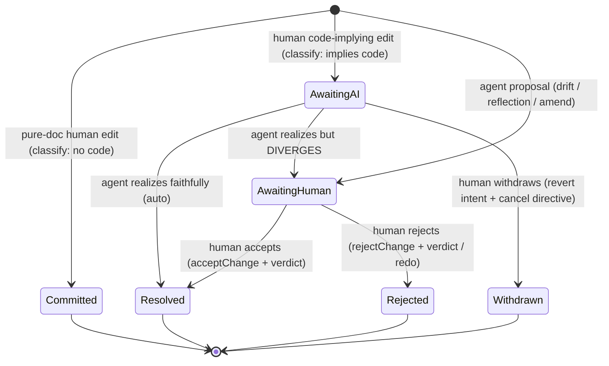
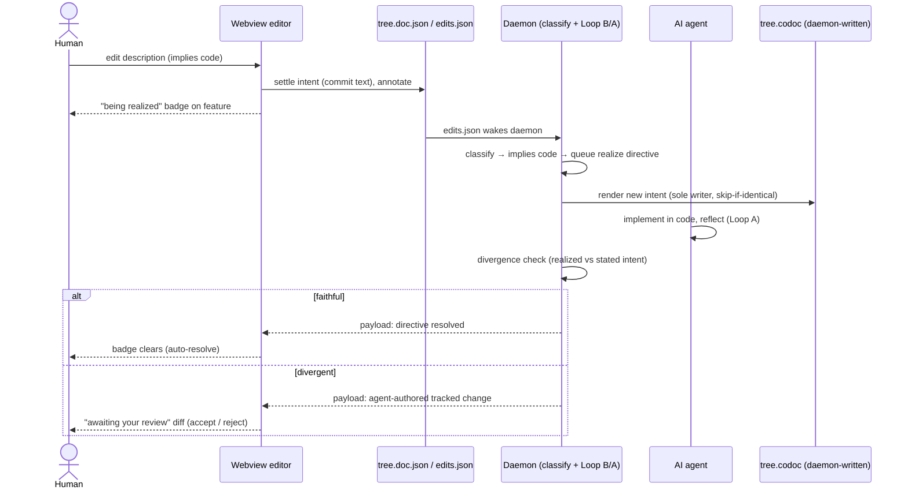
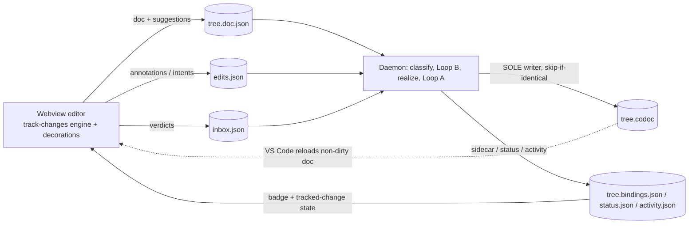

# feat: codoc collaborative editing model

> **Target repo:** this repo (`CodeNav`). All paths repo-relative.
> **Origin:** `docs/brainstorms/2026-06-16-codoc-collaborative-editing-model-requirements.md` — product shape (actors, flows, acceptance examples) confirmed via brainstorm dialogue 2026-06-16.

## Summary

Rebuild the doc-editing/suggesting model on a **vendored, transaction-based tracked-changes engine** so a change from either side — human or AI agent — is a first-class, attributed, negotiable unit. The human just edits (no modes, no pen/pencil); `classify.py` decides per-edit whether it commits (pure-doc) or becomes a code-implying suggestion the agents realize. Unresolved changes wear one of two calm decorations — *awaiting AI realization* or *awaiting your review* — and resolve by the other side, surfacing back only on divergence. `tree.codoc` becomes single-writer (daemon-owned), which removes the save-conflict. The fragile machinery (snapshot text-diff, dual-state-by-caret, `pendingDocAhead`, conditional apply/strip, pen/pencil) is retired.

---

## Problem Frame

The current suggesting feature couples a client-side editing affordance to a file→host→daemon→file round-trip with whole-document replacement, deriving "suggestions" by **text-diffing doc snapshots** (`state/suggestion-model.ts:diffDocsToSuggestions`). Three symptoms, one cause (see origin Problem Frame): the inline diff only shows after the caret leaves a node (dual-state-by-caret in `webview/tiptap/suggestion-decorations.ts`), flickers and vanishes within ~1s (the daemon's Loop B intent-drain auto-applies the doc-ahead suggestion), and saving collides with the daemon's `tree.codoc` write (`"content of the file is newer"` — two uncoordinated writers: `providers/tree-editor.ts` `applyEdit + document.save()` vs `codoc/codoc_file/render.py:write_tree`). The remedy is to move the change state **into the editor as transaction-derived marks** and make `tree.codoc` single-writer.

---

## Requirements (trace to origin)

| ID | Requirement | Origin |
|----|-------------|--------|
| R1 | One editing surface; remove Editing/Suggesting toggle + pen/pencil | origin R1 |
| R2 | Per-edit classification (daemon `classify.py` implies-code): pure-doc commits, code-implying → suggestion | origin R2 |
| R3 | Two unresolved-state decorations: *awaiting AI realization* / *awaiting your review* | origin R3 |
| R4 | Asymmetric visual: human edit = text + badge; agent change = strike/insert tracked diff | origin R4 |
| R5 | Resolution = confirm-only-on-divergence | origin R5 |
| R6 | Bi-directional, resolvable by the other side (human↔agent; agent↔agent serialized) | origin R6 |
| R7 | N-author attribution; multi-agent now, single human; N-author-capable | origin R7 |
| R8 | Single-writer `tree.codoc` (daemon sole writer; webview → `tree.doc.json`) | origin R8 |
| R9 | Tracked changes from real transactions (vendored engine), not snapshot text-diff | origin R9 |
| R10 | Robust structural edits (heading mint, blank-line normalization, delete/restore) | origin R10 |
| R11 | Withdraw/reject reverts intent + cancels queued directive | origin R11 |
| R12 | Concurrency via doc-wins holds | origin R12 |

---

## Key Technical Decisions

- **KTD1 — Vendor `sungkhum/tiptap-track-changes` (MIT) into `vscode-codoc/src/webview/tiptap/track-changes/`** with a `NOTICE`/attribution header. It is transaction-intercepting marks-in-document (converts a deletion of committed text into a `deletion` mark, wraps typed text in an `insertion` mark, with an `appendTransaction` safety net for IME/CJK), zero-runtime-dep (peer `@tiptap/core`/`@tiptap/pm` only — we run 2.27.2), and tested (15 suites incl. multi-author, accept/reject, undo/redo). Exposes `setSuggestMode`/`acceptChange`/`rejectChange`/`acceptAll`/`getBaseText`/`getResultText`/`getTrackedChanges` + an `onStatusChange` callback. Vendor (not npm dep) so we adapt rendering + own the supply chain; keep the engine internals intact (don't fork its logic) and wrap its public API. *Alternative rejected:* `prosemirror-changeset` + DIY decorations (more glue, no accept/reject), and Tiptap Pro Tracked Changes (paid + Yjs-collab-shaped — wrong fit).
- **KTD2 — Marks-engine carries the agent→human direction; human edits commit + badge.** Old+new coexist in the doc only where the human reviews (agent proposals, divergent realizations). The human's own edit commits as their text + a state badge — no strike on your own typing, no cursor-jank, and the daemon classifies asynchronously without flicker. (origin KD2)
- **KTD3 — `tree.codoc` reflects the human's new intent immediately**; the badge means "code is catching up." (origin KD3)
- **KTD4 — Single-writer `tree.codoc`.** The webview's authoritative artifact is `tree.doc.json` (+ `edits.json` intents); the host stops writing `tree.codoc` text; the daemon is the sole renderer and **skips byte-identical writes**. Removes the two-writer mtime race. (origin KD4)
- **KTD5 — Confirm-only-on-divergence** resolution; divergence detected daemon-side (see Open Questions OQ1 for the precise rule). (origin KD5)
- **KTD6 — Async, N-author-capable; no real-time infra.** (origin KD6)
- **KTD7 — Retire the heuristic machinery** (`diffDocsToSuggestions`, dual-state-by-caret, `pendingDocAhead`, conditional apply/strip, pen/pencil re-stamp). (origin KD7)

---

## High-Level Technical Design

### The pending-change lifecycle (state machine)

Every change (either author) is a tracked unit. Human code-implying edits and agent proposals enter from opposite sides; both leave when resolved.



### The realize round-trip (F2 / F3 sequence)



### Writer ownership (component view)



---

## User Flows & Desired Results

This section is the spine — each flow is a result codoc must support, mapped to the units that deliver it. (Flow IDs trace to origin Key Flows.)

- **F1 — Pure-doc edit feels instant.** Rename/reword with no code meaning commits directly, no badge. → U3. *AE1.*
- **F2 — Code-implying edit → realization, no nagging.** Commit + "being realized" badge → agent implements → faithful realization clears the badge silently. → U3, U5. *AE2.*
- **F3 — Divergent realization surfaces back.** Agent did more/other than intended → agent-authored tracked diff in "awaiting your review" → agree/reject. → U4, U5. *AE3.*
- **F4 — Agent proposals reviewed inline.** Drift/reflection/amend renders as a strike/insert diff in place; accept/reject inline (no separate panel). → U4. *AE4.*
- **F5 — Always back-out-able.** Withdraw a pending suggestion (revert + cancel directive); reject an agent change (revert). → U6. *AE5.*
- **F6 — No clobbering (doc-wins).** Human edit on F holds agent reflections on F; agent proposals queue behind the active human edit. → U6.
- **F7 — Multi-agent, attributed.** Agents serialize via the daemon; each change shows its author. → U4, U5 (attribution rides the engine's author marks + the change ledger).
- **F8 — Robust structural edits.** `## ` → exactly one feature; blank lines normalized; delete→retire with clean undo. → U7. *AE6.*
- **Save integrity.** Editing while the daemon runs never conflicts. → U2. *AE7.*

---

## Output Structure

```
vscode-codoc/src/webview/tiptap/
  track-changes/                 # vendored engine (KTD1), adapted
    NOTICE                       # MIT attribution to sungkhum
    extension.ts                 # TrackChanges extension (configured for codoc schema)
    suggest-mode-plugin.ts       # transaction interception (vendored ~unchanged)
    commands.ts                  # accept/reject (vendored ~unchanged)
    marks/{insertion,deletion,format-change}.ts
    helpers.ts                   # getBaseText/getResultText/getTrackedChanges
    types.ts  utils.ts  index.ts
```

The engine is self-contained; codoc-specific wiring (decorations, badge, resolution loop) lives in the existing webview/host files, not inside `track-changes/`.

---

## Implementation Units

Phased: **Foundations** (U1–U2) → **Surface** (U3–U4) → **Negotiation** (U5–U6) → **Robustness & cleanup** (U7–U8).

### U1. Vendor + integrate the tracked-changes engine

**Goal:** Bring the MIT engine in-repo, register it in the codoc schema, and prove serialization round-trips — no behavior wiring yet.
**Requirements:** R9 (foundation), R7 (author attribution surface).
**Dependencies:** none.
**Files:** create `vscode-codoc/src/webview/tiptap/track-changes/**` (vendored + `NOTICE`); modify `vscode-codoc/src/webview/tiptap/schema.ts` (add the extension to `codocExtensions()`, `additionalBlockTypes: ['featureHeading']`); modify `vscode-codoc/src/webview/doc-view.css` (style `ins`/`del` as codoc author-tinted strike/insert); test `vscode-codoc/src/test/track-changes-integration.test.ts`.
**Approach:** Vendor `src/` verbatim (keep its tests' guarantees), add attribution. Configure the extension with codoc's author identity (`AuthorRole`). Map its `ins`/`del`/format marks into codoc's existing color grammar (author ink). Do not yet intercept human edits in anger — just register so the schema builds and helpers are callable.
**Patterns to follow:** existing `codocExtensions()` assembly in `schema.ts`; author-ink tokens in `doc-view.css`.
**Test scenarios:**
- `getSchema(codocExtensions())` builds headlessly with the new marks (no DOM). *Covers R9.*
- A doc with one `insertion` + one `deletion` mark → `getResultText` yields the all-accepted text; `getBaseText` yields the all-rejected text.
- `getTrackedChanges` enumerates both marks with author + changeId.
- Round-trip: `renderTreeFromDoc` over a doc carrying tracked marks still strips them to canonical `tree.codoc` text (no leak).
**Verification:** tsc + vitest green; engine marks render in a manual webview load (struck/inserted, author-tinted); no console errors.

### U2. Single-writer `tree.codoc` (save-conflict fix)

**Goal:** Make the daemon the sole writer of `tree.codoc`; the host stops writing its text; redundant byte-identical writes are skipped.
**Requirements:** R8. **Origin AE7.**
**Dependencies:** none (independent of U1).
**Files:** modify `vscode-codoc/src/providers/tree-editor.ts` (`settleDoc`/`writeTreeWithComments`: persist `tree.doc.json` + `edits.json`, stop the `applyEdit + document.save()` on the `tree.codoc` TextDocument; let the daemon's on-disk write reload the non-dirty doc); modify `codoc/codoc_file/render.py` (`write_tree`: skip `path.write_text` when rendered bytes == on-disk bytes); modify `codoc/loop/reconcile.py` (`safe_write_tree`: honor skip-if-identical); test `vscode-codoc/src/test/single-writer.test.ts` and `tests/loop/test_reconcile.py`.
**Approach:** The webview's authoritative artifact becomes `tree.doc.json` (doc + suggestions) + `edits.json` (intents/annotations). The host signals intent there; the daemon (already watching those) drains via Loop B and renders `tree.codoc` once. `write_tree` becomes a no-op when content is unchanged (kills the mtime bump that races the host). Confirm the CustomTextEditor reloads cleanly when the daemon writes the non-dirty document.
**Execution note:** Start with a failing test reproducing the two-writer mtime race before changing the write path.
**Patterns to follow:** existing `edits.json`/intents channel (`codoc/loop/edits.py`, `src/state/edits-channel.ts`); `safe_write_tree` skip-on-pending-edits logic.
**Test scenarios:**
- `write_tree` with rendered text == on-disk text performs no filesystem write (mtime unchanged). *Covers R8.*
- `write_tree` with changed content writes exactly once.
- Webview settle persists `tree.doc.json` + `edits.json` and does **not** dirty/save the `tree.codoc` TextDocument.
- Integration: a settle followed by a daemon render does not leave the host's TextDocument version stale. *Covers AE7 (save-conflict gone).*
**Verification:** Manual: edit in the webview with `codoc watch` running, repeatedly save — no "content is newer." Python + vitest green.

### U3. One editing surface + classification-driven commit/suggestion

**Goal:** Remove the Editing/Suggesting toggle and pen/pencil; human edits commit immediately; `classify.py` decides pure-doc (no badge) vs code-implying (badge + queued realize).
**Requirements:** R1, R2, R3 (badge half). **F1, F2 (first half). AE1, AE2 (badge).**
**Dependencies:** U2 (commit path writes `tree.doc.json`/`edits.json`).
**Files:** modify `vscode-codoc/src/webview/tiptap/whole-doc-editor.ts` (delete mode toggle + `setSpanMode` pen/pencil + the settle/suggest split; one settle path → intent); modify `vscode-codoc/src/webview/doc-view.ts` (drop mode UI; render the "being realized" badge from payload); modify `vscode-codoc/src/webview/protocol.ts` (payload carries per-feature realization-pending state); modify `codoc/loop/classify.py` only if the implies-code signal needs surfacing to the payload; modify `codoc/loop/loop_b.py`/`status` to expose pending-realization per feature; test `vscode-codoc/src/test/classify-surface.test.ts`.
**Approach:** The webview no longer decides "suggest vs edit" — it always commits the human's intent. The daemon's existing `classify.implies_code` gate (and the queued realize directive) is the source of truth for whether a feature is "awaiting AI"; the payload exposes that per feature and the webview renders a calm badge (tie to `activity.json` phase per OQ2). Pen/pencil authorship marks are removed (authorship rides the engine/ledger).
**Patterns to follow:** `classify.py` is_imperative/implies_code; the existing `activity.json` phase → decoration in `activity-decorations.ts`.
**Test scenarios:**
- Title-only rename classified pure-doc → commits, payload shows no pending state. *Covers AE1.*
- Description edit that implies code → daemon queues a realize directive; payload marks the feature pending; webview shows the badge. *Covers AE2 (badge).*
- The Editing/Suggesting toggle and pen/pencil controls are absent from the toolbar/bubble. *Covers R1.*
- Edge: a code-implying edit then an immediate pure-doc edit on another feature — only the first feature is badged.
**Verification:** Manual: typing a code-implying change shows the badge shortly after (daemon classify); pure-doc edits don't. tsc + vitest green.

### U4. Agent → human tracked changes (review + accept/reject inline)

**Goal:** Render agent-originated changes (drift/reflection/amend proposals) as engine strike/insert marks authored by the agent, in "awaiting your review," with inline accept/reject wired to verdicts. Replaces proposal cards.
**Requirements:** R3, R4, R6. **F4, F7 (attribution). AE4.**
**Dependencies:** U1.
**Files:** modify `vscode-codoc/src/webview/tiptap/suggestion-decorations.ts` (render agent proposals via the engine's marks instead of the diff card; inline ✓/✗); modify `vscode-codoc/src/state/suggestion-model.ts` (map sidecar `proposals` → engine tracked changes authored by the agent, instead of `codeAheadSuggestions` card data); modify `vscode-codoc/src/providers/tree-editor.ts` (inject agent marks into the doc payload); reuse `inbox.json` verdict channel; test `vscode-codoc/src/test/agent-tracked-changes.test.ts`.
**Approach:** A code-ahead proposal (amend/retire/add) becomes agent-authored `insertion`/`deletion` marks in the doc payload (old + new coexist). Accept → engine `acceptChange` + write the `inbox.json` accept verdict; reject → `rejectChange` + reject verdict. Author ink distinguishes which agent (F7). Drop the `ce-diff` card path.
**Patterns to follow:** existing `inbox.json` verdict write (`workspace-state.ts:writeVerdict`); `codeAheadSuggestions` mapping (being replaced).
**Test scenarios:**
- A sidecar `amend` proposal → doc payload carries agent-authored strike(old)/insert(new) marks for that feature. *Covers R4, F4.*
- Accept → `acceptChange` collapses to the new text + an accept verdict is queued. *Covers AE4.*
- Reject → `rejectChange` restores the old text + a reject verdict is queued.
- Two agents' proposals on different features render with distinct author ink. *Covers F7.*
- Integration: accepting an agent change round-trips through `inbox.json` → Loop B → cleared on next payload (no dead click).
**Verification:** Manual: an agent proposal shows inline as a tracked diff; accept/reject behave. vitest green.

### U5. Resolution loop + divergence detection

**Goal:** Close the human→agent loop: faithful realizations auto-clear the badge; divergent ones surface back as agent-authored tracked changes for review.
**Requirements:** R5, R6. **F2 (second half), F3. AE2, AE3.**
**Dependencies:** U3 (badge/pending), U4 (agent tracked-change rendering).
**Files:** modify `codoc/loop/loop_a.py`/`loop_b.py` (after realization, compare the realized/reflected change to the stated intent → faithful vs divergent; stamp via the change ledger `caused_by`); modify `codoc/loop/edits.py`/`status` (emit per-feature resolution outcome); modify `vscode-codoc/src/state/suggestion-model.ts` + `providers/tree-editor.ts` (faithful → drop the badge; divergent → emit agent-authored marks "awaiting your review"); test `tests/loop/test_resolution.py`, `vscode-codoc/src/test/resolution-loop.test.ts`.
**Approach:** Divergence rule (OQ1 default): a realization is **divergent** if the agent touched features/bindings beyond the edited feature, OR the reflected doc change differs from the human's text beyond a threshold, OR the agent flagged ambiguity. Faithful → the badge clears (auto-resolve, no human action). Divergent → reuse U4's agent-authored tracked-change rendering, tagged as "this is what the AI actually did."
**Execution note:** Start from the divergence-classifier as a pure, tested function (intent vs realized) before wiring the loop.
**Test scenarios:**
- Faithful realization (only the edited feature changed, reflected text matches intent) → badge clears, no surfaced change. *Covers AE2.*
- Divergent realization (agent touched an unrelated feature's bindings) → agent-authored tracked change surfaces "awaiting your review." *Covers AE3.*
- Divergence classifier unit tests: same-feature-faithful, touched-beyond-feature, reflected-text-beyond-threshold, ambiguity-flagged.
- Integration: divergent → human rejects → reverts (ties to U6).
**Verification:** Manual: an obviously-faithful edit clears silently; a divergent one surfaces back. Python + vitest green.

### U6. Withdraw / reject + concurrency holds

**Goal:** Let the human back out (withdraw a pending suggestion; reject an agent change), and prevent clobbering via doc-wins holds.
**Requirements:** R11, R12. **F5, F6. AE5.**
**Dependencies:** U3, U4, U5.
**Files:** modify `vscode-codoc/src/webview/tiptap/whole-doc-editor.ts` + `doc-view.ts` (withdraw affordance on the "awaiting AI" badge → revert intent + cancel directive); modify `codoc/loop/edits.py`/`realize` (cancel a queued directive on withdraw); reuse doc-wins holds in `codoc/loop/loop_a.py`/`classify.py`; test `tests/loop/test_withdraw_holds.py`, `vscode-codoc/src/test/withdraw.test.ts`.
**Approach:** Withdraw on a pending human suggestion reverts the feature's intent in `tree.doc.json` and removes the queued realize directive (`realize.json`/`edits.json`). Reject on an agent change is U4's `rejectChange` + verdict. Concurrency reuses the existing **doc-wins holds**: while a feature has an unresolved human edit, code-side ops on it are suppressed (held), and an agent proposal on a feature the human is actively editing queues.
**Patterns to follow:** existing holds (`_doc_intent`/`suppressed_by_hold` in `classify.py`/`loop_a.py`); `edits.py:hold_set`.
**Test scenarios:**
- Withdraw a pending suggestion → intent reverts to baseline and the queued directive is gone. *Covers AE5.*
- Reject an agent change → reverts (U4 path) + reject verdict.
- Doc-wins: a held feature (unresolved human edit) suppresses an incoming code-side amend/retire on it. *Covers F6.*
- Edge: withdraw after the agent already started realizing — directive cancels; partial code work surfaces as a divergent change to review (not silently applied).
**Verification:** Manual: badge → withdraw reverts cleanly; concurrent agent op doesn't clobber an active edit. Python + vitest green.

### U7. Structural-edit robustness

**Goal:** Make outline editing robust: reliable `##` heading mint (no double-add), blank-line normalization between features, clean delete→retire + undo.
**Requirements:** R10. **F8. AE6.**
**Dependencies:** U2 (single-writer footing), U3 (commit path).
**Files:** modify `vscode-codoc/src/webview/tiptap/whole-doc-editor.ts` (carry the title/position-aware mint matching onto the single-writer footing) + `structure-commands.ts`; modify `vscode-codoc/src/state/doc-serialize.ts`/`doc-deserialize.ts` (normalize inter-feature blank lines; keep intra-description paragraph breaks); modify `codoc/codoc_file/parse.py` if normalization must agree on the Python side; test `vscode-codoc/src/test/structural-edits.test.ts`, `tests/codoc_file/test_parse_normalize.py`.
**Approach:** A new `## ` heading mints exactly one feature with a stable id (no duplicate), robust to concurrent restructure. Blank lines between a description and the next heading are cosmetic → normalized away on serialize (don't create features or persist). Deleting a heading is a retire intent; undo before resolution restores cleanly. Ensure webview and Python parsers agree on normalization so the round-trip stays byte-identical.
**Test scenarios:**
- `## New Feature` mid-doc → exactly one feature minted, stable id, no double-add across a settle round-trip. *Covers AE6.*
- Blank lines inserted between two features → normalized; round-trip stable; no phantom empty feature/paragraph.
- Blank line inside a description → preserved as a paragraph break.
- Delete a feature heading then undo → feature restored with the same id; no orphaned bindings.
- Parity: TS and Python parsers produce identical normalized text for the same input.
**Verification:** Manual: add/blank-line/delete/undo behave as expected; no save churn. Parity + vitest + Python green.

### U8. Retire heuristic machinery + finalize decorations

**Goal:** Delete the replaced code paths and finalize the two-state decoration design.
**Requirements:** R3, R9, KD7.
**Dependencies:** U3, U4, U5, U6 (their replacements must be live first).
**Files:** modify/remove in `vscode-codoc/src/state/suggestion-model.ts` (`diffDocsToSuggestions`, `applyDocAheadSuggestions`, `stripDocAheadSuggestions` if no longer used), `vscode-codoc/src/webview/tiptap/whole-doc-editor.ts` (`pendingDocAhead`, dual-state, `actionRange`/lastSelection vestiges that the engine subsumes), `vscode-codoc/src/webview/tiptap/suggestion-decorations.ts` (the `ce-diff` card path), `vscode-codoc/src/webview/doc-view.css` (the `.ce-tc-*`/`.ce-diff` card styles → the calm badge + the engine's tracked-change styling); update `vscode-codoc/src/test/suggestion-model.test.ts`.
**Approach:** Remove dead code only after its replacement is verified live. Finalize per design-taste/minimalist-ui: *awaiting AI* = a calm, low-motion "being realized" badge (tie to activity phase); *awaiting your review* = the engine's author-tinted strike/insert + a quiet inline ✓/✗. Honor the reduced-motion + high-contrast gates already in the CSS.
**Test scenarios:** `Test expectation: none for pure deletions` — but update existing tests so the suite reflects the removed paths; assert the removed exports are gone and decorations render per state.
**Verification:** tsc + full vitest + esbuild green; no references to the removed symbols; the two states render distinctly and calmly.

---

## Scope Boundaries

### Deferred for later (origin)
- Real-time multi-user co-editing — live cursors/presence/CRDT-Yjs + a sync server. The model stays N-author-capable; this is an extension path, not a rewrite.
- Human ↔ human resolution (single human today).

### Outside this product's identity (origin)
- codoc is a local, file-backed, single-author-of-record intent tool with AI agents as collaborators — **not** a Google-Docs-style realtime multiplayer prose editor. The tracked-change UX borrows the look, not the multiplayer infrastructure.

### Deferred to follow-up work (plan-local)
- Per-word accept/reject granularity in the review UI (the engine supports it; the first cut may resolve at feature/region granularity).
- A `codoc_steer`/`codoc_mark_span` MCP tool so agents can author steering notes (pre-existing residual; orthogonal).

---

## Risks & Dependencies

- **Cross-language change (Python daemon + TS host + webview).** U2/U5/U7 span the daemon and the editor; a divergence in normalization or write-ownership reintroduces the round-trip class of bugs. *Mitigation:* parity tests (TS↔Python), single-writer assertion tests, and land U2 before the surface units.
- **The webview cannot be verified by `tsc`/`vitest` alone.** Editor runtime behavior (cursor, decorations, mount) needs a manual Extension-Development-Host pass — this session already shipped a regression (a TDZ in a decoration-config closure) that the test suite couldn't catch. *Mitigation:* each surface unit's Verification names the manual reload + what to observe; treat manual EDH verification as part of "done."
- **Divergence detection is fuzzy (OQ1).** A too-eager rule nags; a too-lax rule lets bad realizations through silently. *Mitigation:* ship the documented default, make it a pure tested function, tune from real use.
- **Vendoring drift.** The engine is a solo MIT project; vendoring (not depending) means we own updates. *Mitigation:* keep internals unforked + the `NOTICE`; the test suite travels with it.
- **Reuses** the daemon, Loop A/B, `edits.json`/intents, doc-wins holds, change ledger, `activity.json` — all present.

---

## Open Questions (resolve in implementation)

- **OQ1 — Divergence rule.** Exact signal set + threshold for "divergent" (touched-beyond-feature / reflected-text-delta / ambiguity-flag). Ship the default in U5; tune from use.
- **OQ2 — Badge ↔ activity coupling.** Precisely how the "being realized" badge derives from `activity.json` phases and the realize-directive lifecycle (U3).
- **OQ3 — codeRef atoms inside tracked changes.** How inserting/deleting an inline `[label](codoc:…)` ref interacts with the engine's node-change tracking (`dataTracked`); verify in U1/U4.

---

## Sources & Research

- This session's grounding: full trace of `vscode-codoc/src/webview/tiptap/whole-doc-editor.ts`, `suggestion-decorations.ts`, `doc-view.ts`, `providers/tree-editor.ts`, and the daemon write path (`codoc/loop/watch.py`, `loop_b.py`, `codoc/codoc_file/render.py`, `codoc/loop/reconcile.py`).
- ProseMirror model (transactions/state/view; decorations): https://prosemirror.net/docs/guide/ ; `prosemirror-changeset` (evaluated, not chosen): https://github.com/ProseMirror/prosemirror-changeset
- Tiptap Tracked Changes (evaluated, rejected — paid + Yjs): https://tiptap.dev/docs/tracked-changes/getting-started/overview
- Vendored engine: `sungkhum/tiptap-track-changes` (MIT), local copy at `repos/tiptap-track-changes`.
- Related prior plan: `docs/plans/2026-06-09-001-feat-codoc-collaborative-doc-ux-redesign-plan.md` (earlier presentation-layer redesign; superseded for the suggesting model by this plan).
