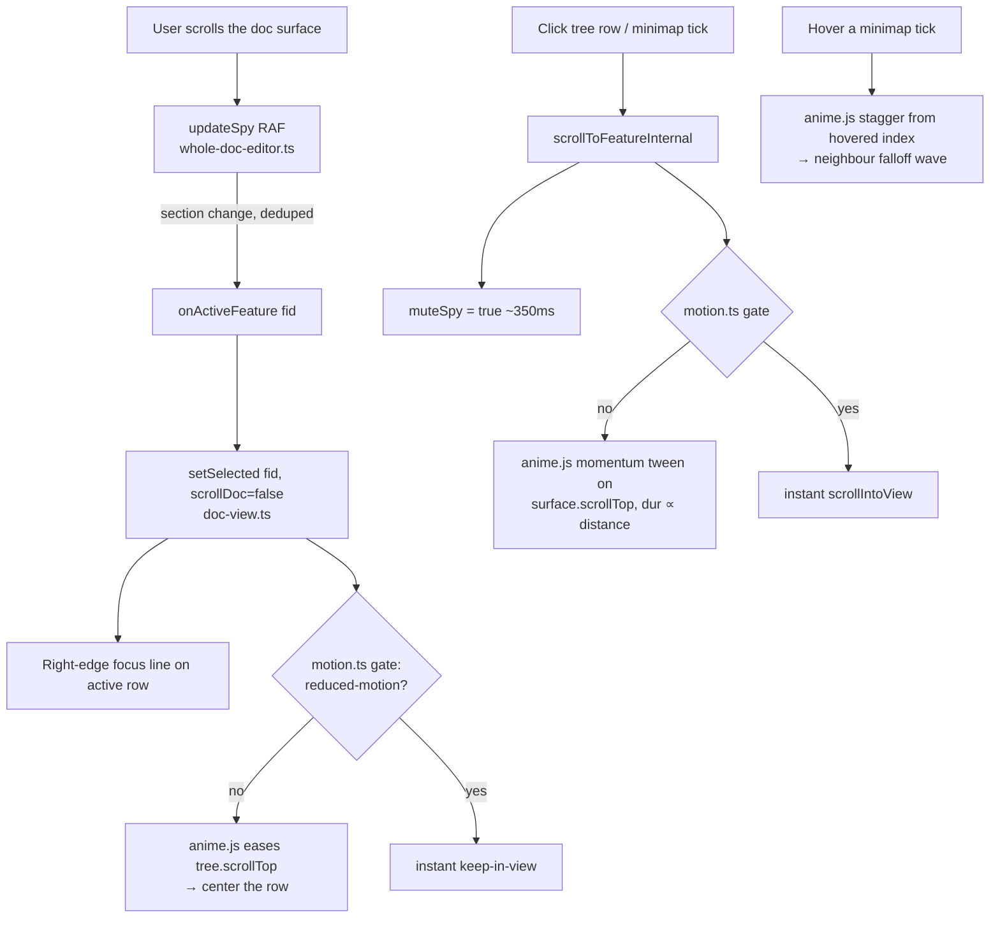

# feat: vscode-codoc webview UX redesign

Make the `Codoc Tree` webview feel alive and considered: the tree pane re-centers on the
feature you're reading as you scroll, motion has momentum, the navigation minimap responds
like a wave under the cursor, the caret never jumps, and every decoration speaks one
in-situ visual language. Scope is **presentation + interaction inside the webview only** —
no loop, daemon, or data-model changes.

Three scope decisions were confirmed with the user up front: **webview-only** (the raw-text
editor's gutter SVGs stay as-is), **continuous re-center** (the active node eases toward
center, your "constantly centered" ask), and **refine in place** (keep VS Code theme tokens
— native, theme-adaptive — and fix the cohesion/hierarchy/motion that reads as "stiff",
rather than introducing custom fonts).

---

## Problem Frame

The webview is the primary surface (`providers/tree-editor.ts` → `webview/doc-view.ts` → a
single whole-doc TipTap editor). It works, but three things make it feel unconsidered:

1. **Navigation is inert.** Scroll-spy already knows which feature you're reading
   (`whole-doc-editor.ts` `updateSpy` → `onActiveFeature`), but the tree pane deliberately
   *does not move* — a code comment calls tree-follows-scroll "the tree keeps scrolling
   jank" and suppresses it (`doc-view.ts:520-525`). The doc itself snaps on programmatic
   nav (`scroll-behavior: auto`, `doc-view.css:329`). Nothing has momentum. The minimap
   (`.ce-toc-rail`) grows one tick on hover with no neighbour response.

2. **The caret is fragile across lifecycle events.** Settle round-trips are handled
   (`setDoc`'s `savedPos` restore), and `retainContextWhenHidden: true` keeps state across
   tab hide/show — but there is **no `getState/setState` anywhere in `src/`**, so closing
   the editor and reopening it, or a full window reload, drops the caret, scroll position,
   selection, and expansion state. Floating surfaces (selection bubble, comment composer)
   use fixed coordinates with no window-resize listener.

3. **Decorations sprawl across many hues and shapes with no single grammar.** Tree badges,
   scroll-spy ticks, phase dots, pending rails/underlines, tracked-change ins/del, diff
   strips, threads lines, hover cards, glance pitches — each was added in its own pass. The
   user can't see the inline code→codoc diff that's supposed to show how an edit propagated
   (the path exists — `agent-proposals.ts` → ins/del marks → CSS — but produces nothing
   visible in practice), and the agent-movement / lifecycle indicators read as noise rather
   than signal.

The design references the user named — `redesign-existing-projects` (audit-first, work with
the existing stack, motion-with-inertia), `ui-ux-pro-max` (150–300ms micro-motion,
transform/opacity only, reduced-motion as a requirement, motion conveys meaning), and
`design-taste-frontend` (motion must be motivated, one accent, no slop) — all point the same
way: refine the existing token-driven system with motivated, gated motion, not a rewrite.

---

## Scope Boundaries

### In scope
- The `Codoc Tree` webview: `webview/doc-view.ts`, `webview/doc-view.css`, the
  `webview/tiptap/*` editor + decoration modules, and the host payload/persistence seams in
  `providers/tree-editor.ts` strictly needed for UI-state restore.
- anime.js v4 as a bundled webview dependency, routed through one motion helper.
- An audit + fix of the inline code→codoc diff rendering, and a cohesion pass over every
  webview decoration.

### Deferred to Follow-Up Work
- A "↻ from code" cue for *auto-applied* small amends — those below `AMEND_SAFE_RATIO`
  (`codoc/loop/apply.py:22`), which never become proposals, so there is no ins/del diff to show.
  U6's audit decides its fate: if code-ahead amend proposals genuinely never reach the payload
  in practice, this cue becomes the primary way to see code→codoc propagation and is promoted
  in-scope; otherwise it stays deferred to its own plan.
- Persisting fine-grained editor undo history across reload (we restore caret + scroll +
  selection + expansion, not the full undo stack).

### Out of scope (non-goals)
- The raw-text editor's gutter SVGs (`media/gutter-*.svg`) and `providers/decoration.ts`,
  `inlay.ts`, `code-lens.ts`, etc. — the secondary surface stays as-is (user decision).
- Any loop/daemon, MCP, Python core, or `.codoc` data-model change.
- Introducing a custom typeface or moving off VS Code theme tokens (user chose refine-in-place).

---

## Requirements

Traceability back to the request. Each maps to one or more Implementation Units.

| ID | Requirement | Units |
|----|-------------|-------|
| R1 | As the document scrolls, the tree pane eases the active feature toward vertical center (continuous re-center), momentum-smoothed. | U1, U2 |
| R2 | A vertical focus line marks the centered/active node on its right edge. | U2 |
| R3 | Programmatic doc navigation scrolls with momentum (anime.js), with duration that scales to travel distance (different speeds). | U1, U3 |
| R4 | Minimap ticks vary width by heading depth; hovering sweeps a wave across neighbouring ticks (stagger falloff). | U1, U4 |
| R5 | The caret does not jump on window resize; floating surfaces reposition. | U5 |
| R6 | Caret, scroll, selection, and expansion state survive close→reopen and full reload. | U5 |
| R7 | All webview decorations resolve into one in-situ, inline language — no extra cards. | U6 |
| R8 | The code→codoc inline diff renders **whenever a code-ahead amend proposal exists**, with a non-color direction label. (Small amends auto-apply below `AMEND_SAFE_RATIO` and never become proposals — U6 audits first and decides the auto-applied case.) | U6 |
| R9 | Agent-movement and lifecycle/stage indicators are intuitive and orthogonal to the diff. | U6 |
| R10 | All motion respects reduced-motion and screen-reader preferences at runtime (correctness, not polish). | U1, U7 |
| R11 | The refresh stays within VS Code theme tokens and preserves the design-system CSS invariants. | U1, U6 |

---

## Key Technical Decisions

**KTD1 — anime.js v4 (`animejs`), routed through one runtime-gated motion helper.**
The user named anime.js (`https://context7.com/websites/animejs/llms.txt`); honor it. The v4
npm package is `animejs` (import `{ animate, createTimeline, stagger, utils }`) — *not*
`anime`. esbuild bundles it into the existing IIFE with no config change (no `external`
field on the webview build). All motion goes through a new `webview/motion.ts` that
**checks `body.vscode-reduce-motion` and `body.vscode-using-screen-reader` at call time and
jumps to the final value instead of tweening** when either is set. This is load-bearing:
VS Code relays reduced-motion as a body class, *not* a reliable media query in the webview,
and a JS tween never sees the CSS gate (grounds: `docs/plans/2026-06-09-001`, KTD4;
`design-system-css.test.ts`).

**KTD2 — Re-center only on the SCROLL-driven spy, never on caret moves.** `onActiveFeature`
is fired from **two** places: `updateSpy` (per scroll, RAF-throttled, deduped on `lastSpyFid`,
guarded by `muteSpy`) **and** `onSelectionUpdate` (per caret/selection change,
`whole-doc-editor.ts:220-225`). Hanging auto-center on `onActiveFeature` blindly would animate
the tree on every keystroke and arrow-press — re-creating the exact "tree keeps scrolling jank"
the codebase deliberately removed (`doc-view.ts:520-525`). So the callback must carry a
`source: 'scroll' | 'selection'`, and **only `source === 'scroll'` re-centers**; a caret move
still just highlights the row. No second scroll listener is added — it would re-trigger the
known `muteSpy` race (grounds: `docs/plans/2026-06-09-001`). Manual tree scroll opens a
`suppressAutoCenter` window so the two don't fight; keyboard tree-nav cancels any in-flight
tween and snaps immediately rather than queuing animations on key-repeat.

**KTD3 — Persist UI state via webview `getState/setState`, restored after the editor settles.**
`retainContextWhenHidden: true` (`extension.ts:553`) already preserves the live DOM across tab
hide/show, so the gap is *disposal* (close→reopen, reload). Serialize `{ selectedId, expanded[],
caretPos, treeScroll, docScroll }` to `vscode.getState()/setState()` (debounced ~400ms) and
restore on first render. Three ordering constraints make this correct: **(a)** the local
`declare function acquireVsCodeApi()` at `doc-view.ts:17` must be widened with
`getState()/setState()` or `tsc` errors (the binding type is local, not `@types/vscode`);
**(b)** expansion + selection are seeded **synchronously before the first `renderAll()`** so the
first paint doesn't flash the expand-all default (`doc-view.ts:629-636`); **(c)** the editor
caret is restored **after** the host's authoritative first-payload `setDoc` settles (the host
reposts on the `ready` handshake — `tree-editor.ts:96-118`) via a new caret-set entry point on
the editor handle — otherwise `setDoc`'s own heading-fallback caret placement
(`whole-doc-editor.ts:776-779`) clobbers the restored position. The host stays the source of
truth for document content.

**KTD4 — Decouple the in-situ diff from the volatile realize/hold lifecycle.** The inline
code→codoc diff must render from the tracked-changes engine's stable baseline and rebuild
**only when the change or baseline actually changes** — never on a no-op daemon pass. The
"being realized" / stage indicator is an *orthogonal* calm signal projected from
`sidecar.holds` that never gates or blinks the diff (grounds: `docs/plans/2026-06-18-001`,
KTD1/U6 — coupling decorations to the per-pass lifecycle is what caused prior flicker and
baseline erosion).

**KTD5 — One decoration grammar: color = who/direction, shape/texture = kind, motion =
liveness.** Keep one structural accent (`--accent` = `--vscode-focusBorder`), the two
directional hues (`--dir-review`, `--dir-await`), and role inks — pure `--vscode-*` tokens
with `color-mix`, color in the stylesheet (not inline, for CSP). Every diff carries a
non-color direction label (`▲ from code` / `▼ your edit`) for colorblind parity. The cohesion
pass must keep all `design-system-css.test.ts` assertions green.

**KTD6 — Verification is a manual Extension-Development-Host (EDH) gate.** Caret, scroll,
flicker, and momentum cannot be observed by `tsc`/vitest/esbuild — two TDZ regressions
shipped invisibly this way before (grounds: `docs/plans/2026-06-18-001`). Testable *logic*
is extracted into pure functions with vitest coverage; the *interaction* is verified through
a documented EDH checklist (U7), rebuilding the bundle and reloading the window before each
check.

---

## High-Level Technical Design

### Navigation + motion loop (R1–R4)

Manual tree scroll sets a short `suppressAutoCenter` window so the spy-driven center doesn't
yank the pane back while the user is dragging the tree scrollbar.

### Decoration taxonomy — the cohesion target (R7–R9)

The unified grammar. Color answers *who/which direction*, shape/texture answers *what kind*,
motion answers *is it live right now*. Lifecycle/stage state is orthogonal to the diff.

| Signal | Meaning | Color (who/dir) | Shape / texture (kind) | Motion (liveness) |
|--------|---------|-----------------|------------------------|-------------------|
| Active feature (scroll-spy) | "you are here" | `--accent` | right-edge focus line | eased center |
| Code→codoc amend | code changed; review it | `--dir-review` | ins underline / del strike + `▲ from code` | static |
| Held / being realized | your edit is queued for the agent | none (status axis) | dashed hollow dot + calm chip | slow breathe (`@keyframes breathe`, 2.6s) |
| Agent editing (now realizing) | agent at work *now* | none | solid dot | pulse (`@keyframes pulse`, 1.4s — faster, reads as live) |
| Agent reflecting | catching up | none | hollow dot | static |
| Unrealized | plan, no code yet | none | italic + dashed ring | static |
| Retired | removed | none | strike | static |
| Comment / steering | note for the agent | `--accent-amend` | dotted underline + anchor | static |
| Add / Move proposal | structural change | `--dir-review` | ghost row + glyph | static |

Directional/diff labels are text, never color-only — satisfies colorblind parity and the
high-contrast floors the test pins.

### UI-state persistence lifecycle (R5–R6)

| Lifecycle event | Today | After U5 |
|-----------------|-------|----------|
| Tab hide / show | preserved (`retainContextWhenHidden`) | unchanged |
| Settle round-trip | caret preserved (`savedPos`) | unchanged (extended, not replaced) |
| Window resize | DOM retained, but bubble/composer keep stale coords | floating surfaces reposition; caret/scroll stable |
| Close → reopen | **lost** (expand-all + first root) | restored from `getState` |
| Full reload | **lost** | restored from `getState` |

State persisted (webview-local, debounced): `selectedId`, `expanded[]`, editor caret
position, tree scroll, doc scroll. Document *content* is never persisted here — the host /
`tree.doc.json` remains authoritative.

---

## Implementation Units

Grouped into phases. Within a phase, units are independent unless a dependency is noted.

### Phase 1 — Motion foundation

#### U1. anime.js dependency + runtime-gated motion helper

- **Goal:** Add anime.js v4 to the webview bundle and centralize every animation behind one
  helper that respects reduced-motion / screen-reader at runtime and exposes shared easing +
  duration tokens.
- **Requirements:** R1, R3, R4, R10, R11.
- **Dependencies:** none (foundation for U2–U4).
- **Files:**
  - `vscode-codoc/package.json` (add `animejs` ^4 to `dependencies`)
  - `vscode-codoc/src/webview/motion.ts` (new)
  - `vscode-codoc/src/test/motion.test.ts` (new)
  - `vscode-codoc/src/webview/doc-view.css` (add `--ease-momentum`, `--dur-nav` tokens beside the existing motion tokens; do not disturb the pinned tokens)
- **Approach:** `motion.ts` wraps `animate`/`createTimeline`/`stagger` from `animejs`. A single
  `prefersReducedMotion()` reads `document.body.classList` for `vscode-reduce-motion` /
  `vscode-using-screen-reader`. Public helpers — `tweenScrollTop(el, to, {duration, ease})`,
  `staggerHover(els, fromIndex, opts)`, and a thin `motionGuard(fn, applyFinal)` — each
  **apply the final value immediately and skip the tween** when the gate is on. Keep the bundle
  growth visible: log `dist/webview/doc-view.js` size before/after in the unit's notes.
- **Patterns to follow:** the existing `--ease-out` / `--ease-spring` / `--dur-*` token block
  in `doc-view.css:42-54`; mirror its naming. Keep all imports tree-shake-friendly
  (`import { animate } from 'animejs'`).
- **Technical design (directional, not spec):** scroll-tween shape from the anime.js v4 docs —
  `animate(proxy, { value: to, duration, ease, onUpdate: () => { el.scrollTop = proxy.value } })`,
  with the gate jumping `el.scrollTop = to` directly when reduced motion is on.
- **Test scenarios** (`motion.test.ts`, vitest node-env — DOM-free pure logic only):
  - `prefersReducedMotion()` returns true when a stubbed `classList.contains('vscode-reduce-motion')` is true; false otherwise. Covers R10.
  - `motionGuard` invokes the apply-final callback (not the tween factory) when the gate is on, and the tween factory when off.
  - Duration helper for nav scales with travel distance: a larger |from−to| yields a longer (clamped) duration than a small one. Covers R3.
  - Wave delay helper returns a symmetric falloff around `fromIndex` (delay increases with index distance), bounded to a max. Covers R4.
- **Verification:** `npx tsc --noEmit` + esbuild clean; `npx vitest run` green including the new
  file and the unchanged `design-system-css.test.ts`; bundle still builds and loads in EDH.

### Phase 2 — Navigation feel

#### U2. Tree pane continuous re-center + right-edge focus line

- **Goal:** As the doc scrolls, ease the active feature's tree row toward vertical center, and
  mark it with a right-edge focus line — reversing the old "don't scroll the tree" suppression,
  done smoothly this time.
- **Requirements:** R1, R2.
- **Dependencies:** U1.
- **Files:**
  - `vscode-codoc/src/webview/doc-view.ts` — the `onActiveFeature` → `setSelected` path (`~:439-444`, `:508-532`); **add a `source: 'scroll'|'selection'` discriminator to `onActiveFeature`** so caret moves don't re-center; add the `suppressAutoCenter` window on manual tree `scroll`/`wheel`; make keyboard `moveCursor` cancel the in-flight tween and snap.
  - `vscode-codoc/src/webview/tiptap/whole-doc-editor.ts` — pass `source` from `updateSpy` (scroll) vs `onSelectionUpdate` (selection) into `onActiveFeature`.
  - `vscode-codoc/src/webview/doc-view.css` (focus-line rule; reduced-motion + high-contrast fallbacks)
  - `vscode-codoc/src/webview/tree-center.ts` (new — pure target math, webview-local) + `vscode-codoc/src/test/tree-center.test.ts` (new)
- **Approach:** Re-center fires **only** on the scroll-driven spy (`source === 'scroll'`), per
  KTD2. Compute the centering scrollTop with the pure
  `centerScrollTarget(rowOffsetTop, rowHeight, viewportHeight, scrollHeight)` (clamped) and call
  `motion.tweenScrollTop` with a **fixed short tween — ~180–240ms, `--ease-out`** (each row change
  is a discrete step, not a journey; distance-scaling is for U3's nav, not here). A **center
  deadband of ±15% of the tree viewport height** makes near-centered rows a no-op so micro-scrolls
  don't jitter. `suppressAutoCenter` is an **~800ms window** opened on manual tree `scroll`/`wheel`;
  a spy-fired center during it is dropped (not queued), and it does **not** apply to
  `revealAncestors`-driven re-renders (those are user-initiated). Keyboard `moveCursor` cancels the
  anime.js controller and snaps. Reduced-motion → `scrollIntoView({block:'center'})` snap.
  **Focus line — avoid the `::after` collision:** the existing dep-spotlight already owns
  `.tree .row.{dep-on,dep-by,dep-focus}::after` as a right-edge 2px rail (`doc-view.css:201-207`),
  so a new `.row.selected::after` would clash on the common selected-and-focused row. Reconcile by
  making the selected focus line a **`box-shadow: inset -2px 0` (or a dedicated `.focus-rail` child
  element)** rather than a third `::after` claimant, or merge into a combined
  `.row.selected.dep-focus::after` rule; pick one and state it in the implementation.
- **Patterns to follow:** the existing right-edge `::after` dependency rails
  (`doc-view.css:201-207`) for geometry + the collision to avoid; the `syncingFromEditor` guard
  (`doc-view.ts:40, 524-525, 529`); the `muteTimer` window idiom (`whole-doc-editor.ts:368`) for
  `suppressAutoCenter`; reduced-motion mirrors `body.vscode-reduce-motion` usage already in the CSS.
- **Test scenarios** (`tree-center.test.ts`, pure):
  - `centerScrollTarget` centers a mid-list row (target ≈ rowTop − (viewport−rowH)/2). Covers R1.
  - Clamps to 0 for a row near the top and to `scrollHeight−viewport` for a row near the bottom (no overscroll).
  - Returns the current scrollTop (no-op) when the row sits within the ±15% deadband, so micro-scrolls don't jitter the pane.
  - A `source: 'selection'` activation does NOT produce a center target (the gate is on source, asserted via the wiring helper). Covers the keystroke-jank guard.
  - `Test expectation: visual (focus line, eased motion)` — covered by U7 EDH scenarios; the focus-line CSS rule is asserted present by a source-level check added to `design-system-css.test.ts`.
- **Verification:** scroll the doc in EDH → the matching tree row eases to center with a
  right-edge line; dragging the tree scrollbar is not yanked back; reduced-motion snaps without
  animation.

#### U3. Momentum document scrolling

- **Goal:** Replace the snap on programmatic navigation with a momentum tween whose duration
  scales to distance.
- **Requirements:** R3.
- **Dependencies:** U1.
- **Files:**
  - `vscode-codoc/src/webview/tiptap/whole-doc-editor.ts` (`scrollToFeatureInternal`, `:359-369`)
  - `vscode-codoc/src/webview/doc-view.css` (`.doc` / `.ce-whole-surface` scroll-behavior note, `:329`, `:494`)
- **Approach:** The scroll container is **`.ce-whole-surface`** (the `surface` element the existing
  scroll-spy already listens on — `whole-doc-editor.ts:417`), *not* the outer `.doc`; tween that
  element's `scrollTop`. Derive the target explicitly (don't use `scrollIntoView`):
  `target = surface.scrollTop + (headingDom.getBoundingClientRect().top − surface.getBoundingClientRect().top) − topInset`,
  where `topInset` aligns the landing with `updateSpy`'s `+72px` active threshold so the section the
  tween lands on is the one the spy marks active. Tween via `motion.tweenScrollTop` with
  `--ease-momentum` and a **distance-scaled duration (clamped ~220–520ms)**. Set the `muteSpy`
  window to **`tweenDuration + 80ms`** (computed per call — not the hardcoded 350ms, which is shorter
  than a long tween and would flicker-select mid-glide); a second nav click **cancels the in-flight
  tween** and resets the window. Reduced-motion → the current instant `scrollIntoView`.
- **Patterns to follow:** the existing `muteSpy`/`muteTimer` guard (`whole-doc-editor.ts:357-369`)
  — replace the fixed `350` with the computed window; `scrollToFeature` (`:824`) already calls this
  with `smooth=false` — momentum becomes the new "smooth" path while reduced-motion keeps the snap.
- **Test scenarios** (`whole-doc-editor` wiring — pure helpers only; DOM interaction in U7):
  - Reuses U1's distance→duration helper (asserted there). Covers R3.
  - The mute-window helper returns `tweenDuration + 80` for a given duration (so the window always covers the glide).
  - `Test expectation: interaction` — momentum smoothness, lands on the correct heading (spy marks it active), no neighbour flicker mid-tween, second-click cancel, and reduced-motion snap verified in U7.
- **Verification:** click a far minimap tick / tree row in EDH → the doc glides with momentum and
  lands on the heading; exactly one section ends up active; reduced-motion jumps instantly.

#### U4. Minimap wave hover + depth-scaled ticks

- **Goal:** Make the right-edge `.ce-toc-rail` legible and tactile: tick width reads heading
  depth, and hovering sweeps a wave across neighbouring ticks.
- **Requirements:** R4.
- **Dependencies:** U1.
- **Files:**
  - `vscode-codoc/src/webview/tiptap/whole-doc-editor.ts` (`rebuildRail`, `:370-388`; add hover wiring)
  - `vscode-codoc/src/webview/doc-view.css` (`.ce-toc-rail` / `.ce-tick`, `:606-622`)
- **Approach:** Keep one tick per heading. Strengthen the depth taper (width by `--d`) so nesting
  reads at a glance — keep `scaleY(2.2)` as the active-tick emphasis but drive the wave on the
  horizontal axis so the two don't compete. On `mouseover` of a tick, run `motion.staggerHover`
  over a **bounded band of ±3 ticks** from the hovered index, using the wave-delay helper from U1
  (delay grows with index distance, ~30ms/step). Concrete shape: hovered tick `scaleX≈1.6` /
  `opacity 1`, first neighbour ~`1.35`, second ~`1.18`, third ~`1.06`, falling off; per-tick
  duration **~120ms**; on `mouseleave` the whole band settles back together. Keep the active
  ("you are here") tick visually dominant throughout. Reduced-motion → the current single-tick
  hover only (no neighbour wave).
- **Patterns to follow:** the existing `.ce-tick:hover { transform: scaleY(2.2) }` and `--d`
  width taper (`doc-view.css:612-619`) — replace the single-tick growth with the staggered band;
  reuse `tickByFid` ordering from `rebuildRail` to find neighbours.
- **Test scenarios:**
  - Wave-delay symmetry/falloff asserted in U1's `motion.test.ts`. Covers R4.
  - `Test expectation: interaction` — wave sweep on hover, depth-readable widths, reduced-motion fallback verified in U7.
- **Verification:** sweep the minimap in EDH → a wave ripples out from the cursor; tick widths
  visibly encode depth; the active tick stays clearly marked; reduced-motion shows only the plain
  hover.

### Phase 3 — Stability + cohesion

#### U5. Caret + UI-state stability hardening

- **Goal:** The caret holds through window resize, and selection/scroll/caret/expansion survive
  close→reopen and full reload.
- **Requirements:** R5, R6.
- **Dependencies:** none (independent of motion units).
- **Files:**
  - `vscode-codoc/src/webview/doc-view.ts` (widen the local `acquireVsCodeApi` declaration at `:17` with `getState/setState`; seed state synchronously before `renderAll` replacing `:629-636`; restore caret after first `setDoc`; window `resize` listener)
  - `vscode-codoc/src/webview/tiptap/whole-doc-editor.ts` (expose `getCaretPos()/setCaretPos()` on the handle; reposition floating surfaces on resize, extend `:715-725`)
  - `vscode-codoc/src/webview/tiptap/suggestion-decorations.ts`, `comment-decorations.ts` (route their fixed-coord popups through the shared resize reposition)
  - `vscode-codoc/src/webview/ui-state.ts` (new — pure serialize/deserialize, webview-local) + `vscode-codoc/src/test/ui-state.test.ts` (new)
- **Approach:** Add `serializeUiState/deserializeUiState` (pure, validated, version-tagged). In
  `doc-view.ts`, write state to `vscode.setState()` on selection/expansion/scroll change
  (**debounced ~400ms**) and read it **synchronously before the first `renderAll()`** to seed
  `selectedId`/`expanded`/scroll instead of the expand-all default (so the first paint doesn't
  flash all-expanded); restore the editor caret **after** the host's first-payload `setDoc` settles
  via the new `setCaretPos()` handle method, so `setDoc`'s heading-fallback doesn't clobber it
  (KTD3). Add ONE shared `repositionFloatingSurfaces()` invoked from a `window` `resize` listener
  that re-anchors **all four** fixed-coordinate surfaces — selection bubble, comment composer
  (`coordsRect` recomputed live from `composeRange`; dismiss if it returns null), the suggestion
  popup (`suggestion-decorations.ts:276`), and the comment hovercard content
  (`comment-decorations.ts:87`) — and is a no-op when none are open. Extend — do not replace — the
  existing `savedPos` restore and `syncingFromEditor` gate.
- **Execution note:** Characterize first — before touching `setDoc`/restore, add the pure
  `ui-state` round-trip tests and confirm the existing settle-round-trip caret behavior still
  holds, so this hardening doesn't regress the just-merged `savedPos` fix.
- **Patterns to follow:** `getState/setState` is absent today — follow the standard VS Code
  webview pattern (state is a plain JSON object). Mirror the existing per-workspace prefs seam
  (`tree-editor.ts:181-197`) for shape, but keep this webview-local (not workspaceState). Reuse
  `coordsRect`/`updateBubble` (`whole-doc-editor.ts:540-552, 586-594`) for reposition.
- **Test scenarios** (`ui-state.test.ts`, pure):
  - Round-trips `{ selectedId, expanded[], caretPos, treeScroll, docScroll }` losslessly. Covers R6.
  - Deserialize tolerates missing/extra/legacy fields and a null prior state → safe defaults (no throw). Covers R6.
  - A selectedId no longer present in the payload is dropped on restore (mirrors `doc-view.ts:627`).
  - `Test expectation: interaction` — resize keeps the caret and repositions all four floating surfaces; close→reopen and reload restore caret+scroll+selection, and the restored caret is NOT clobbered by the first `setDoc` (distinguish "restored" from "fell back to heading") — verified in U7.
- **Verification:** in EDH — type mid-document, resize the window → caret stays put, bubble (if
  open) follows; close the editor and reopen → same feature selected, same scroll, caret near
  where it was; reload the window → same.

#### U6. Decoration cohesion pass + inline code→codoc diff fix

- **Goal:** Resolve every webview decoration into the single grammar (color=who/dir, shape=kind,
  motion=liveness), make the code→codoc inline diff actually render with a non-color direction
  label, and make agent-movement vs lifecycle/stage indicators orthogonal and intuitive.
- **Requirements:** R7, R8, R9, R11.
- **Dependencies:** none (can land in parallel with Phase 2; independent CSS/decoration surface).
- **Files:**
  - `vscode-codoc/src/webview/doc-view.css` (consolidate the decoration rules; add direction labels; keep all pinned invariants)
  - `vscode-codoc/src/webview/tiptap/suggestion-decorations.ts`, `activity-decorations.ts`, `hold-decorations.ts` (align to the taxonomy; ensure rebuild-on-real-delta only)
  - `vscode-codoc/src/state/agent-proposals.ts`, `vscode-codoc/src/state/suggestion-model.ts` (audit the code-ahead amend path)
  - `vscode-codoc/src/providers/tree-editor.ts` (`buildPayload` `:400-460` — confirm the suggestion list is populated for code→codoc amends)
  - `vscode-codoc/src/test/decoration-grammar.test.ts` (new, source-level) + extend `vscode-codoc/src/test/agent-tracked-changes.test.ts`
- **Approach:**
  1. **Audit the diff gap FIRST — the verdict gates the rest (R8).** Trace why
     `payload.suggestions` yields no rendered ins/del: the path is
     `sidecar.proposals.by_feature[fid] {op:'amend'}` → `buildSuggestions` → `codeAheadSuggestions`
     (`direction:'code-ahead', kind:'amend'`) → `agentAmendsFrom` filter → `applyAgentProposals`
     marks → CSS. The audit produces an explicit verdict between two cases: **(i)** a genuine bug
     drops code-ahead amend proposals before they reach the payload → fix the path; **(ii)** by
     design, small amends auto-apply below `AMEND_SAFE_RATIO` (`codoc/loop/apply.py`) so most
     code→codoc updates never become proposals → R8 is satisfied for the *proposal* case (large
     amends render the diff), and the **auto-applied case is covered by promoting the deferred
     "↻ from code" cue in-scope** (the Deferred section's contingency). Either way, render the
     existing/fixed diff with a non-color `▲ from code` label so direction reads without hue.
  2. **Orthogonal lifecycle (R9, KTD4).** Keep the "being realized" chip/dot projected from
     `sidecar.holds`, never gating or blinking the diff; ensure decorations rebuild only when the
     change/baseline actually changes — note the per-decoration `set*` setters dispatch a meta
     transaction on every host repost (`whole-doc-editor.ts:786-822`), so guard each builder to
     no-op when its input is unchanged (the `setDoc` `proposalsSig` guard at `:741-743` covers the
     doc reload but not these).
  3. **Cohesion (R7).** Reconcile hues/shapes to the taxonomy table; collapse redundant accents;
     prefer in-situ inline marks over floating cards where a card adds nothing.
  4. **High-contrast floors (R11).** Every NEW signal added by this redesign gets an explicit HC
     rule beside the existing `body.vscode-high-contrast` floors: the U2 focus line (full-opacity
     fill or `outline: 1px solid var(--vscode-contrastBorder)`, not a low-% color-mix), the U4 wave
     ticks (degrade to a solid `var(--vscode-foreground)` without opacity reduction — low-opacity
     tints vanish in HC), and the `▲ from code` diff label.
- **Patterns to follow:** the design language in `docs/plans/2026-06-09-001` (color=who/direction,
  decoration=kind; one structural accent); the engine-baseline decoupling in
  `docs/plans/2026-06-18-001` (U6); the existing ins/del CSS (`doc-view.css:425-442`) and the
  `agentAmendsFrom` filter (`agent-proposals.ts:107`).
- **Test scenarios:**
  - `agent-tracked-changes.test.ts` (extend): given a code-ahead amend suggestion, `applyAgentProposals` injects ins/del marks carrying `changeId` + `authorId`; an empty/auto-applied amend list injects none (documents the by-design no-diff case). Covers R8.
  - `decoration-grammar.test.ts` (source-level, like `design-system-css.test.ts`): the diff carries a non-color direction label class; lifecycle/hold classes are distinct from change-mark classes; no decoration rule reintroduces a per-op rainbow hue. Covers R7, R9.
  - `design-system-css.test.ts` stays green (tokens, reduced-motion gate, HC floors, neutral human ink, L3 not uppercase). Covers R11.
  - `Test expectation: visual cohesion` — the actual "feels cohesive / diff is visible" judgment is a U7 EDH scenario.
- **Verification:** in EDH, trigger a code→codoc change (edit a bound symbol, let Loop A run) → the
  amend renders as an inline word-level diff with a `▲ from code` label; the held/realizing
  indicator sits beside it without blinking the diff; no decoration flickers on an idle daemon pass.

### Phase 4 — Verification

#### U7. Interaction-hardening acceptance gate (manual EDH)

- **Goal:** A documented, repeatable EDH checklist that catches the caret/scroll/flicker/motion
  regressions automated tooling cannot.
- **Requirements:** R1–R10 (interaction verification).
- **Dependencies:** U2, U3, U4, U5, U6.
- **Files:**
  - `docs/edh-interaction-checklist-webview-ux.md` (new — repo-root `docs/` tree, where verification artifacts live; `vscode-codoc/docs/` does not exist)
- **Approach:** Enumerate concrete pass/fail checks, each preceded by "rebuild `dist/webview/
  doc-view.js` and reload the EDH window." Cover: tree re-centers on scroll (R1) with the
  right-edge focus line (R2); **typing and arrow-nav inside the editor do NOT move the tree** (the
  keystroke-jank guard — the most important regression check); momentum doc scroll lands on the
  correct heading (R3); minimap wave + depth widths (R4); caret stable on resize with all four
  floating surfaces repositioned (R5); close→reopen and reload restore state, caret "restored" not
  "fell back to heading" (R6); decorations cohesive and the code→codoc diff visible with its
  `▲ from code` label when a proposal exists (R7, R8); lifecycle indicator orthogonal, no
  idle-pass flicker (R9); **toggle "Reduce Motion" and screen-reader → every animation suppressed
  and the scroll-spy auto-select calmer** (R10); **high-contrast theme → the new focus line, wave
  ticks, and diff label all stay legible** (enumerate each new element, not just "looks fine").
  Plus one **aesthetic verdict gate distinct from the per-R checks**: a before/after side-by-side
  the user signs off on, explicitly answering "does this read as *more considered*, or just busier
  / more noise?" — so the subjective "feel alive and considered" goal has a falsifiable pass, not
  just green behavior checks.
- **Execution note:** This is the "done" gate, not optional polish — mirror the prior plan's U7.
- **Test scenarios:** `Test expectation: none — this unit IS the manual verification artifact;`
  the automated coverage lives in U1/U2/U5/U6 pure-logic + source-level tests.
- **Verification:** every checklist item passes on a fresh EDH build, including the reduced-motion
  and high-contrast passes.

---

## Risks & Mitigations

| Risk | Likelihood | Impact | Mitigation |
|------|-----------|--------|------------|
| anime.js tweens ignore reduced-motion (CSS gate doesn't reach JS). | High if unguarded | A11y regression | KTD1 — every tween goes through `motion.ts`'s runtime body-class gate; U7 explicitly toggles the pref. |
| Auto-center fires on caret moves (typing/arrow-nav), re-creating the very keystroke jank the codebase removed. | High if naive | Headline regression | KTD2 — `onActiveFeature` carries a `source`; only `source==='scroll'` re-centers; keyboard nav snaps + cancels in-flight tween. U7 makes this an explicit check. |
| Continuous re-center fights manual tree scrolling (the original "jank" returns). | Medium | Annoying | `suppressAutoCenter` ~800ms window on manual scroll/wheel; ±15% center-deadband no-op; reduced-motion snap. |
| Re-center re-triggers the `muteSpy` scroll-spy race. | Medium | Wrong active node | KTD2 — hang off the existing `onActiveFeature`, no second listener; reuse `muteSpy`. |
| Bundle size grows from anime.js. | Low–Med | Slower webview load | Measure before/after in U1; anime.js v4 is modular — import only `animate`/`stagger`/`createTimeline`. |
| The "missing diff" is by-design (auto-applied small amends), so a "fix" finds nothing to fix. | Medium | Misframed work | U6 audits first and documents the no-diff-by-design case; the deferred "↻ from code" cue covers auto-applied propagation if wanted. |
| Webview interaction regressions ship invisibly (no tsc/vitest coverage). | High without a gate | Silent breakage | KTD6 / U7 manual EDH gate; extract testable logic into pure functions. |
| CSS refactor breaks a pinned `design-system-css.test.ts` assertion. | Medium | Red tests | Treat the test as the contract; run it after every CSS edit; never remove the body-class gate or token definitions. |
| `getState/setState` restores a stale selection no longer in the payload. | Low | Confusing restore | `ui-state` deserialize validates against the live payload (drop unknown ids), mirroring `doc-view.ts:627`. |

---

## System-Wide Impact

- **Affected surface:** the webview only. No host behavior changes except a webview-local
  state seam; the document/`tree.doc.json`/loop pipeline is untouched.
- **New dependency:** `animejs` enters the webview bundle (browser IIFE). No host-side dep.
- **Build/CI:** `npx tsc --noEmit`, esbuild, and `npx vitest run` must stay clean; the new pure
  modules add real coverage. Interaction coverage is manual (U7) by necessity.
- **Accessibility:** reduced-motion, screen-reader, high-contrast, and colorblind parity are
  first-class acceptance criteria, not afterthoughts.
- **Users:** anyone using the Codoc Tree editor — the change is visible and tactile on first open.

---

## Sources & Research

- **anime.js v4 API** (user-named: `https://context7.com/websites/animejs/llms.txt`) — package
  `animejs`; `animate`/`createTimeline`/`stagger`/`utils`; numeric/scrollTop tween via `onUpdate`;
  spring + ease functions; `stagger(…, { from })` for the wave. Shaped KTD1, U1, U3, U4.
- **`docs/plans/2026-06-09-001-feat-codoc-collaborative-doc-ux-redesign-plan.md`** — reduced-motion
  must gate on `body.vscode-reduce-motion` (media query unreliable in webview); "color =
  who/direction, decoration = kind"; the minimap-as-position-map spec; scroll-spy `muteSpy` race.
  Shaped KTD1, KTD2, KTD5, U4, U6.
- **`docs/plans/2026-06-18-001-feat-insitu-suggesting-mode-plan.md`** + its requirements doc —
  the just-merged `savedPos` caret fix and `syncingFromEditor` scroll-gate; decouple decorations
  from the volatile realize/hold lifecycle; webview regressions are invisible to tsc/vitest →
  manual EDH gate. Shaped KTD4, KTD6, U5, U6, U7.
- **Codebase recon** — `extension.ts:553` (`retainContextWhenHidden`), no `getState/setState` in
  `src/`, `esbuild.config.mjs` (IIFE, deps bundled), `design-system-css.test.ts` (pinned CSS
  invariants), and the full diff pipeline (`agent-proposals.ts` → ins/del marks → CSS). Shaped
  KTD3, KTD5, U5, U6.
- **Design skills** — `redesign-existing-projects` (audit-first, inertia/spring motion, work with
  the stack), `ui-ux-pro-max` (150–300ms, transform/opacity, reduced-motion, motion-conveys-
  meaning, 60fps budget), `design-taste-frontend` (motion must be motivated, one accent, no slop).
