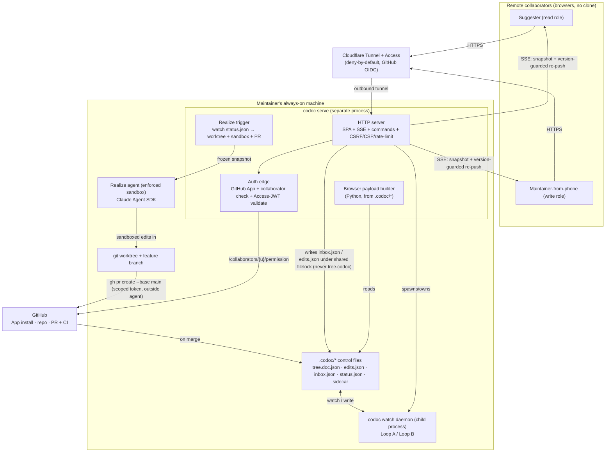

# feat: Deployed codoc — remote GitHub-authorized suggestion surface (Tier 1)

## Summary

Add a `codoc serve` home-hub: a long-lived web server that **supervises the `codoc watch` daemon as a separate process** (peer to the VS Code extension) and exposes the existing intent-tree editor to GitHub-authorized remote users over a tunnel. Remote contributors suggest edits and comments; code-implying edits are held safe-by-default as drafts; the maintainer hands them off; the server's realize trigger runs the local agent in an **enforced sandbox** on a git worktree and opens a code PR. The suggester watches suggestion status progress live; the tree's bindings catch up when the PR merges. The server is a new file-channel client — it writes only the verdict/draft channels (under a lock shared with the daemon) and never `tree.codoc`, so the existing loops stay structurally untouched.

---

## Problem Frame

codoc is a local, single-author-of-record tool: the only way to steer the tree is the VS Code extension on a checkout, with the daemon and a coding agent alive on that machine. That excludes a contributor on another continent (who would have to clone), a non-coder teammate (who owns intent but not an IDE), and the maintainer away from their box. Those people can file an issue or open a PR, but only at the code/text altitude — none can operate at the *intent* altitude, which is codoc's wedge.

The 2026-06-16 collaborative-editing model parked this as a deferred extension path and deliberately built the AI-collaboration plumbing (change ledger, holds, per-author attribution, `tree.doc.json` authority) N-author-capable so it could be added without a rewrite. This plan executes the Tier-1 slice of that path (see origin: `docs/brainstorms/2026-06-19-deployed-codoc-collaborative-suggestion-requirements.md`).

The architectural delta is real: the extension is documented as "File-based; no HTTP server, no port." This plan introduces the first networking layer and the first external identity boundary in the repo — but bolts the server onto the existing *file channels* as a separate process, not into the daemon, so the single-writer contract that fixed the save-conflict is preserved rather than reopened.

---

## Key Technical Decisions

Research and an adversarial security + architecture deepening pass, then a multi-persona document review, were load-bearing — the codebase has zero local patterns for serving, auth, tunneling, or git/PR, so most KTDs are grounded in external findings and an analysis of the existing daemon/file-channel internals.

- KTD1. **The web surface is a new file-channel client, peer to the VS Code extension and MCP server.** It reads the `.codoc/*` control files to derive the browser UI and writes `inbox.json` (verdicts) + `edits.json` (`drafts`/`intents`/`steers`/`cancellations`) to feed the loops. It never writes `tree.codoc`. *Caveat:* those write channels were only ever single-host-safe — a second concurrent writer needs a lock (see U5). *Why:* preserves the single-writer fix; a remote browser is a second front-end of the same contract (`codoc/loop/watch.py:292`).

- KTD2. **Server runtime: a separate process that supervises the daemon and owns the deliberate realize trigger; the daemon is NOT co-hosted in-process.** The deepening pass showed the daemon's hot path is synchronous and blocking (index re-read + a synchronous tree-update LLM call), so running the server inside it would starve every SSE heartbeat and inbound POST during a pass and force an async rewrite of the daemon's core loop. The extension already proves the separate-process file-channel pattern (`vscode-codoc/src/daemon/daemon-manager.ts`). The server spawns/owns the daemon, watches `.codoc/*` to push state to browsers, accepts HTTP POST for commands, and — because the deployed hub has no interactive session attached — **owns the realize trigger itself** (it watches `status.json` for handed-off, snapshot-verified directives and drives the worktree+sandbox+PR flow), rather than relying on the daemon's `--auto-realize` fallback (which is disabled here, see KTD7).

- KTD3. **Browser front-end reuses the existing webview bundle behind a `HostBridge` transport shim; the `protocol.ts` union is the wire contract verbatim.** The webview bundle is already a browser IIFE; the only host coupling is `acquireVsCodeApi()`. Two `HostBridge` implementations (VS Code `postMessage` / network) select at boot. The standalone shell replaces the stripped VS Code CSP nonce with its **own strict CSP** (see KTD5). Stay on TipTap v2 (2.27.2) — a v3 upgrade is orthogonal and must not be bundled in.

- KTD4. **Auth: a GitHub App with the authorization-code + PKCE web flow as the primary login (device flow only for genuinely headless cases).** The visitor's identity comes from a user access token; the collaborator-permission check runs with the maintainer/installation identity against `GET /repos/{owner}/{repo}/collaborators/{username}/permission` (the endpoint needs the *caller* to have push access, so it cannot use the visitor's token). `permission ∈ {write, admin}` → hand-off authority; `read` → suggest-only. Sessions are server-side, HTTP-only, `Secure`, `SameSite` cookies — **not** tokens in `localStorage`; the server-side token cache is mode `0600` + encrypted/keychain. *Why:* least privilege, short-lived rotating tokens, no standing non-expiring secret on a home machine, and device-flow-on-a-shared-link is a code-phishing vector for a remote surface.

- KTD5. **Exposure + web-boundary hardening: Cloudflare named Tunnel + Cloudflare Access by default, defense-in-depth.** `cloudflared` is outbound-only (no inbound ports, no public origin IP); Access denies-by-default at the edge; the origin independently validates the Access JWT *and* runs the KTD4 collaborator check; single hostname → single localhost port. State-changing endpoints require a **CSRF defense** (SameSite + Origin/Referer allowlist + a same-origin custom header — the hand-off endpoint specifically); the SPA ships a **strict CSP** and sanitizes all remote-authored markdown (block `javascript:`/`data:` link schemes, no raw HTML); per-identity **request rate-limits** apply at the edge and origin on write/SSE endpoints. *Alternative:* Tailscale Funnel/Serve has stronger isolation but requires every collaborator on the tailnet — documented option, default Cloudflare.

- KTD6. **Realization output: deterministic git worktree → feature branch → `gh pr create`; never a direct push to `main`.** Git/PR is orchestrated *around* the agent run so branch naming ties to the directive `d-…` id and the PR targets a feature branch. The `gh pr create` orchestration uses the scoped GitHub App installation token (Contents + Pull-requests write); **the agent process itself holds no token** (PR creation runs outside the agent). The PR body is templated, not free-form agent output. Branch protection / Rulesets (PR + review + CI, bot not on the bypass list) is the technical backstop. *Open:* installation Contents:write is repo-wide — see Open Questions for branch-prefix scoping + compensating control.

- KTD7. **Safe-by-default execution, with the approval frozen to an immutable directive snapshot.** Remote code-implying edits are held as `drafts`; the maintainer hand-off is the only crossing from suggestion to execution. Because hand-off today clears a *set* and Loop B re-derives the directive from *live* state, the hand-off must **freeze an immutable snapshot of the exact directive** (title, description, bound symbols, `Edit only:` scope, signal lines) into the channel; the server's realize trigger executes the **frozen snapshot**, not a live re-derivation, so a suggestion mutated after approval cannot change what runs. Done-tracking keys on `directive_id` (the snapshot is the integrity guard; the key need not include it). The Consult-URL fetch path uses a real **SSRF posture** (https-only; resolve-and-pin the IP; reject loopback/link-local/RFC1918/CGNAT/metadata ranges; no redirects; default-empty allowlist) and treats fetched content as untrusted data, never instructions. The daemon's `--auto-realize` unattended fallback and remote-authored `> steer` independent draining are both disabled on the deployed surface — the server-owned hand-off trigger (KTD2) is the *only* execution crossing. Audit via the change ledger extended with remote identity, approval id, the snapshot digest, and the realized-diff hash.

- KTD8. **Concurrency: per-feature soft-lock + last-write-wins keyed on a store-derived (HLC) monotonic version — not a per-process counter.** The webview's `rev` is a per-instance counter, so "LWW by rev" is meaningless across two writers or a server restart; derive the version from the store's HLC (`codoc/model/hlc.py`) so ordering is global. Full CRDT merge stays in the deferred Tier-2 work. A prerequisite is verifying the `tree.doc.json` ↔ store round-trip is idempotent (origin R19) — genuinely net-new (the existing suite covers `tree.codoc`, not the `tree.doc.json` round-trip) — so a no-op render does not fan out a broadcast.

- KTD9. **Verify model IDs (the migration is already done).** The codebase carries no retired `…-20250514` IDs and `codoc/config.py` already defaults to `claude-sonnet-4-6`; treat this as a cheap verify, not a migration task. The load-bearing caveat that *is* real: headless SDK usage draws from a separate weekly token pool (relevant to the U8 budget caps).

- KTD10. **The realize agent runs in an enforced sandbox that still admits codoc's own tooling by identity.** `Edit only:` and "never edit `.codoc/`" are today soft prompt instructions; for a remotely-triggered agent they must be enforced. The agent runs with a minimal `allowed_tools` set (Bash disabled/denylisted), a path allow/denylist enforced via an SDK `PreToolUse`/`canUseTool` hook plus a post-run out-of-scope-diff gate that fails PR creation, and a secret-read exclusion (`.env*`, `.codoc/` token files, `~/.config`, the App private key). Because the realize run *needs* codoc's own MCP server + hooks (currently loaded from the repo's `.mcp.json`/`.claude/settings.json`), the sandbox cannot simply drop `project`/`local` settings sources — it loads a **server-owned settings file (or an allowlist of codoc's own MCP server + hooks by identity)** instead of honoring repo-controllable registration, so codoc tooling is present but a malicious in-repo `.claude/settings.json` is not.

---

## High-Level Technical Design

### Component topology — the server supervises the daemon, owns the realize trigger, and is a file-channel peer



### Sequence — suggest → frozen hand-off → sandboxed realize → PR → post-merge catch-up

```mermaid
sequenceDiagram
  participant S as Remote suggester
  participant W as Server (hub)
  participant F as .codoc files
  participant D as Daemon (Loop B)
  participant M as Maintainer
  participant A as Sandboxed agent
  participant G as GitHub

  S->>W: POST suggestion (code-implying)
  W->>F: write edits.json (intent + draft, attributed, under lock)
  F->>D: Loop B drains; directive queued, held (handed_off=false)
  W-->>S: SSE: tree shows attributed suggestion, "awaiting review"
  M->>W: accept + hand-off (freezes directive snapshot)
  W->>F: writeVerdict(inbox.json) + clear drafts + snapshot
  F->>D: Loop B marks handed_off, status awaiting_impl
  W->>A: realize trigger runs the frozen snapshot on a git worktree (sandbox)
  A->>G: branch + gh pr create outside agent, scoped token (never main)
  W-->>S: SSE: status → realizing → PR opened (live)
  G->>F: on merge, daemon re-indexes; bindings update
  F-->>W: file change
  W-->>S: SSE: tree + bindings catch up (post-merge)
```

---

## Output Structure

New files (directional; the per-unit `**Files:**` lists are authoritative):

```
codoc/
  serve/                    # new: the home-hub web server (separate process; supervises the daemon)
    __init__.py
    app.py                  # HTTP app: static SPA + SSE + command routes + CSRF/CSP/rate-limit
    supervise.py            # spawn/own the codoc watch daemon (peer to daemon-manager.ts)
    payload.py              # derive the browser DocPayload from .codoc/* (server-owned, browser-only)
    push.py                 # SSE: snapshot-on-connect + version-guarded full re-push
    commands.py             # inbound HTTP handlers → inbox.py/edits.py writers (shared filelock)
    auth.py                 # GitHub App + PKCE login + collaborator gate + Access-JWT validation
    tunnel.py               # cloudflared named-tunnel + Access orchestration/docs
    realize_trigger.py      # watch status.json → drive worktree+sandbox+PR for handed-off snapshots
    realize_pr.py           # worktree → branch → gh pr create (agent holds no token)
    sandbox.py              # enforced realize sandbox: allowed_tools, path gate, secret exclusion
    budget.py               # per-session cost cap + tool-call rate limit + breaker + liveness timeout
  cli/main.py               # + `codoc serve` command
vscode-codoc/
  src/webview/host-bridge.ts  # new: HostBridge interface + VS Code impl + network impl (offline retry queue)
  src/daemon/lockfile.ts      # shouldSpawn defers to a hub-owned daemon
  web/                        # new: standalone SPA shell (strict CSP) reusing the existing bundle
    index.html
    main.ts
```

---

## Requirements

Carried from origin (`docs/brainstorms/2026-06-19-deployed-codoc-collaborative-suggestion-requirements.md`); R16-R18 are safety-hardening requirements the security deepening made concrete (refinements of the origin's safe-by-default R9/R10/R11). Each notes the unit(s) that satisfy it.

**Deploy & access**
- R1. Serve the web surface from the maintainer's machine, reachable via a tunnel, with no cloud holding the repo, keys, or agent. (U1, U6)
- R2. Access requires GitHub sign-in and is granted only to collaborators on the target repo. (U4)
- R3. GitHub repo role maps to capability: read → suggest/comment; write → hand-off/edit. (U4)
- R4. The deployed surface is the existing intent-tree editor in a browser — no install, no clone. (U2)

**Suggestion surface**
- R5. Authorized users can suggest edits to feature titles and descriptions. (U2, U5)
- R6. Authorized users can leave inline comments on features, PR-review style, that the maintainer resolves. (U5)
- R7. Every suggestion and comment is attributed and rendered as a tracked, reviewable change, reusing the existing suggesting + comment machinery. (U2, U5)
- R8. The maintainer can accept or reject any suggestion; a suggester can withdraw their own pending suggestion. (U5)

**Realization & safety**
- R9. A remote code-implying edit is held as a draft and never triggers the agent or spends budget on its own. (U5, U8)
- R10. Realization runs only after a user with hand-off authority accepts and hands off. (U7, U8)
- R11. Remote-originated realization lands on a branch as a code PR; it never pushes to `main`. (U7)
- R12. Rejecting or withdrawing a suggestion reverts the intent and cancels any queued realize directive. (U5)

**Live feedback & robustness**
- R13. While a suggester views the live doc, suggestion status (awaiting → realizing → PR opened) updates live; the tree's bindings catch up when the PR merges. (U3, U7)
- R14. If the hub or tunnel is unavailable, suggestions are retained client-side and sync when it returns; no edit is lost. (U2, U3, U5)
- R15. Concurrent suggestions from multiple users are reconciled without clobbering. (U9)

**Safety hardening**
- R16. The hand-off freezes an immutable snapshot of the exact directive; realization executes the frozen snapshot, so a directive changed after approval cannot run. (U5, U8)
- R17. The realize agent runs in an enforced sandbox — minimal tools, a path allow/denylist, secret-read exclusion, codoc tooling admitted by identity — not a prompt-only boundary. (U11)
- R18. The web boundary is hardened: CSRF protection on state-changing endpoints, a strict SPA CSP with markdown sanitization, server-side sessions (no `localStorage` tokens), and per-identity request rate-limits. (U2, U4, U5, U6)

---

## Implementation Units

Grouped into four phases. U-IDs are stable; phases are for clarity only. (U11, the enforced sandbox, was added in the security deepening and is sequenced before U7 in Phase C because U7 runs the agent it sandboxes.)

### Phase A — Serve & live view

### U1. `codoc serve` + separate-process server that supervises the daemon

- **Goal:** A long-lived `codoc serve` process that spawns and owns the `codoc watch` daemon (peer to the VS Code extension), serves the standalone SPA, and holds the single-daemon-owner lock atomically.
- **Requirements:** R1
- **Dependencies:** none
- **Files:** `codoc/serve/__init__.py`, `codoc/serve/app.py`, `codoc/serve/supervise.py`, `codoc/cli/main.py`, `codoc/loop/watch.py` (atomic pidfile acquisition), `vscode-codoc/src/daemon/lockfile.ts` (defer to a hub-owned daemon), `pyproject.toml` (new `serve` optional-dependencies extra), `tests/serve/test_supervise.py`
- **Approach:** Register `@app.command()` `serve` following the `watch` convention (`root` option, `_codoc_dir`, lazy import). Run the HTTP server in the `serve` process and spawn `codoc watch` as a child (mirroring `daemon-manager.ts`: `CODOC_WATCH_OWNER`/`CODOC_WATCH_PARENT_PID`); the daemon stays synchronous and untouched (KTD2). Make the `watch.pid` acquisition atomic (`O_EXCL`/`wx`) — a hard deliverable — and reconcile cross-owner spawning: the extension's `shouldSpawn` must recognize a hub-owned daemon and defer, so opening the repo in VS Code while the hub runs does not double-spawn. Mount the built SPA via static files + a catch-all `index.html` route declared after API/SSE routes. Remote reachability is provided by U6's tunnel; the localhost bind is the security floor.
- **Patterns to follow:** `vscode-codoc/src/daemon/daemon-manager.ts` (child-process supervision + ownership); Typer command + lazy import in `codoc/cli/main.py`; the `sdk` optional-extra shape in `pyproject.toml`; `fsio.py` atomic writes.
- **Test scenarios:**
  - `codoc serve` starts, binds localhost only (asserted on the bound socket), serves `index.html`, and spawns exactly one daemon child.
  - Atomic pidfile acquisition: two racing owners cannot both acquire; the loser defers.
  - The VS Code extension's `shouldSpawn` defers when a hub-owned daemon is live (no double-spawn).
  - The catch-all SPA route does not shadow API/SSE routes.
  - Shutdown stops the daemon child and clears the pidfile.
- **Verification:** `codoc serve` boots, serves the SPA, owns exactly one daemon even with a VS Code window open on the same repo, and exits cleanly.

### U2. Browser transport shim + standalone SPA shell (strict CSP, offline queue)

- **Goal:** Run the existing webview editor as a standalone browser app behind a `HostBridge`, with its own strict CSP, sanitized content, and a client-side retry queue so suggestions survive a hub outage.
- **Requirements:** R4, R5 (UI), R7 (UI), R14 (client retention), R18 (CSP/XSS)
- **Dependencies:** U1
- **Files:** `vscode-codoc/src/webview/host-bridge.ts`, `vscode-codoc/src/webview/doc-view.ts` (route `acquireVsCodeApi()` through the bridge), `vscode-codoc/web/index.html`, `vscode-codoc/web/main.ts`, `vscode-codoc/esbuild.config.mjs`, `vscode-codoc/src/test/host-bridge.test.ts`
- **Approach:** Define `HostBridge { postMessage(msg), onMessage(cb) }`; VS Code impl wraps `acquireVsCodeApi()` + window message, network impl sends the `WebviewMessage` union over HTTP POST and receives `DocPayload` over SSE; select at boot. The network impl queues failed POSTs in a short-lived local store and retries with backoff on reconnect (R14 send-side retention). Confine VS Code coupling to the bridge module; reuse `protocol.ts` verbatim. The standalone shell replaces the stripped VS Code CSP nonce with a strict CSP (no inline/eval script except hashed; locked `connect-src`/`img-src`) and sanitizes rendered markdown (no raw HTML; block `javascript:`/`data:` link schemes). Back `getState/setState` with `localStorage` for view state only — never auth tokens (KTD4). Stay on TipTap v2.
- **Patterns to follow:** the existing `doc-view.ts` message handling; `protocol.ts` type-only union.
- **Test scenarios:**
  - The bridge selects the network impl when `acquireVsCodeApi` is absent, VS Code impl when present; outbound `WebviewMessage` values serialize identically across both.
  - A `DocPayload` with a lower version than the last applied is dropped (ordering guard).
  - A POST that fails while the hub is offline is queued and retried on reconnect; nothing is lost (R14 send-side).
  - A description containing `` / a `javascript:` link does not execute in the standalone SPA (CSP + sanitization).
- **Verification:** The same bundle renders inside VS Code and in a browser tab; offline suggestions sync on reconnect; injected markup cannot execute.

### U3. Server-derived browser payload + SSE live status

- **Goal:** Derive the browser's tree payload server-side from `.codoc/*` and push it over SSE (snapshot on connect, version-guarded full re-push on change) so suggesters see suggestion status live.
- **Requirements:** R13 (status), R14 (reconnect)
- **Dependencies:** U1, U2
- **Files:** `codoc/serve/payload.py`, `codoc/serve/push.py`, `codoc/serve/app.py`, `tests/serve/test_payload.py`, `tests/serve/test_push.py`, `tests/codoc_file/test_doc_json_roundtrip_idempotency.py`
- **Approach:** The server derives **its own browser-facing `DocPayload`** from the file channels the daemon already emits (sidecar `by_feature`/`proposals`/`features`, `status.json`, `tree.doc.json`) — a Python derivation of the *file-derived slice* of the TS `buildPayload`. It does **not** attempt a single payload shared with the VS Code reader: `buildPayload` mixes in webview-only in-memory editor state (docAhead, the in-memory drafts mirror) the daemon does not have, so unifying the two front-ends is out of Tier-1 scope; the VS Code reader is left untouched. Push via SSE: full snapshot on connect, then a **version-guarded full re-push** when the watched files change (the daemon re-renders whole files, so deltas are not a Tier-1 primitive; the client reconciles against the snapshot). Derive the payload **version from the store HLC** (KTD8), not a per-process counter. **Prerequisite (net-new):** a `tree.doc.json` ↔ store round-trip idempotency test (the existing suite covers only `tree.codoc`) so a no-op render produces no re-push. A parity test guards the server's browser payload against the file-derived expectations.
- **Patterns to follow:** the daemon's "re-emit sidecar as pure derived state every pass"; the existing `parse.py`↔`tree-model.ts` parity test; `codoc/codoc_file/doc_parse.py`.
- **Test scenarios:**
  - A new SSE connection receives a complete snapshot first; a change triggers a full re-push with a higher HLC-derived version.
  - A server restart does not regress a browser to a lower version (HLC ordering holds).
  - A no-op re-render (byte-identical doc) pushes no event (idempotency guard).
  - Client disconnect stops the generator without leaking the task; reconnect resyncs from a fresh snapshot.
  - Browser-payload parity: the server's derivation matches the file-derived expectation for a fixture tree.
- **Verification:** A suggestion's status updates a connected browser within one loop pass; a no-op render produces no broadcast; the VS Code reader is unchanged.

### Phase B — Authorize & suggest

### U4. GitHub App auth (PKCE) + repo-collaborator authorization + session model

- **Goal:** Sign visitors in via the auth-code+PKCE web flow, authorize only repo collaborators, map role to capability, and bind sessions/SSE securely.
- **Requirements:** R2, R3, R18 (session)
- **Dependencies:** U1
- **Files:** `codoc/serve/auth.py`, `codoc/serve/app.py` (auth middleware), `tests/serve/test_auth.py`
- **Approach:** GitHub App. Primary login is the authorization-code + PKCE web flow (device flow reserved for headless). Check permission with the maintainer/installation identity against `/collaborators/{username}/permission` (never the visitor token); gate `permission ∈ {write, admin}` → `handoff`, `read`/`triage` → `suggest`, else deny; cache results briefly. Sessions are server-side, HTTP-only, `Secure`, `SameSite` cookies; the token cache file is mode `0600` + encrypted/keychain. Bind the SSE stream to the session: re-check on permission-cache expiry, tear the stream down on a permission downgrade, cap stream lifetime. When fronted by Access, validate the Access JWT (issuer/audience) at the origin so an edge-bypassing request is rejected.
- **Patterns to follow:** `codoc/config.py` env-var secret loading; `fsio.py` for the token cache.
- **Test scenarios:**
  - A read-collaborator gets `suggest`; a write-collaborator gets `handoff`; a signed-in non-collaborator is denied.
  - The permission lookup uses the maintainer/installation identity, not the visitor token.
  - A request without a valid Access JWT (when Access is configured) is rejected even with a valid session.
  - An SSE stream is torn down when the session's permission drops to none; capability never escalates without a fresh check.
  - User access tokens are not exposed to the browser (server-side session only).
- **Verification:** Only repo collaborators reach the surface; capability matches role; edge-bypass and stale-permission streams are rejected.

### U5. Inbound command handlers → file channels (locked, CSRF-guarded, snapshot-freezing)

- **Goal:** Map `WebviewMessage` commands to the existing file channels under a shared lock, with capability + CSRF gating, attributing each write and freezing the directive snapshot at hand-off.
- **Requirements:** R5, R6, R7, R8, R9 (hold), R10 (gesture), R12, R14 (retain), R16 (snapshot), R18 (CSRF)
- **Dependencies:** U3, U4
- **Files:** `codoc/serve/commands.py`, `codoc/serve/app.py`, `codoc/loop/edits.py` + `codoc/loop/inbox.py` (filelock around read-modify-write; snapshot capture), `tests/serve/test_commands.py`, `tests/loop/test_edits_inbox_lock.py`
- **Approach:** HTTP POST endpoints for the inbound union (`doc-settle`, `commit`, `verdict`, `comment-*`, `withdraw-realization`, `hand-off`, `move`, `set-pref`, `open-binding`/`open-link`). **Wrap every `edits.json`/`inbox.json` read-modify-write in the existing `filelock` pattern (`codoc/loop/activity.py:110`), shared with the daemon's drain/clear** — these files were only single-host-safe and the server is now a second concurrent writer (lost-update risk). Reuse the Python writers (`inbox.py` verdict parity with `writeVerdict`; `edits.py` `set_drafts`/`appendCancellation`/`appendSteer`). Enforce capability per endpoint: `suggest` may write intents/drafts/comments/withdraw-own; only `handoff` may clear drafts or write verdicts. CSRF: state-changing endpoints require SameSite + an Origin/Referer check + a same-origin custom header (hand-off especially). At hand-off, **freeze an immutable snapshot of the exact directive** into the channel (KTD7/R16) so realization runs the frozen text. Code-implying edits land as held drafts (R9). **The remote surface never auto-stages: the "Save = stage & send" gesture from the staging-lifecycle plan must not apply to remote-originated drafts — they always require an explicit maintainer hand-off (R10).** Remote `> steer` lines are gated behind hand-off, not drained independently. Give comment threads author-scoped identity (not `(featureId, noteText)`). `open-binding`/`open-link` are maintainer-only or no-ops on the remote surface.
- **Patterns to follow:** `codoc/loop/inbox.py`, `codoc/loop/edits.py` (`_LISTS`/`_rewrite`); `codoc/loop/activity.py` filelock; `vscode-codoc/src/state/edits-channel.ts`; `tree-editor.ts` `handOff`.
- **Test scenarios:**
  - Covers AE2. A `suggest`-role code-implying edit writes an intent + held draft and queues no realization.
  - Covers AE5. A withdraw appends a cancellation and removes the queued directive.
  - A remote-authored draft is NOT cleared by the local "Save = stage & send" gesture — it requires an explicit hand-off (R10).
  - N concurrent draft writes plus a daemon clear lose no list entry (shared lock holds).
  - A `suggest`-role hand-off/verdict request is rejected; a cross-origin POST to `/hand-off` with a valid cookie but wrong Origin/no CSRF header is rejected.
  - A remote `> steer` line does not reach realization without a hand-off.
  - Two byte-identical comments on one feature do not collapse (author-scoped identity).
- **Verification:** Remote actions land in the right channels with correct attribution, capability + CSRF gating, no lost updates, a frozen approval snapshot, and `tree.codoc` is never written by the server.

### U6. Tunnel + Access deployment posture + rate-limiting

- **Goal:** Expose the hub over a Cloudflare named Tunnel + Access (default, Tailscale documented), and rate-limit write/SSE endpoints per identity.
- **Requirements:** R1, R18 (rate-limit)
- **Dependencies:** U1, U4
- **Files:** `codoc/serve/tunnel.py`, `codoc/serve/app.py` (rate-limit middleware), `codoc/cli/main.py` (`codoc serve --tunnel`), `docs/serve-deployment.md`
- **Approach:** `codoc serve --tunnel` orchestrates/documents a `cloudflared` named tunnel bound to the single localhost port with Access deny-by-default (GitHub OIDC) at the edge (KTD5). Add a per-identity request rate-limit (an edge/WAF rule plus an origin-side token-bucket per GitHub user) on write endpoints and a per-user SSE connection cap, with back-pressure on the Loop-B trigger so a write flood cannot DoS the daemon or amplify SSE fan-out. Document the Tailscale alternative and the `cloudflared` + GitHub App setup prerequisites. Print the authed URL.
- **Patterns to follow:** none in-repo (greenfield) — follow the research's named-tunnel + Access pattern; secrets via `config.py`.
- **Test scenarios:**
  - `Test expectation: none for the external tunnel infra itself.` Unit-test the local pieces: the listener binds localhost (not `0.0.0.0`); a burst of suggestion writes from one identity is throttled; SSE connections per user are capped.
  - With Access configured, an origin request lacking a valid Access JWT is rejected (shared with U4).
- **Verification:** A collaborator opens the printed link, passes Access + the collaborator check, and reaches the surface; a single identity cannot flood the write/SSE path.

### Phase C — Hand-off → code PR

### U11. Enforced realize sandbox

- **Goal:** Make the realize agent's filesystem, tool, and secret scope an enforced boundary, not a prompt instruction (the single most important security addition from the deepening). Built before U7 because U7 runs the agent this sandboxes.
- **Requirements:** R17
- **Dependencies:** U5
- **Files:** `codoc/serve/sandbox.py`, `codoc/loop/sdk_realize.py` (apply the sandbox to the agent run), `codoc/prompts/realize.txt` (note enforcement), `tests/serve/test_sandbox.py`
- **Approach (KTD10):** Run the agent with a minimal `allowed_tools` set (Edit/Write within scope; WebFetch only via the SSRF-hardened path; Bash disabled or denylisted). Enforce a path allow/denylist via an SDK `PreToolUse`/`canUseTool` hook AND a post-run out-of-scope-diff gate that **fails PR creation** if files outside the directive's `Edit only:` scope changed — explicitly denying `.github/`, `.claude/`, `.mcp.json`, `pyproject.toml`/lockfiles, and `.codoc/` for remote-originated directives. Exclude secret paths from reads (`.env*`, `.codoc/` token files, `~/.config`, the App private key). Admit codoc's own MCP server + hooks via a **server-owned settings file / identity allowlist** rather than honoring repo-controllable `.claude/settings.json`/`.mcp.json` registration (KTD10) — confirm the pinned SDK version exposes both `canUseTool`/`PreToolUse` (gates tool *use*) and a settings-source/registration control (gates tool *registration*).
- **Patterns to follow:** `codoc/loop/sdk_realize.py` `ClaudeAgentOptions` construction; the Claude Agent SDK `PreToolUse`/`canUseTool` hook surface.
- **Test scenarios:**
  - A remote-originated realization that writes outside the directive's `Edit only:` scope (e.g. `.github/workflows/`) is rejected before PR creation.
  - Secret-bearing files (`.env`, token caches) are not readable by the agent; no secret value appears in the produced commit/PR diff or body.
  - `Bash` (or an unlisted tool) is denied for a remote-originated run.
  - A malicious in-repo `.claude/settings.json` does not register tools/hooks (server-owned settings honored instead), while codoc's own MCP server + hooks remain available.
- **Verification:** A remote-triggered realization cannot read secrets, edit out-of-scope/CI/settings paths, or run arbitrary shell, while codoc's own tooling still loads.

### U7. Server-triggered realization on a git worktree → code PR

- **Goal:** When a snapshot-frozen, handed-off directive is ready, the server's realize trigger runs the sandboxed agent on an isolated git worktree + feature branch and opens a code PR — agent holding no token, never touching `main`.
- **Requirements:** R10, R11, R13 (status + post-merge catch-up)
- **Dependencies:** U5, U11
- **Files:** `codoc/serve/realize_trigger.py`, `codoc/serve/realize_pr.py`, `codoc/loop/sdk_realize.py` (run with sandbox + worktree cwd), `tests/serve/test_realize_pr.py`, `tests/serve/test_realize_trigger.py`
- **Approach:** Because the deployed hub has no interactive session, the **server owns the realize trigger** (KTD2): `realize_trigger.py` watches `status.json`/`realize.json` for handed-off, snapshot-frozen directives and drives the flow directly (it does not reuse the daemon's `--auto-realize` fallback, which is disabled — KTD7). Before the agent runs, `git worktree add` a feature branch named from the directive `d-…` id; run the agent (sandboxed, U11) with `cwd` set to the worktree, executing the **frozen snapshot**. After success, the **orchestrator** (outside the agent process, holding the scoped installation token) commits and runs `gh pr create --base main --head <branch>` with a templated PR body. *Catch-up boundary (resolved):* the worktree's code is not in the daemon's watched tree until merge, so for Tier 1 the suggester sees **status** live (awaiting → realizing → PR opened) and the **tree/bindings catch up post-merge**, when the daemon re-indexes `main` (R13). Pre-merge worktree indexing is out of scope (it would force the daemon to index a second tree).
- **Patterns to follow:** `codoc/loop/autorealize.py` spawn-gating; `codoc/loop/sdk_realize.py` SDK invocation + `RealizeMonitor`; the Claude Agent SDK `query()` + `ClaudeAgentOptions` pattern.
- **Test scenarios:**
  - The server trigger fires only for handed-off, snapshot-frozen directives; nothing fires for held drafts.
  - A directive realizes on a new worktree/branch, not the live tree; nothing pushes to `main`.
  - The branch name derives from the directive `d-…` id; the PR body is templated (no free-form agent text).
  - The agent process environment contains no GitHub token; PR creation uses the scoped installation token in the orchestrator.
  - A failed agent run leaves no orphan branch/PR and reports status.
  - After the PR merges, the daemon re-indexes and the suggester's browser receives the binding update (post-merge catch-up).
- **Verification:** Hand-off produces a reviewable PR on a feature branch via a token the agent never sees; status is live; bindings catch up on merge; `main` is never directly modified.
- **Execution note:** Start with a failing integration test asserting the trigger→worktree→PR→no-token-in-agent contract before wiring the SDK call.

### U8. Safe-by-default queue + budget hardening

- **Goal:** Make remote-triggered realization correct and bounded: lock + done-track the realize queue, enforce the SSRF-hardened Consult allowlist, cap remote-triggered spend, and audit every hand-off.
- **Requirements:** R9, R10, R16 (snapshot execution)
- **Dependencies:** U5, U7, U11
- **Files:** `codoc/loop/loop_b.py` + `codoc/loop/edits.py` (realize-queue filelock + done-tracking; execute frozen snapshot), `codoc/loop/sdk_realize.py` (Consult-URL SSRF allowlist), `codoc/serve/budget.py`, `codoc/model/event.py` (ledger fields), `tests/serve/test_budget.py`, `tests/loop/test_realize_queue_lock.py`
- **Approach:** Promote two accepted residuals to must-fixes (origin learning: steering-residual findings 1 and 6): a `filelock` spanning the realize-queue read→write plus per-directive done-tracking (keyed on `directive_id`) so a fresh session never re-implements an already-done directive; and an SSRF-hardened Consult-URL allowlist (https-only; resolve-and-pin IP; reject loopback/link-local/RFC1918/CGNAT/metadata; no redirects; default-empty). Realization executes the **frozen snapshot** captured at hand-off (U5/R16), not a live re-derivation. Add Denial-of-Wallet guardrails in `budget.py` — per-session cost cap, tool-call rate limit, circuit breaker, and a liveness timeout on a hung realize — grounding R9's "never spends budget on its own" into a runtime ceiling for remote-triggered spend. Extend the change ledger with remote identity + approval id + snapshot digest + the realized-diff hash.
- **Patterns to follow:** existing `filelock` usage; the change-ledger validator in `codoc/model/event.py`; `codoc/loop/autorealize.py` gating.
- **Test scenarios:**
  - Realization runs the frozen snapshot; a suggestion mutated after hand-off does not change what executes.
  - Two concurrent realize-queue writers do not lose or duplicate a directive; an already-done directive is not re-implemented after a fresh session.
  - A `Consult:` URL resolving to a private/link-local/metadata IP, or 302-redirecting to one, is refused.
  - A session exceeding the cost cap or rate limit is halted; the breaker trips after repeated failures; a hung realize is timed out, not frozen at `realizing`.
  - A hand-off records remote identity + approval id + snapshot digest in the ledger.
- **Verification:** Remote-triggered realization executes only the approved snapshot, cannot duplicate work, fetch private/arbitrary URLs, run unbounded cost, or land unattributed.

### Phase D — Concurrency & docs

### U9. Concurrent-suggestion reconciliation (R15)

- **Goal:** Multiple remote users suggest without clobbering — per-feature soft-lock + last-write-wins on a store-derived version, full CRDT left to Tier 2.
- **Requirements:** R15
- **Dependencies:** U3, U5
- **Files:** `codoc/serve/commands.py`, `codoc/serve/push.py`, `tests/serve/test_concurrency.py`
- **Approach:** A per-feature soft-lock at the suggestion layer (the held-draft set already serializes per-feature directives); resolve simultaneous edits by last-write-wins using the **store HLC-derived version** (KTD8), not a per-process `rev`, so ordering holds across writers and server restarts. The soft-lock also guards the approval window so a concurrent suggester cannot mutate a feature between hand-off and snapshot freeze (ties to R16). Broadcast the authoritative post-merge state. No CRDT.
- **Patterns to follow:** the HLC clock (`codoc/model/hlc.py`); the `hold_set` per-feature serialization (`codoc/loop/edits.py:360`).
- **Test scenarios:**
  - Two users editing different features both land; neither is lost.
  - Two users editing the same feature resolve to last-write-wins; the loser sees the winning state on the next push.
  - A stale-version write is rejected; a server restart does not let a version reset regress a browser.
  - A concurrent suggestion cannot mutate a feature between hand-off and snapshot freeze.
- **Verification:** Concurrent remote editing converges to a single authoritative state with no lost, duplicated, or approval-racing suggestions.

### U10. Docs, invariant update, EDH for the browser surface

- **Goal:** Update the documented invariants this work supersedes and extend manual verification to the browser runtime. (The remote-gesture safety constraint moved into U5 as a tested behavior.)
- **Requirements:** Documents/verifies R7, R10 (primarily satisfied by U2/U5 and U5/U7).
- **Dependencies:** U5, U7
- **Files:** `CLAUDE.md` (the "File-based; no HTTP server, no port" section), `docs/edh-interaction-checklist-webview-ux.md`, `docs/serve-deployment.md`
- **Approach:** Update `CLAUDE.md` to record that the home-hub server supersedes the "no HTTP server" invariant for the deployed surface (the local extension stays file-only). Extend the EDH checklist to cover the browser runtime (caret/scroll/flicker/SSE-fan-out behaviors invisible to `tsc`/`vitest`/`esbuild`). The remote "always held + explicit hand-off" gesture is enforced and tested in U5, not here.
- **Patterns to follow:** existing `docs/edh-interaction-checklist-webview-ux.md` structure.
- **Test scenarios:** `Test expectation: none — documentation + manual-verification checklist.` The remote-gesture correctness is tested in U5; the browser surface is verified by the EDH manual pass.
- **Verification:** Docs reflect the new architecture; the EDH checklist covers the browser surface.

---

## Scope Boundaries

### Deferred for later (from origin)
- Tier 2 — real-time co-editing sessions (live cursors, presence, simultaneous CRDT merge) for trusted collaborators. The planned fast-follow on this same infrastructure.
- Auto-realization without hand-off (a "trust = write access, auto-run" mode).
- Multiple maintainer hubs / hub fail-over — one always-on host per repo for v1.

### Outside this product's identity (from origin)
- Cloud-hosted realization, managed CRDT/sync services, or third-party custody of repo access and API keys. The agent and keys stay on the maintainer's machine by design.
- codoc as a real-time multiplayer prose editor — the PR-review UX borrows the look, not the multiplayer infrastructure.

### Deferred to Follow-Up Work (plan-local)
- TipTap v2 → v3 upgrade — orthogonal to standalone serving; do not bundle into this work (KTD3).
- A single canonical `DocPayload` derivation shared between the browser and the VS Code reader — the VS Code surface mixes in in-memory editor state, so unifying is a separate refactor; Tier 1 derives the browser payload independently (U3).
- Pre-merge worktree indexing for live *code* catch-up — Tier 1 catches up bindings post-merge (U7).
- A persistent server-side audit dashboard beyond the change-ledger entries U8 adds.

---

## Risks & Dependencies

- **First external identity boundary in the repo.** Exposing a home machine is the dominant risk; mitigated by outbound-only tunnel, deny-by-default Access, origin JWT validation, localhost-only listener, CSRF defense, strict CSP, the collaborator check, and per-identity rate-limits (KTD4, KTD5, U2, U4, U6).
- **Approve-A-execute-B.** Hand-off clears a set and Loop B re-derives the directive from live state; mitigated by freezing an immutable directive snapshot at hand-off and executing the frozen snapshot (KTD7, R16, U5, U8).
- **Agent over-reach / secret exfiltration.** A remote-triggered agent could read `.env`/keys or edit CI/settings paths. Mitigated by the enforced sandbox — minimal tools, path gate, secret-read exclusion, codoc tooling admitted by identity, agent holds no token (KTD6, KTD10, R17, U11).
- **SSRF + prompt injection via Consult URLs.** Mitigated by the https-only resolve-and-pin allowlist blocking private/metadata ranges + no redirects + default-empty, treating fetched content as untrusted data (KTD7, U8).
- **Lost-update race on the write channels.** `edits.json`/`inbox.json` were single-host-safe; the server is a second concurrent writer. Mitigated by a `filelock` shared with the daemon's drain (U5).
- **Ordering across writers.** A per-process `rev` makes LWW meaningless; mitigated by an HLC-derived version (KTD8, U3, U9).
- **Realization trigger gap.** The daemon's `spawn_realize` is reachable only via `--auto-realize`, which is disabled here — so the server must own a deliberate trigger; without it nothing realizes after hand-off (KTD2, U7).
- **R13 expectation shape.** Live *code* catch-up cannot happen pre-merge without major new daemon work; Tier 1 delivers live *status* and post-merge binding catch-up (R13, U7).
- **External dependencies:** GitHub App + `gh`/GitHub API, `cloudflared` + Cloudflare Access (or Tailscale), the Claude Agent SDK (pin a tested range — U11 relies on pre-1.0 hook/settings surfaces), and the new web server extra (`fastapi`/`starlette`/`uvicorn`/`sse-starlette`, current 0.x — verify versions at install).

---

## System-Wide Impact

- **Auth boundary:** introduces the first external identity boundary in codoc — the GitHub App install + collaborator gate is now a load-bearing security surface.
- **Write-channel concurrency:** `edits.json`/`inbox.json` gain a second concurrent writer; their read-modify-write must move under a `filelock` shared with the daemon's drain — the single-host atomicity assumption no longer holds (U5).
- **Doc-wins holds span remote authors:** remote-authored intents enter the `hold_set` and can suppress the maintainer's local Loop A reconciliation; the staleness backstop + per-author hold scoping must bound this (U5, U9).
- **Realize trigger ownership:** the deployed hub has no interactive session, so the server owns realization triggering; the daemon's `--auto-realize` fallback is disabled on this surface (U7).
- **Daemon lifecycle:** the hub becomes the canonical single daemon owner; the extension's `shouldSpawn` must defer to it to avoid double-spawn (U1).
- **Agent execution boundary:** the realize agent gains an enforced sandbox; its tool/secret scope is now a security boundary, not a prompt (U11).
- **Change ledger:** extended with remote identity + approval id + snapshot digest + realized-diff hash; downstream consumers should tolerate the new fields.
- **Documented invariant:** the "no HTTP server, no port" property is superseded for the served surface (U10).

---

## Open Questions (deferred to implementation)

- **Installation-token scoping.** Can the GitHub App token be scoped below repo-wide Contents:write (a `codoc/d-*` branch prefix), and if not, what compensating control bounds branch-overwrite / Actions-trigger abuse? (Resolve in U7.)
- **Consult-URL SSRF posture details.** DNS-rebinding defense, redirect handling, and the default-empty allowlist policy — confirm the exact resolve-and-pin implementation during U8.
- **Token storage + SPA CSP specifics.** Confirm tokens stay server-side only and the standalone SPA's CSP is sufficient given the stripped VS Code nonce (U2, U4).
- **SDK control surface.** Confirm the pinned Claude Agent SDK version exposes both tool-use gating (`canUseTool`/`PreToolUse`) and a registration/settings-source control sufficient for KTD10's identity allowlist (U11).
- **Tier-2 store model.** CRDT replaces `tree.doc.json` vs. a transient sync layer — explicitly out of scope here; recorded for the Tier-2 plan.

---

## Sources / Research

- Origin requirements: `docs/brainstorms/2026-06-19-deployed-codoc-collaborative-suggestion-requirements.md`.
- Repo grounding: no networking layer exists; the server is a new file-channel client (`codoc/loop/watch.py:292`). The daemon hot path is synchronous/blocking and realization is already out-of-process (`codoc/loop/autorealize.py`), which is why the server runs as a separate supervising process and owns its own realize trigger (KTD2). `spawn_realize` is reached only via the `--auto-realize` fallback (`codoc/loop/watch.py:481`), so the server triggers realization deliberately (U7). Hand-off clears a draft set and Loop B re-derives the directive (`codoc/loop/edits.py` `set_drafts`/`Directive.handed_off`, `codoc/loop/loop_b.py` `build_directive`), hence freezing an approval snapshot (KTD7). `buildPayload` mixes webview-only in-memory state (`vscode-codoc/src/providers/tree-editor.ts:254`), so the server derives its own browser payload (U3). `edits.json`/`inbox.json` writers are atomic but not lock-guarded (`codoc/loop/edits.py` `_rewrite`, `codoc/loop/inbox.py`), hence the shared filelock (U5). `rev` is a per-instance counter, hence the HLC-derived version (KTD8). `sdk_realize.py` already targets `claude-sonnet-4-6` and loads repo `.mcp.json`/`.claude/settings.json` via `setting_sources` (`:215`), which the sandbox must replace with a server-owned identity allowlist (KTD10). No git/PR path exists (net-new, U7). The `filelock` pattern to reuse: `codoc/loop/activity.py`.
- Prior art / learnings: `docs/plans/2026-06-16-001-feat-codoc-collaborative-editing-model-plan.md` (single-writer contract), `docs/brainstorms/2026-06-18-codoc-insitu-suggesting-mode-requirements.md` (R19 idempotency), `docs/residual-review-findings/feat-steering-emphasis-links-sdk.md` (realize-queue lock + Consult-URL allowlist), `docs/plans/2026-06-19-001-feat-codoc-edit-staging-lifecycle.md` (the "Save = stage & send" gesture the remote surface must not apply).
- External (load-bearing): GitHub App vs OAuth App + `/collaborators/{username}/permission` (caller needs push access); auth-code+PKCE web flow vs device flow for a remote browser; Cloudflare named Tunnel + Access with origin JWT validation (Tailscale alternative); Claude Agent SDK `query()`/`ClaudeAgentOptions` + `PreToolUse`/`canUseTool` enforcement + deterministic git-worktree/`gh pr create` wrapping; FastAPI/Starlette + `sse-starlette` (current 0.x) for SSE; OWASP-2026 agentic guardrails (approval-to-action binding, least-privilege token, enforced tool/secret sandbox, PR-only, Denial-of-Wallet caps, SSRF defense, audit).
