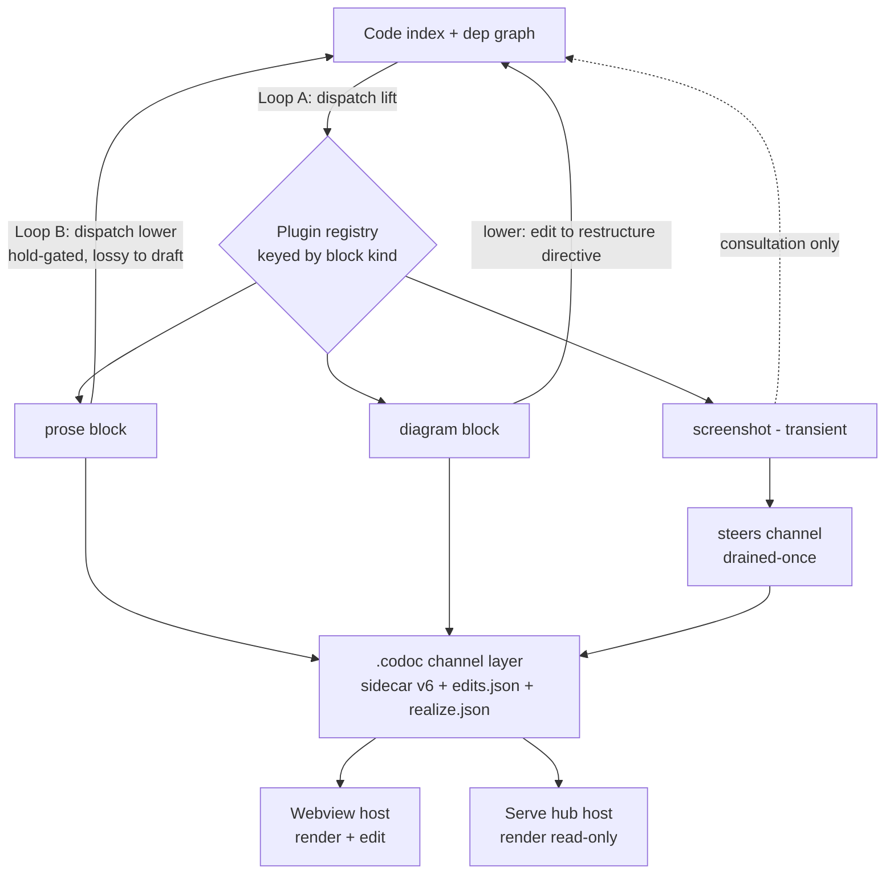

# feat: Agent-Native Notebook Protocol

## Implementation status (2026-06-24)

All eight units shipped. U1–U5, U7, U8 landed in `4ba4b74`. U6 completed here:

- **Consult arrow wired (R6/R7, AE3).** `plugin.consult()` is now dispatched in
  Loop B: CONSULT-capable *persistent* blocks (url/image) ride a feature's realize
  directive as `Consult:` lines once per feature (`loop_b._consult_block_lines`),
  and a *transient* screenshot rides a one-shot steer (`loop_b._media_consult_line`)
  consumed exactly once. Previously the consult media were registered but inert.
- **Transient screenshot→steer path.** `Steer` carries an author/id-scoped
  (`comment_id`) `media`/`media_kind` attachment; the webview composer gained a
  "📎 attach screenshot" affordance that stores bytes under `.codoc/media/` and
  hands the ref on the steer (never `tree.codoc`).
- **Tests:** `tests/blocks/test_screenshot_plugin.py`, `tests/loop/test_consult_wiring.py`,
  `tests/loop/test_phase_blocks.py`, `tests/serve/test_payload_blocks.py`, plus a TS
  steer-media round-trip. (U3 dispatch was already covered by `test_block_lift/lower/
  edit_robustness/edits_channel.py` rather than the plan's original filenames.)

**Deliberate deviations from the plan as written:**
- No `prompts/block_diagram_lower.txt` / `block_screenshot_consult.txt` — the
  diagram `lower` delta is deterministic and the screenshot consult is a one-liner,
  so both live inline rather than as prompt files.
- KTD3 "feed block lifecycle into `compute_phases`" is satisfied *by omission*:
  transient blocks aren't features (no phase) and persistent blocks inherit their
  feature's single phase, so no block-keyed phase state exists. Guarded by
  `tests/loop/test_phase_blocks.py`.

## Summary

Generalize codoc's prose feature-node into a typed, bindable, lifecycled **block** backed by a **plugin codec** (`lift`: code→block, `lower`: block→code directive). The block + plugin contract lives at the `.codoc` channel layer; the two loops dispatch to a plugin registry. v1 ships three reference plugins — prose (plugin-zero), diagram (driven by the dependency graph), and a transient bug-screenshot — and proves the protocol across **two hosts** (the webview and the serve hub) so the headline claim holds: one binding mechanism, many media, many surfaces.

## Problem Frame

codoc's contribution reads as a bespoke VS Code editor feature rather than a general mechanism — the weakness behind R2's score. The binding between intent and code is not about prose or about VS Code; it is a stable, reflective correspondence that should hold across *media* and *surfaces*. The substrate already exists: `.codoc/` is a file-channel protocol with two independent clients today (the webview and `codoc serve`), and the webview is already a block editor (TipTap/ProseMirror). This plan makes that generality real and demonstrable, without reworking the loops or relaxing the invariants that keep the tree de-duplicated and merge-safe.

---

## Key Technical Decisions

- **KTD1 — Binding identity stays feature-level; blocks are codecs over a feature's existing binding set.** The `UNIQUE(file, symbol_path)` constraint in `codoc/store/db.py` is the load-bearing anti-duplication invariant and is left unchanged. A block does not bind code independently — it renders/edits a typed projection of its parent feature's bindings (a diagram and a prose block on one feature share that feature's bound symbols; an ambient block has none). True per-chunk-per-block binding is deferred (see origin: `docs/brainstorms/2026-06-22-agent-native-notebook-protocol-requirements.md`). This resolves the origin's blocking "block-level binding identity" question by *not* generalizing the key. The nearest precedent is the existing soft `(normalized_title, parent_id)` guard for binding-less nodes.

- **KTD2 — `lift` is attribution (ungated); `lower` is intent (gated).** Per the change ledger (`docs/codoc-change-ledger.md`), attribution ops (refresh/attach/detach) run unconditionally so the index never goes stale, while intent ops (amend/retire/move/add) are hold-gated. Plugin dispatch preserves this split exactly: `lift` runs on every affected block even when the feature is held; `lower` is suppressed by holds and routes ambiguous results to the existing draft/hand-off gate rather than applying code silently.

- **KTD3 — One lifecycle projection, not per-plugin status.** Block lifecycle (persistent vs transient) feeds `compute_phases` in `codoc/loop/phase.py` as an *input* and is emitted as part of the single `feature_phase`/slice family. No plugin carries parallel per-plugin phase state — re-fragmenting the projection is the documented dominant source of past merge fragility.

- **KTD4 — Transient blocks ride the existing one-shot steering channel; they are not features.** A transient bug-screenshot is an attachment on a `steers` entry (drained-once), consumed by realization and never persisted as a feature with a lifecycle. Persistent blocks (prose, diagram) live on features. The transient channel uses **author/id-scoped identity**, not `(featureId, noteText)`, to avoid the documented thread-collapse and literal-`>` re-parse hazards.

- **KTD5 — Plugin dispatch is a registry keyed by block `kind`; a medium declares which of three capabilities it supports.** "Bidirectional codec" is the *maximal* shape; most media implement a subset. A plugin declares any subset of three capabilities — `lift` (code→block, ungated attribution), `lower` (block→code directive, hold-gated, lossy→draft), and `consult` (block→realization context, passive, no round-trip) — plus binding mode (`bound` inherits the feature's binding set, `ambient` has none), lifecycle (`persistent`/`transient`), and per-direction dispatch (`deterministic` codec or `agent`-contract prompt). The loops dispatch *only* the declared capabilities, so a medium is honest about its arrows (a website URL is `consult`-only; a UI screenshot is `lift`+`consult` but never `lower`). `consult`-only + `ambient` is the cheapest medium to add (no codec to write) and reuses the existing `Consult:` mechanism. v1: prose = `lift`+`lower` (agent); diagram = `lift` (deterministic, from graph) + `lower` (agent); screenshot = `consult`+`transient`; plus URL/image as `consult`-only reference media.

- **KTD8 — Structured mapping is deterministic; only content transformation (`lift`/`lower`) is the LLM.** This is the load-bearing idea: bi-directional/bi-modal programming was previously impossible to do deterministically, but codoc factors the problem into (a) a *deterministic structural layer* — which block binds which code, and **block identity** — and (b) *LLM transformations* over content. The robustness contract follows: **every block carries a stable `id` that survives arbitrary host edits** (move, delete+undo, heading→paragraph→undo, edits that bundle deletions). The loops never interpret keystrokes; they diff the settled block-id set + per-block content against a stable baseline (the existing webview baseline-diff), so the LLM never has to "track" anything — it only transforms content for blocks the structural diff already identified. Identity is never derived from content. This is why undo-to-baseline is a structural no-op and a moved image is a position change with no code effect.

- **KTD6 — Every `.codoc` schema extension is versioned + presence-keyed; the realize queue stays append-never-clobber.** The sidecar gains a `blocks` slice and `edits.json` gains a block-edit channel, both presence-keyed so older sidecars still parse. The `realize.md`/`realize.json` queue continues to be appended, never wholesale-rewritten, and block `lower` directives merge into it under the existing filelock discipline.

- **KTD7 — Every host is a file-channel client.** Hosts read `.codoc/*` to derive their UI and write only the verdict/draft/steer channels under the shared `filelock` (pattern in `codoc/loop/activity.py`); the daemon remains the **sole writer** of `tree.codoc`. Hosts derive their own payload (the webview's `buildPayload` mixes in-memory state and is not shareable), so the host contract specifies channel I/O and rendering obligations, not a shared payload.

---

## High-Level Technical Design

One code ground truth, projected to many typed blocks by plugin codecs, consumed by many hosts over the file channel:



The loops keep their current shape; the only structural change is a dispatch seam: Loop A routes each affected bound block through `plugin.lift` after deterministic relocation matching; Loop B routes each edited block through `plugin.lower` where it currently builds a directive.

---

## Output Structure

New plugin surface (per-unit `**Files:**` remain authoritative):

```
codoc/blocks/
  __init__.py
  registry.py        # kind -> plugin lookup; dispatch entry points
  base.py            # BlockPlugin protocol: lift / lower / lifecycle / dispatch_mode
  prose.py           # plugin-zero: the existing feature-node path
  diagram.py         # lift from dep graph; lower = restructure directive
  screenshot.py      # transient steering-channel attachment + multimodal consult
prompts/
  block_diagram_lower.txt
  block_screenshot_consult.txt
```

---

## Requirements Traceability

| Origin requirements | Implementation unit(s) |
|---|---|
| R1–R3 (block model: kind, binding, provenance, ambient) | U1 |
| R4–R7 (codec contract, dispatch, ambient consultation, lossy→gate) | U1, U3, U5, U6 |
| R8–R10 (loop dispatch, transient vs persistent) | U3 |
| R11–R13 (channel-layer contract, host contract, existing hosts valid) | U2, U7, U8 |
| R14–R16 (three reference plugins) | U4, U5, U6 |

---

## Implementation Units

### Phase 1 — Protocol kernel

### U1. Block model, plugin protocol, and binding-identity decision

- **Goal:** Introduce the typed block (with a **stable id** per KTD8) as a codec over a feature's existing bindings, plus the capability-declaring `BlockPlugin` protocol and registry. Lock KTD1 + KTD8 in code.
- **Requirements:** R1, R2, R3, R4, R5
- **Dependencies:** none
- **Files:** `codoc/model/block.py` (new — `Block`: stable id, kind, feature_id, content, lifecycle, provenance, ord), `codoc/model/ids.py` (`new_block_id`), `codoc/model/feature.py` (additive `provenance` only — prose stays `description`), `codoc/blocks/base.py` (new — `Capability`, `BlockPlugin`, lift/lower/consult result types), `codoc/blocks/registry.py` (new), `codoc/blocks/prose.py` (new — plugin-zero stub), `codoc/store/db.py` (additive `blocks` table; `UNIQUE(file, symbol_path)` unchanged), `tests/blocks/test_registry.py` (new), `tests/blocks/test_block_identity.py` (new), `tests/store/test_blocks_store.py` (new)
- **Approach:** A `BlockPlugin` declares a `kind`, a `capabilities` set (any subset of `LIFT`/`LOWER`/`CONSULT`), `binding_mode` (`bound`/`ambient`), `lifecycle` (`persistent`/`transient`), and per-direction `dispatch` (`deterministic`/`agent`). The registry validates that each declared capability has its method and dispatches only declared capabilities (KTD5). Prose is the implicit **block-zero** backed by `feature.description` (no blocks-table row, full back-compat); non-prose media are rows in a new `blocks` table. A block's binding view derives from `bindings_for_feature` (KTD1) — no per-block binding column, so `UNIQUE(file, symbol_path)` is untouched. Block ids are stable and assigned once (KTD8); the core only stores them, the host preserves them across edits.
- **Patterns to follow:** Additive PRAGMA-guarded migration in `codoc/store/db.py._migrate`; short prefixed ids in `codoc/model/ids.py`; additive-field + computed-view pattern from `docs/plans/2026-06-20-001-core-data-model-and-merge-architecture.md`.
- **Test scenarios:**
  - Registry resolves a plugin by `kind`; unknown kind raises a typed error; a plugin declaring a capability without its method fails registration.
  - A feature with a prose (block-zero) and a diagram block exposes the same derived binding set; the `bindings` table still rejects a second feature binding an already-bound `(file, symbol_path)`.
  - An `ambient` block reports an empty binding view and is never proposed for realization. Covers AE3.
  - A `consult`-only plugin (no `lift`/`lower`) registers and is dispatchable for consultation only.
  - **Edit-robustness (KTD8):** a block keeps its `id` across an `ord` change (move); a delete followed by re-insert with the same id is a no-op against baseline; round-tripping a block through the store preserves `id`/`kind`/`lifecycle`/`provenance`.
  - Old `blocks`-less DB rows and a feature with zero blocks load unchanged.
- **Verification:** New block kinds register by capability; the uniqueness constraint is provably unchanged; block identity survives reorder/store round-trip; existing model + store tests stay green.

### U2. Channel-layer schema v6: `blocks` sidecar slice + block-edit channel

- **Goal:** Carry block metadata through the file channels without breaking older readers, preserving append-never-clobber.
- **Requirements:** R11
- **Dependencies:** U1
- **Files:** `codoc/codoc_file/render.py` (emit `blocks` slice), `codoc/loop/edits.py` (block-edit entries in `edits.json`), `codoc/loop/fsio.py` (atomic IO unchanged), `vscode-codoc/src/state/bindings-model.ts` (parse new slice, presence-keyed), `vscode-codoc/src/state/edits-channel.ts` (block-edit contract), `tests/codoc_file/test_render_blocks.py` (new), `vscode-codoc/test/bindings-model.test.ts` (extend)
- **Approach:** Add a `blocks` slice (`{feature_id: [{id, kind, lifecycle, dispatch, proposalRender?}]}`) to the sidecar, bumped to v6 and keyed on field presence so older sidecars parse. Add a `blocks` array to `edits.json` for block-specific edits, parallel to `edits`/`intents`/`steers`. Keep `realize.json` append-only.
- **Patterns to follow:** The `{"version": N}` + presence-keyed discipline and the append-not-clobber rule from `docs/codoc-change-ledger.md`.
- **Test scenarios:**
  - A v5 sidecar (no `blocks` key) parses without error in both the Python reader and the TS reader.
  - A round-trip render→parse preserves block kind, lifecycle, and dispatch fields.
  - Two concurrent block-edit writes under the shared filelock do not lose either entry.
  - A `lower` directive appended while a realization is in flight does not clobber existing queued directives.
- **Verification:** Old and new sidecars coexist; block metadata survives round-trip; queue integrity holds under concurrent writes.

### U3. Loop dispatch: `lift` in Loop A, `lower` in Loop B

- **Goal:** Thread plugin dispatch through both loops while preserving the attribution/intent split and the single phase projection.
- **Requirements:** R6, R7, R8, R9, R10
- **Dependencies:** U1, U2
- **Files:** `codoc/loop/loop_a.py` (dispatch `lift` after relocation matching), `codoc/loop/loop_b.py` (dispatch `lower` where directives are built), `codoc/loop/classify.py` (route block ops through the decision table), `codoc/loop/phase.py` (block lifecycle as a `compute_phases` input), `codoc/blocks/registry.py` (dispatch entry points), `tests/loop/test_block_dispatch.py` (new), `tests/loop/test_phase_blocks.py` (new)
- **Approach:** In Loop A, after deterministic relocation pairing, dispatch each affected bound block to `plugin.lift`; `lift` runs even on held features (attribution). In Loop B, where `implies_code()` currently builds a directive, dispatch to `plugin.lower`; `lower` is hold-suppressed and routes ambiguous output to the draft gate. Feed block lifecycle into `compute_phases` and emit through the existing slice — no parallel status.
- **Execution note:** Add a failing dispatch contract test first — the loop seam is the highest-risk change.
- **Patterns to follow:** The 13-row decision table in `docs/codoc-change-ledger.md`; the single-slice projection in `docs/plans/2026-06-20-001-core-data-model-and-merge-architecture.md`.
- **Test scenarios:**
  - `lift` fires for a bound block on a held feature (attribution ungated). Covers AE1.
  - `lower` for an edited block on a held feature is suppressed until hand-off (intent gated).
  - An ambiguous `lower` result produces a held draft proposal, not a code apply. Covers AE4.
  - A transient block contributes no persistent phase state; `feature_phase` emits one consistent value per feature.
  - A RETIRE on a bound block deletes code only on explicit `delete_code` (destructive asymmetry preserved).
- **Verification:** Both directions dispatch correctly; holds and destructive asymmetry behave exactly as before for prose; phase slice stays single-source.

---

### Phase 2 — Reference plugins

### U4. Prose plugin (plugin-zero)

- **Goal:** Express the existing feature-node prose path as the text block plugin — no behavior change — proving the registry against the incumbent path.
- **Requirements:** R2, R14
- **Dependencies:** U1, U3
- **Files:** `codoc/blocks/prose.py` (new), `codoc/loop/loop_a.py` / `loop_b.py` (route prose through the plugin), `tests/blocks/test_prose_plugin.py` (new)
- **Approach:** Wrap the current refresh/amend (`lift`) and directive-building (`lower`) prose behavior behind the plugin interface so the default path is itself a registered plugin. This is a refactor-to-seam, not new behavior.
- **Patterns to follow:** Existing Loop A `derive_auto_ops` and Loop B `build_directive`.
- **Test scenarios:**
  - Existing Loop A/B prose round-trip tests pass unchanged with prose routed through the plugin.
  - Disabling the prose plugin in the registry is detectable (guards against silent loss of the default path).
- **Verification:** Full existing loop test suite green; prose path now flows through the registry.

### U5. Diagram plugin

- **Goal:** A bidirectional non-text plugin: `lift` renders the feature's dependency neighborhood; `lower` turns a diagram edit into a restructure directive.
- **Requirements:** R4, R5, R15
- **Dependencies:** U1, U3
- **Files:** `codoc/blocks/diagram.py` (new), `codoc/graph/query.py` (use `ego_graph`/`neighbors`; add a render-oriented query if needed), `prompts/block_diagram_lower.txt` (new), `tests/blocks/test_diagram_plugin.py` (new)
- **Approach:** `lift` calls `ego_graph(store, bound_symbols_of_feature, hops=2)` and renders mermaid (deterministic). `lower` interprets a structural diagram edit (add/remove edge or node, rename) as an agent-assisted restructure directive; ambiguous edits route to the draft gate (KTD2).
- **Technical design (directional, not specification):** diagram edit delta → normalized intent (`add_edge`/`remove_node`/`rename`) → directive text via the prompt; unmapped deltas → held draft.
- **Patterns to follow:** The graph query API (`ego_graph`, `neighbors`, `topological_order`) in `codoc/graph/query.py`.
- **Test scenarios:**
  - `lift` for a feature with N bound symbols renders a graph containing exactly its 2-hop internal neighborhood. Covers AE1 (refresh-in-place when code changes).
  - A code change to a bound symbol re-runs `lift` and replaces the diagram in place rather than appending.
  - An unambiguous `remove_edge` edit produces a restructure directive naming the affected symbols.
  - An ambiguous edit (e.g., a node with no clear symbol mapping) produces a held draft, not a directive. Covers AE4.
- **Verification:** Diagram round-trips both directions; the lower path honors the draft gate.

### U6. Transient bug-screenshot plugin

- **Goal:** Prove the transient lifecycle and ambient-as-consultation: a screenshot in a comment thread is consumed by realization and never persisted.
- **Requirements:** R3, R6, R10, R16
- **Dependencies:** U1, U3
- **Files:** `codoc/blocks/screenshot.py` (new), `codoc/loop/loop_b.py` (steer-path consumption), `codoc/loop/edits.py` (author/id-scoped steer identity), `prompts/block_screenshot_consult.txt` (new), `tests/blocks/test_screenshot_plugin.py` (new)
- **Approach:** A screenshot attaches to a `steers` entry (drained-once). During realization the agent reads it as multimodal consultation (richer `Consult:`); it is discarded on the next render and never becomes a feature. Identity is author/id-scoped to avoid the `(featureId, noteText)` collapse; serialized content never emits a bare leading `>`.
- **Patterns to follow:** The `steers` one-shot channel and the serve-hub's author-scoped thread identity; the `Consult:` external-link consumption in Loop B.
- **Test scenarios:**
  - A screenshot steer is consumed exactly once and absent from the next render. Covers AE2.
  - Two byte-identical screenshot notes on the same feature remain distinct (author/id-scoped key).
  - An ambient screenshot is offered as consultation but never generates a realize directive of its own. Covers AE3.
  - Serialized screenshot metadata containing a `>` does not re-parse as a steering comment.
- **Verification:** Transient consumption is single-shot and non-persisting; the documented steer-channel hazards are provably avoided.

---

### Phase 3 — Hosts and conformance

### U7. Webview host: render, edit, lifecycle for blocks

- **Goal:** Make the webview a conforming block host — render typed blocks, route block edits to `lower`, decorate lifecycle.
- **Requirements:** R12, R13
- **Dependencies:** U2, U4, U5, U6
- **Files:** `vscode-codoc/src/webview/protocol.ts` (`UINode.blocks`, block payload), `vscode-codoc/src/providers/tree-editor.ts` (assemble blocks in `buildPayload`), `vscode-codoc/src/webview/host-bridge.ts` (block-message transport), `vscode-codoc/src/webview/tiptap/*` (block node views), `vscode-codoc/src/state/edits-channel.ts` (write block edits), `vscode-codoc/test/blocks.test.ts` (new)
- **Approach:** Extend `UINode` with an optional `blocks` array and add per-kind render components. Route block-specific webview messages through `host-bridge` to a block-edit write on `edits.json` (never to `tree.codoc`). Render lifecycle (transient vs persistent, proposal overlay) from the sidecar `blocks` slice.
- **Patterns to follow:** The single-writer contract and `edits.json` channel from `docs/codoc-collaborative-editing-model.md`; existing proposal-overlay decoration.
- **Test scenarios:**
  - A diagram block renders from the sidecar slice and a layout edit produces a block-edit entry, not a `tree.codoc` write.
  - A transient block renders with its consumed-on-next-render affordance.
  - An unknown block kind degrades to an inert placeholder rather than throwing.
  - TS parsing of the v6 sidecar stays parity-equal to the Python reader for the shared fields.
- **Verification:** Webview renders and edits all three block kinds; host writes only the allowed channels.

### U8. Second host (surfaces axis) + host-conformance harness

- **Goal:** Prove "many surfaces" by rendering blocks read-only in the serve hub, and lock the host contract with a conformance/parity harness.
- **Requirements:** R11, R12, R13
- **Dependencies:** U2, U7
- **Files:** `codoc/serve/payload.py` (derive blocks into the hub payload, read-only), `tests/serve/test_payload_blocks.py` (new), `tests/blocks/test_host_conformance.py` (new), `vscode-codoc/test/parity.test.ts` (extend)
- **Approach:** Teach the hub's payload derivation to surface the `blocks` slice read-only (no edit obligations — per-host policy may omit editing, as the hub already omits "Save = stage & send"). Build a host-conformance harness modeled on the existing TS↔`parse.py` parity tests: assert that any host fed a fixture sidecar derives the same block set and lifecycle.
- **Patterns to follow:** The serve hub as a file-channel client (`docs/plans/2026-06-19-002-feat-deployed-codoc-suggestion-surface-plan.md`); the TS↔`parse.py` parity-test pattern.
- **Test scenarios:**
  - The hub payload renders all three block kinds read-only from a fixture sidecar.
  - The conformance harness fails when a host drops or mis-types a block from the fixture.
  - The webview and hub derive identical block sets and lifecycle from the same fixture (multi-surface parity). Covers the surfaces-axis headline claim.
- **Verification:** Two hosts render the same blocks from one protocol; the conformance harness guards future hosts.

---

## Scope Boundaries

**Deferred for later** (from origin)
- Notion as a first-class host — its cloud/block-API model can't carry the real-time inline overlay + accept/reject without degrading it.
- Rust↔Python (general cross-language round-trip) as a shipped plugin — vision-frame only; embeds an unsolved problem.
- Plugin marketplace, third-party distribution, and a plugin sandbox/security model.
- A standalone (non-VS-Code) notebook shell — reachable later by lifting the webview.

**Outside this product's identity** (from origin)
- A general note-taking app divorced from code binding. The product is intent↔code correspondence across media and surfaces.

**Deferred to Follow-Up Work** (plan-local)
- True per-chunk-per-block binding (relaxing `UNIQUE(file, symbol_path)`) — only if a future plugin genuinely needs independent attribution; KTD1 defers it.
- Editing affordances for blocks in the serve hub (v1 hub is read-only for blocks).

---

## Risks & Dependencies

- **Loop-seam regression (high).** The Loop A/B dispatch (U3) is the riskiest change. Mitigation: dispatch-contract test first (Execution note on U3); prose routed through the plugin (U4) must keep the full existing loop suite green.
- **Phase-projection re-fragmentation (high).** Adding per-plugin lifecycle state would reintroduce the 8-way mid-flight sprawl. Mitigation: KTD3 — lifecycle is a `compute_phases` input emitting one slice; enforced by `tests/loop/test_phase_blocks.py`.
- **Realize-queue TOCTOU (medium).** Block `lower` directives merging into `realize.md`/`realize.json` inherit the documented append-vs-`/codoc:sync`-delete race. Mitigation: append-only + filelock spanning read→write; per-directive done-tracking (U2, U6).
- **Steer-channel sharp edges (medium).** The transient screenshot reuses the `> …` channel with known `(featureId, noteText)` collapse and literal-`>` re-parse hazards. Mitigation: author/id-scoped identity and no bare leading `>` in serialized content (U6).
- **Cross-language parity drift (medium).** New sidecar fields must parse identically in Python and TS. Mitigation: presence-keying (U2) and the conformance/parity harness (U8).
- **Dependency:** Multimodal agent capability for screenshot/diagram consultation; where absent, ambient blocks degrade to inert human context (origin assumption).

---

## Open Questions (deferred to implementation)

- Exact mermaid dialect/escaping for diagram `lift` output (settle when rendering against real fixtures).
- The precise normalized-intent vocabulary for diagram `lower` (`add_edge`/`remove_node`/`rename`/…) — finalize against actual diagram-edit deltas.
- Whether block metadata needs its own store table or rides existing feature rows — decide once U1's storage volume is real.
- The agent-contract prompt shape for diagram `lower` and screenshot consult — tune against live runs, not at plan time.

---

## Sources & Research

- Origin requirements: `docs/brainstorms/2026-06-22-agent-native-notebook-protocol-requirements.md`
- Classify decision table + channel versioning + append-not-clobber: `docs/codoc-change-ledger.md`
- Phase projection, lifecycle enum, binding identity, dedup: `docs/plans/2026-06-20-001-core-data-model-and-merge-architecture.md`
- Single-writer contract, draft/hand-off gate, TS↔`parse.py` parity: `docs/codoc-collaborative-editing-model.md`
- Serve hub as file-channel client (precedent for a second host): `docs/plans/2026-06-19-002-feat-deployed-codoc-suggestion-surface-plan.md`, `docs/serve-deployment.md`
- Steering-channel + realize-queue residual hazards: `docs/residual-review-findings/feat-steering-emphasis-links-sdk.md`
- Graph query API for diagram `lift`: `codoc/graph/query.py`, `codoc/graph/extract.py`
