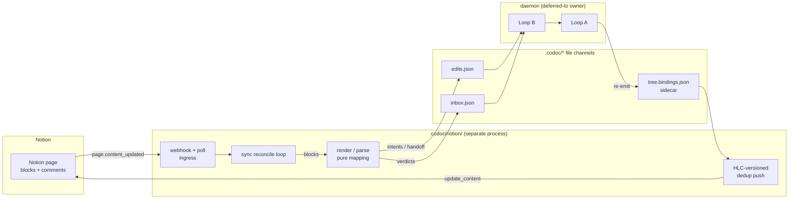

# feat: Notion as a codoc host (ongoing authoring home)

## Summary

Add a new `codoc/notion/` bridge that makes a Notion page an ongoing authoring
surface for the feature tree: a Notion user edits intent prose, sees structural
proposals as inline callouts, accepts/rejects via comment commands, and watches
code follow. The bridge is an architectural sibling of `codoc serve` — a
file-channel client that reads `.codoc/*`, writes only the verdict/draft/intent
channels under the shared filelock, and **never writes `tree.codoc`**. It is
additive: no changes to the two loops, no new block plugin.

## Problem Frame

The agent-native notebook protocol (`docs/plans/2026-06-22-001-feat-agent-native-notebook-protocol-plan.md`)
defined a host contract and deferred Notion because "its cloud/block-API model
can't carry the real-time inline overlay + accept/reject without degrading it."
This plan accepts the degraded surface and asks what authoring loop *is* workable:
Notion intent edits flow through the existing `edits.json` intent channel; verdicts
ride comment commands; proposals render as callout blocks; live catch-up pushes
derived state back. The goal (see origin) is letting someone who lives in Notion
author the tree without VS Code or the hub.

---

## Requirements

Carried from the origin requirements doc (R1–R7), refined by research and the three
confirmed design forks.

### Bridge process and channel discipline
- R1. A standalone bridge process, sibling of `codoc serve`, that is a file-channel
  client: reads `.codoc/*`, writes only `inbox.json` / `edits.json` under the shared
  filelock, never `tree.codoc`.
- R2. The bridge defers to an existing daemon owner (`codoc serve` or `codoc watch`)
  and never double-spawns `codoc watch` (single-owner lock model).

### Render and parse
- R3. Render the feature tree to a Notion page from the sidecar (`tree.bindings.json`),
  not a fresh store walk — mirroring `serve/payload.py`. Nodes → headings/paragraphs,
  preserving order and hierarchy.
- R4. Map the three markdown-native signals: steering (`>`) → quote blocks; focus
  (`**bold**`) → preserved bold annotations; external `Consult:` links → preserved
  links. Code citations (`codoc:` URIs) render as a Notion-renderable form.
- R5. Parse the Notion page's blocks back to a `ParsedTree` whose `local_id` is the
  Notion block id, then reuse `diff_codoc(has_local_ids=True)` and Loop B unchanged.

### Authoring loop, verdicts, live catch-up
- R6. Notion intent edits route as `edits.json` intents, **auto-handed-off** so code
  follows without a second approval (authoritative authoring), preserving the
  frozen-directive-snapshot protection at hand-off.
- R7. Structural proposals (ADD/MOVE/RETIRE/AMEND) render as inline callout blocks;
  accept/reject is captured via comment commands using author/id-scoped identity and
  written to the `inbox.json` verdict channel (never a local double-apply).
- R8. As realization lands, push derived state back to the Notion page — an
  HLC-versioned, dedup'd push that suppresses no-op re-renders (echo-loop guard).

### Inbound signal and safety
- R9. Learn of Notion changes via signature-verified webhooks as the primary trigger,
  reconciling from the API, with `last_edited_time` polling as fallback.
- R10. The Notion-page ⇄ store round-trip is idempotent: a no-op render produces no
  push-back and no phantom AMEND, verified before webhooks are wired.
- R11. Verify the inbound webhook signature (timing-safe, on raw bytes); apply the
  existing SSRF posture to Notion-authored links; treat all Notion content as
  untrusted data, never instructions.

---

## Key Technical Decisions

- **Bridge as serve-sibling, not a fork of the daemon.** Reproduce the file-channel
  client pattern (`serve/payload.py` read, `serve/dispatch.py` write); reuse
  `Capability`, `inbox.append_verdict`, and the `edits.py` writers verbatim. *Why:*
  the daemon's hot path is synchronous (index re-read + LLM call); a second in-process
  server would starve it (serve-hub KTD2). Separate process, defer-to-owner.

- **Notion edits transported as append-only `edits.json` intents.** Intents are
  host-owned, idempotent (skip-if-payload-matches), and expire after 7 days — no lock
  required, which is essential because Notion exposes none. *Why:* sidesteps the
  single-writer problem the webview solves with `tree.doc.json` + `loop.lock`, which
  Notion can't replicate. Authoritative authoring is achieved by **auto-handoff** of
  those intents, not by making Notion an authoritative `tree.doc.json` writer.

- **Identity via Notion block id → `local_id`.** Mapping each Notion block's stable id
  to the parsed node's `local_id` inherits the entire dup/zombie-clone defense in
  `diff.py` (identity by author-stable `local_id`, not title or advisory fid) for free.

- **Verdicts and proposals on the page, not a companion database.** Proposals render as
  callout blocks; accept/reject via comment commands (`GET /v1/comments`, reply with
  `discussion_id`). *Why:* preserves the single-page authoring feel the brainstorm
  chose over a database tracker. *Cost accepted:* free-text command parsing is fuzzier
  than a status property, and the comments API can't open new inline threads (only
  reply) — documented as the degraded-surface trade-off.

- **Concurrency is best-effort, not CRDT.** Notion has no etag/version/conditional-write
  — only `last_edited_time`. Push-back uses read-compare + **context-anchored
  `update_content`** (`old_str` with enough surrounding text that a concurrent edit
  makes the write fail loudly rather than clobber), HLC-versioned and dedup'd. True
  per-node merge stays deferred (matches the hub's Tier-2 deferral).

- **Native markdown endpoints for bulk content, block API for identity.** Use
  `GET/PATCH /v1/pages/{id}/markdown` for the authoring body, but the block API
  (`GET /v1/blocks/{id}/children`) for stable per-node ids and `<unknown>`-type
  fallback. *Why:* the markdown format carries no embedded block ids, so identity must
  come from the block API. Pin `Notion-Version: 2026-03-11`.

- **`notion` optional extra, lazy-imported.** Declare a `notion` extra in
  `pyproject.toml` mirroring `serve`; lazy-import the client inside the entrypoint
  (the `serve/app.py:14` pattern) so the base CLI stays light.

---

## High-Level Technical Design

### Component topology



### Edit round-trip (sequence)

```mermaid
sequenceDiagram
  participant U as Notion user
  participant N as Notion API
  participant B as Bridge
  participant C as .codoc channels
  participant D as daemon (Loop B/A)

  U->>N: edit intent prose
  N-->>B: webhook page.content_updated (signal only)
  B->>N: fetch current blocks (reconcile)
  B->>B: parse → ParsedTree(local_id=block id); diff_codoc
  B->>C: append intents (auto handed_off) / verdicts
  C->>D: Loop B drains → realize.md → implement
  D->>C: Loop A reflects, re-emits sidecar
  B->>B: sidecar changed → render (dedup vs last push)
  B->>N: update_content (context-anchored old_str)
  N-->>U: page shows code moved
```

The **echo-loop guard** (R10) breaks the cycle `Notion edit → store → push-back →
re-detected as edit`: push only when the rendered payload differs from the last
pushed payload (HLC-versioned), and the parse side is idempotent under
`normalize_description`, so a pushed-back render re-parses to zero user ops.

---

## Output Structure

```
codoc/notion/
  __init__.py
  config.py        # NotionConfig: token, page_id, version pin, poll interval, webhook secret
  render.py        # sidecar → Notion block payload (pure)
  parse.py         # Notion blocks → ParsedTree(local_id=block id) (pure)
  dispatch.py      # Notion-detected edits/verdicts → inbox.json / edits.json writers
  client.py        # injected Notion client wrapper: read/markdown/update_content + rate-limit
  push.py          # HLC-versioned, dedup'd push-back (PayloadStream analogue)
  webhook.py       # signature-verified ingress + last_edited_time polling fallback
  bridge.py        # process entrypoint: defer-to-owner, reconcile loop wiring
tests/notion/
  test_render.py test_parse.py test_roundtrip.py test_dispatch.py
  test_client.py test_push.py test_webhook.py test_bridge.py
  test_concurrency.py test_host_conformance.py
```

The per-unit `**Files:**` lists are authoritative; the implementer may adjust layout.

---

## Implementation Units

Grouped into four phases. Phases 1–2 are network-free and fully testable now; phase 3
introduces the live API behind an injected client; phase 4 hardens and validates.

### Phase 1 — Scaffold and pure mapping

### U1. Package scaffold, `notion` extra, config, CLI entrypoint stub
- **Goal:** Create `codoc/notion/` with config and a `codoc notion` CLI command that
  lazy-imports the client and errors cleanly when the extra is absent.
- **Requirements:** R1, R2 (process shape only).
- **Dependencies:** none.
- **Files:** `codoc/notion/__init__.py`, `codoc/notion/config.py`,
  `pyproject.toml` (add `notion` extra), `codoc/cli/main.py` (add `notion` command),
  `tests/notion/test_config.py`.
- **Approach:** Mirror the `serve` extra in `pyproject.toml` and the lazy-import guard
  at `serve/app.py:14`. `NotionConfig` holds token, page id, `Notion-Version` pin,
  poll interval, webhook secret — sourced from env, matching how `serve` reads config
  in `cli/main.py:86-154`. CLI command stub wires config → `bridge.run` (filled in U9).
- **Patterns to follow:** `codoc/cli/main.py:86-154` (`serve`), `serve/app.py:14`.
- **Test scenarios:** config loads from env and applies defaults (poll interval, version
  pin); missing required field (token/page id) raises a clear error; invoking the CLI
  without the `notion` extra installed raises an actionable ImportError message.
- **Verification:** `codoc notion --help` works without the extra; config round-trips
  from env in tests.

### U2. `render.py` — sidecar → Notion block payload (pure)
- **Goal:** Build a Notion block payload from `tree.bindings.json` (+ `status.json`),
  not a store walk.
- **Requirements:** R3, R4.
- **Dependencies:** U1.
- **Files:** `codoc/notion/render.py`, `tests/notion/test_render.py`.
- **Approach:** Model on `serve/payload.py:build_browser_payload` (line ~212) and
  `blocks/conformance.py:canonical_block_view`. Map: feature → heading (depth-capped to
  Notion's heading_1–3, deeper levels degrade to bold paragraph since Notion headings
  can't nest), description prose → paragraph, steering `>` runs → quote blocks, focus
  `**bold**` → rich-text bold annotation (`link`/`href` are siblings of annotations, not
  inside them), `Consult:` links → link rich-text, `codoc:file#sym` citations → a
  link-styled rich-text with a label (no clickable repo nav in v1; documented). Emit the
  block-API JSON shape (type-keyed payloads) so block ids can be tracked, plus a markdown
  projection for the bulk `update_content` path.
- **Patterns to follow:** `serve/payload.py`, `codoc_file/render.py`,
  `blocks/conformance.py:canonical_block_view`.
- **Test scenarios:** a 3-level tree renders headings 1–3 in order; a 4th level degrades
  to bold paragraph; steering line renders as a quote block; a bolded focus span carries
  `bold` annotation; a consult link preserves href; a `codoc:` citation renders a labeled
  link; rendering reads only the sidecar (no store dependency injected).
- **Verification:** rendered payload matches expected block JSON for a fixture sidecar.

### U3. `parse.py` — Notion blocks → ParsedTree (pure)
- **Goal:** Walk Notion blocks into a `ParsedTree` with `local_id` = Notion block id, so
  `diff_codoc(has_local_ids=True)` yields user ops with full identity defenses.
- **Requirements:** R5.
- **Dependencies:** U1.
- **Files:** `codoc/notion/parse.py`, `tests/notion/test_parse.py`.
- **Approach:** Closest template is `codoc_file/doc_parse.py:parse_doc_file` — a
  level→parent stack mirroring the indent stack, producing the same `ParsedNode` shape
  (`id, title, description, parent_id, retired, local_id, realized, refs, comments`).
  Heading depth gives hierarchy; quote blocks → `comments` (steering); bold annotations →
  emphasis; links → refs. **Apply `parse.normalize_description` verbatim** (the one
  canonical normalization) or phantom AMEND loops result. Map comment threads to
  author/id-scoped identity (`comment_id`), not `(featureId, noteText)`.
- **Patterns to follow:** `codoc_file/doc_parse.py`, `codoc_file/parse.py:normalize_description`,
  `codoc_file/diff.py:56-90` (identity rule).
- **Test scenarios:** nested headings reconstruct correct `parent_id`; block id becomes
  `local_id`; a quote block becomes a steering comment with id-scoped identity; bold span
  becomes emphasis; a `codoc:` link becomes a ref; `normalize_description` is applied
  (trailing whitespace / signal markers normalized identically to the text parser);
  two byte-identical comments do NOT collapse (distinct `comment_id`).
- **Verification:** `diff_codoc(parse(blocks), store, has_local_ids=True)` produces the
  expected user ops for add/amend/move/retire fixtures.

### U4. Round-trip idempotency + echo-loop guard
- **Goal:** Prove `parse(render(state))` yields zero user ops and a no-op render produces
  no push, before any live wiring.
- **Requirements:** R8 (guard), R10.
- **Dependencies:** U2, U3.
- **Files:** `codoc/notion/push.py` (dedup core only), `tests/notion/test_roundtrip.py`.
- **Approach:** Implement the dedup/version core of the push (the `PayloadStream`
  analogue from `serve/push.py:32` `next_if_changed`): serialize the render, compare to
  last-pushed, suppress identical. Version by store HLC (`model/hlc.py`), not a
  per-process counter (serve-hub KTD8). The round-trip test renders a fixture sidecar →
  blocks → parses back → asserts `diff_codoc` is empty.
- **Patterns to follow:** `serve/push.py:PayloadStream`, `serve/payload.py:payload_version`,
  `tests/serve/test_push.py`, the deferred idempotency test
  `tests/codoc_file/test_doc_json_roundtrip_idempotency.py` (per serve-hub KTD8/U3).
- **Test scenarios:** render→parse→diff is empty for add/amend/retire fixtures; identical
  consecutive renders push once (second suppressed); an HLC advance with identical content
  still suppresses; an HLC advance with changed content pushes.
- **Verification:** round-trip and dedup tests green; no push on no-op.

### Phase 2 — Channel writes and verdict detection

### U5. `dispatch.py` — Notion edits → channels (authoritative auto-handoff)
- **Goal:** Route parsed Notion user ops to `edits.json` intents with auto-handoff, and
  steers to the steer channel, under the shared filelock.
- **Requirements:** R6, R1.
- **Dependencies:** U3.
- **Files:** `codoc/notion/dispatch.py`, `tests/notion/test_dispatch.py`.
- **Approach:** Reuse `edits.py` writers verbatim (`append intents`, `append_steer`,
  `append_cancellation`, the handoff writers `append_handoffs`/`set_drafts`). Model the
  gate on `serve/dispatch.py` (`_verdict`, `_hand_off`, `_comment_create`). Authoritative
  authoring = write the intent AND immediately enqueue its hand-off so Loop B derives
  `handed_off=True` and queues realization. Preserve the frozen-snapshot-at-handoff
  protection (serve-hub KTD7 / R16): the directive realizes from the snapshot, not live
  state mutated afterward. Intents are idempotent — re-pushing an unchanged edit must not
  double-apply.
- **Patterns to follow:** `serve/dispatch.py`, `loop/edits.py` (intents/handoffs/steers),
  `docs/codoc-collaborative-editing-model.md` (single-writer; never double-apply).
- **Test scenarios:** an intent edit writes an `edits.json` intent and a matching handoff;
  re-dispatching the same edit is a no-op (idempotent skip); a steer writes one steer and
  is drained once; concurrent dispatch + a simulated daemon drain don't lose updates
  (filelock held around RMW); a mutated suggestion after handoff still realizes the frozen
  snapshot.
- **Verification:** Loop B (run in-test against a temp `.codoc/`) drains the intents into
  `realize.md` with `handed_off=True`.

### U6. Proposal callouts + comment-command verdicts
- **Goal:** Render ADD/MOVE/RETIRE/AMEND proposals as callout blocks and detect
  accept/reject from comment commands, writing verdicts to `inbox.json`.
- **Requirements:** R7.
- **Dependencies:** U2, U5.
- **Files:** `codoc/notion/render.py` (proposal callouts), `codoc/notion/dispatch.py`
  (verdict detection), `tests/notion/test_verdicts.py`.
- **Approach:** Read the sidecar `proposals` slice (`render._proposals_map`, event ids
  surfaced per `tests/serve/test_payload.py`) and render each as a callout block carrying
  the event id in a stable, machine-recoverable way (e.g. an icon + a hidden marker in the
  callout text). Detect verdicts by reading comments (`GET /v1/comments?block_id=...`),
  parsing `/accept` | `/reject` commands keyed to the callout's discussion, and calling
  `inbox.append_verdict(codoc_dir, event_id, accept)`. Never double-apply (the verdict is
  authority; do not also edit the page). Reply in-thread to confirm and resolve.
- **Patterns to follow:** `serve/dispatch.py:_verdict`, `loop/inbox.py:append_verdict`,
  `codoc_file/render.py:_proposals_map`.
- **Test scenarios:** each proposal kind renders a callout with a recoverable event id;
  `/accept` comment writes `accept=True` verdict for the right event id; `/reject` writes
  `accept=False`; an ambiguous/garbage comment writes no verdict and replies with help;
  a duplicate `/accept` on an already-drained event is a safe no-op; RETIRE-accept is
  detach-only unless delete-code is signaled (matches `loop_b.py:600-605`).
- **Verification:** verdicts drain through Loop B and apply the proposal op.

### Phase 3 — Live Notion API (injected client)

### U7. `client.py` — Notion client wrapper with rate-limit + anchored writes
- **Goal:** A thin, injectable wrapper over `notion-client`: read blocks, read/write
  markdown, context-anchored `update_content`, comments read/reply, with rate-limit and
  backoff.
- **Requirements:** R8, and the concurrency posture for R6/R10.
- **Dependencies:** U1.
- **Files:** `codoc/notion/client.py`, `tests/notion/test_client.py`.
- **Approach:** Pin `Notion-Version: 2026-03-11`. Token-bucket at ~3 req/sec with
  `Retry-After` honoring on 429/529 (research §1). Writes use `update_content` with
  context-rich `old_str` so a concurrent edit changes the anchor and the write fails
  loudly (validation_error) instead of clobbering; never `replace_content` for live sync.
  Read-compare `last_edited_time` before write. The wrapper is **injected** everywhere
  (test seam) — no live calls in unit tests; a fake client returns canned block/markdown
  fixtures and simulates 429 + anchor-miss.
- **Patterns to follow:** injection convention in `tests/serve/` (resolvers/clocks/run/agent
  injected); `serve/ratelimit.py` token bucket.
- **Test scenarios:** a 429 with `Retry-After` backs off and retries; an anchor-miss
  (`old_str` not found) surfaces a concurrency error, not a clobber; pagination over >100
  children collects all blocks; `last_edited_time` mismatch triggers re-fetch; writes
  never use `replace_content`.
- **Verification:** all client tests pass against the fake; no network in unit tests.

### U8. `webhook.py` — signature-verified ingress + polling fallback
- **Goal:** Receive Notion webhooks (verified, deduped, reordered) as the primary trigger;
  fall back to `last_edited_time` polling.
- **Requirements:** R9, R11.
- **Dependencies:** U1.
- **Files:** `codoc/notion/webhook.py`, `tests/notion/test_webhook.py`.
- **Approach:** Handle the one-time `verification_token` handshake; verify
  `X-Notion-Signature` (HMAC-SHA256 over **raw bytes**, timing-safe compare) before any
  JSON parse. Dedupe on `deliveryId`, reorder by `timestamp`, treat events as signals only
  (fetch current state from the API — U7). No block-level events exist, so
  `page.content_updated`/`comment.created` are the triggers. Polling fallback queries
  `last_edited_time` on the configured interval when no public endpoint is reachable.
  FastAPI imported lazily (the `serve/app.py:14` pattern). This is the repo's **first
  inbound network boundary** — flagged in System-Wide Impact.
- **Patterns to follow:** `serve/app.py` (lazy FastAPI, CSRF posture), `serve/auth.py`
  (boundary hardening), `serve/ratelimit.py`.
- **Test scenarios:** valid signature accepted; tampered body / wrong key rejected
  (timing-safe); the `verification_token` handshake responds correctly; duplicate
  `deliveryId` processed once; out-of-order events reordered by `timestamp`; polling
  fallback detects a `last_edited_time` advance; an event never trusts its own payload
  (always reconciles from API).
- **Verification:** webhook + polling tests green; signature verification rejects forgeries.

### U9. `bridge.py` — process, defer-to-owner, reconcile loop
- **Goal:** The bridge entrypoint: confirm an existing daemon owner, run the reconcile
  loop (ingress → render/parse → channels) and the store-change → push-back loop.
- **Requirements:** R1, R2, R6, R8.
- **Dependencies:** U4, U5, U6, U7, U8.
- **Files:** `codoc/notion/bridge.py`, `codoc/cli/main.py` (finalize command),
  `tests/notion/test_bridge.py`.
- **Approach:** Defer-only ownership: check for an existing `serve.lock`/`watch.pid`
  owner; if none, exit with guidance to start `codoc watch`/`codoc serve` (do not
  double-spawn — serve-hub ownership model). Wire two directions: inbound (webhook/poll →
  fetch → parse → diff → dispatch to channels) and outbound (`awatch(codoc_dir)` on
  `.codoc/*` → render → dedup push via U4's core → `client.update_content`). Reuse the
  `awatch` live-loop shape from `serve/push.py`.
- **Patterns to follow:** `serve/supervise.py` (ownership), `serve/push.py` (awatch loop),
  `serve/app.py`.
- **Test scenarios:** bridge refuses to start with no daemon owner (clear message, no
  spawn); an inbound webhook drives a full parse→dispatch with the fake client; a sidecar
  change drives one dedup'd push; an inbound edit that echoes back as a sidecar change does
  NOT re-push (echo-loop guard end-to-end with fakes).
- **Verification:** end-to-end with fakes: Notion edit → channels → (in-test Loop B) →
  sidecar → single push-back; no echo.

### Phase 4 — Hardening and conformance

### U10. Security hardening + invariant update
- **Goal:** Lock the inbound boundary and untrusted-content handling; update the
  superseded "no HTTP server, no port" invariant.
- **Requirements:** R11.
- **Dependencies:** U8, U9.
- **Files:** `codoc/notion/webhook.py` (harden), `codoc/notion/client.py` (SSRF on links),
  `CLAUDE.md` (invariant), `tests/notion/test_security.py`.
- **Approach:** Reuse `serve/consult.py:consult_url_allowed` (https-only, resolve-and-pin
  IP, reject loopback/link-local/RFC1918/CGNAT/metadata, no redirects, default-empty
  allowlist) for any Notion-authored `Consult:` link before fetch; treat fetched content
  as data, never instructions. Per-identity rate-limit the webhook endpoint
  (`serve/ratelimit.py`). Update `CLAUDE.md`'s "no HTTP server, no port" note (already
  superseded by serve U10; the inbound webhook supersedes it further).
- **Patterns to follow:** `serve/consult.py`, `serve/ratelimit.py`,
  `docs/residual-review-findings/feat-steering-emphasis-links-sdk.md` (SSRF finding 6).
- **Test scenarios:** a Notion link to a private/loopback IP is rejected; a redirect to a
  blocked host is rejected; webhook endpoint rate-limits abusive callers; malicious Notion
  prose with instruction-like text is treated as data (no directive injection).
- **Verification:** security tests green; `CLAUDE.md` invariant updated.

### U11. Host-conformance + concurrency + deployment doc
- **Goal:** Validate the Notion host against the conformance harness, prove two-writer
  safety, and document deployment.
- **Requirements:** R1, R2 (validation); R10 (concurrency).
- **Dependencies:** U9, U10.
- **Files:** `tests/notion/test_host_conformance.py`, `tests/notion/test_concurrency.py`,
  `docs/notion-deployment.md`.
- **Approach:** Run the existing host-conformance harness (`blocks/conformance.py` /
  `tests/blocks/test_host_conformance.py`) against the Notion render to confirm it
  reproduces `canonical_block_view`. Add a concurrency test (bridge + daemon as two writers
  to `inbox.json`/`edits.json`, modeled on `tests/serve/test_concurrency.py`) proving no
  lost updates. Write `docs/notion-deployment.md` (token/connection setup, sharing the
  connection to the page, webhook endpoint vs polling, security posture) mirroring
  `docs/serve-deployment.md`.
- **Patterns to follow:** `tests/blocks/test_host_conformance.py`,
  `tests/serve/test_concurrency.py`, `docs/serve-deployment.md`.
- **Test scenarios:** Notion render satisfies `canonical_block_view` for prose + diagram +
  screenshot blocks; concurrent bridge writes + daemon drain lose no verdicts/intents;
  deployment doc covers connection grant + webhook signature secret.
- **Verification:** conformance + concurrency green; deployment doc reviewed.

---

## Scope Boundaries

### Deferred for later (from origin)
- **Apple Notes host** — a thinner, likely read-mostly instance of the same contract.
  R-level contract here must not preclude it, but no Apple Notes code ships.
- **Real-time co-editing / cursors** in Notion (live catch-up ≠ co-editing).
- **The Agent/External-Agents (request/response) path** — the new Notion dev agent
  primitives are TS-only / alpha and don't fit an unattended Python two-way sync.

### Outside this product's identity (from origin)
- **Notion as source of truth** — `.codoc/` and the local repo stay authoritative.
- **Cloud custody of repo access or API keys** — realization and keys stay on the
  maintainer's machine.

### Deferred to follow-up work
- **True per-node conflict merge (CRDT).** v1 is best-effort read-compare + anchored
  writes; a real merge is Tier-2, matching the hub.
- **Multi-workspace OAuth / public connection.** v1 is a single internal connection token.
- **Clickable repo navigation from `codoc:` citations** inside Notion (rendered as labeled
  links only in v1).
- **Companion verdict database.** If comment-command verdicts prove too fuzzy in practice,
  a database status property is the documented upgrade path.

---

## Risks & Dependencies

- **No Notion lock or conditional-write (highest risk).** Only `last_edited_time`.
  Mitigated by context-anchored `update_content` (fail-loud), HLC-versioned dedup'd push,
  and append-only idempotent intents — but simultaneous edits to the same node can still
  lose a change. Documented as a v1 limitation; CRDT deferred.
- **Echo loop.** Notion edit → store → push-back → re-detected. Mitigated by R10
  idempotency + dedup push; U4 verifies before webhooks wire (U8).
- **First inbound network boundary.** The hub deliberately used outbound tunnels; the
  webhook reverses that. Mitigated by signature verification, rate-limit, polling-only
  fallback for those who won't open a port.
- **Notion API churn / status.** Native markdown endpoints and Workers are recent; GA/beta
  labels unstated. Pin `Notion-Version: 2026-03-11`; verify the changelog before relying on
  markdown endpoints. The maintained Python client is community (`notion-client` 3.1.x).
- **Rate limits (~3 req/sec/connection, per-workspace pool).** A full-tree resync must
  respect this; lean on dedup'd incremental pushes, not full rewrites.
- **No live token in this worktree.** All units are built/tested against an injected fake
  client; real-workspace E2E validation is itself deferred until a token is wired.

---

## System-Wide Impact

- **First inbound HTTP endpoint in the repo.** Update the `CLAUDE.md` "no HTTP server, no
  port" invariant (U10); document the new threat surface.
- **Third concurrent writer** to `inbox.json`/`edits.json` (after IDE and hub). Must hold
  the shared filelock on every read-modify-write (U5); concurrency test required (U11).
- **New optional dependency surface** (`notion` extra). Base install unaffected (lazy
  import).
- **No change to the two loops, the store, or the block protocol.** The bridge is purely
  additive — a new host, validated by the existing conformance harness.

---

## Sources & Research

- Origin requirements: `docs/brainstorms/2026-06-25-notion-host-integration-requirements.md`.
- Architectural template & contract: `codoc/serve/{payload,push,dispatch,supervise,app,auth,consult,ratelimit}.py`,
  `codoc/loop/{loop_b,edits,inbox,reconcile,locks}.py`, `codoc/codoc_file/{render,parse,diff,doc_parse}.py`,
  `codoc/blocks/{base,registry,conformance}.py`, `codoc/model/{hlc,feature}.py`, `docs/architecture.md`,
  `docs/serve-deployment.md`.
- Prior decisions carried forward: serve-hub plan
  `docs/plans/2026-06-19-002-feat-deployed-codoc-suggestion-surface-plan.md` (separate-process KTD2,
  shared-filelock KTD1, HLC-versioning KTD8, frozen-snapshot KTD7), notebook-protocol plan
  `docs/plans/2026-06-22-001-feat-agent-native-notebook-protocol-plan.md` (host contract; Notion deferral),
  `docs/residual-review-findings/feat-steering-emphasis-links-sdk.md` (SSRF, steer-identity collapse),
  `docs/codoc-collaborative-editing-model.md` (single-writer; never double-apply).
- Notion API (official docs, `Notion-Version: 2026-03-11`): request limits
  (https://developers.notion.com/reference/request-limits), markdown endpoints
  (https://developers.notion.com/reference/update-page-markdown), block object
  (https://developers.notion.com/reference/block), webhooks
  (https://developers.notion.com/reference/webhooks), comments
  (https://developers.notion.com/docs/working-with-comments). Python client
  `notion-client` 3.1.x (https://github.com/ramnes/notion-sdk-py).
