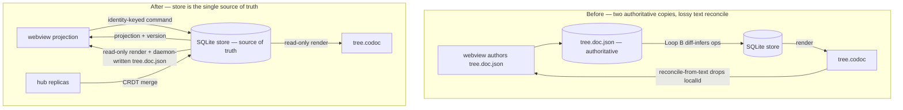
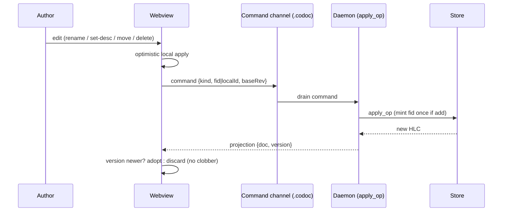

# refactor: Store-authoritative coordination for the codoc tree

## Summary

Make the SQLite store the single source of truth for the codoc feature tree. The VS Code webview becomes a pure projection of the store plus an identity-keyed command emitter; `tree.codoc` becomes a read-only export; tracked-change marks, comment anchors, and drafts move into the store so the projection carries them. The work lands in two phases in this one document: **Phase A** (local store-authoritative path) closes all three reported bugs and needs no CRDT; **Phase B** adds a Yjs/`pycrdt` merge layer at the `codoc serve` hub's multi-user boundary. Phase A is independently landable and ships first.

## Problem Frame

codoc holds the tree in two files that each behave as a source of truth: `tree.doc.json` (host-owned ProseMirror doc the webview authors) and `tree.codoc` (daemon-owned render). They diverge, and the divergence self-sustains. Node identity (`localId`) is dropped when the host re-sources the doc from `tree.codoc` text (`vscode-codoc/src/state/doc-reconcile.ts`), so `codoc/codoc_file/diff.py` re-mints new features every Loop B pass; the `docAhead` gate (`vscode-codoc/src/providers/tree-editor.ts`) clears only on exact text equality, unreachable once diverged, pinning the webview to a stale doc; and `buildPayload`'s side-effect re-persist overwrites a just-deleted node before `codoc/loop/doc_presence.py` can detect the deletion. Observed live: deletions resurrect, one authored node duplicates into 3–5 features (15→23 count), and VS Code raises "content of the file is newer" save conflicts.

The fix already half-exists. `codoc/codoc_file/doc_render.py` renders a `ParsedTree` (parsed from `tree.codoc` text) into the `tree.doc.json` shape via `build_doc(tree)`, and the `codoc serve` hub (`codoc/serve/payload.py`) uses it (through `build_doc_from_text`) to serve a doc with no editor attached. It does not yet read the store directly — that is part of this work (U2 adds a store-fed entry point). The local VS Code path is the only consumer that inverts the ownership. The work is to finish that migration locally, then strengthen the hub's multi-user edge with a real merge layer.

---

## Requirements

Origin R-IDs (`see origin`) are preserved 1:1 for traceability.

**Source of truth and projection**

- R1. The SQLite store is the single source of truth for authored intent and derived attribution.
- R2. The webview renders a projection of the store and holds no authoritative parallel document; when store and any prior local view disagree, the projection wins.
- R3. The local path uses the same store→doc projection the hub uses (`codoc/codoc_file/doc_render.py`).

**Identity and commands**

- R4. Each authored edit is an explicit identity-keyed command; the daemon applies it without inferring ops from a text or document diff.
- R5. `fid` is minted once by the store and carried in every projection; an already-minted node is never re-added.
- R6. A newly authored node carries a `localId` that round-trips through the projection until its minted `fid` is echoed back, after which `localId` remains the stable correlation token.
- R7. A delete is an explicit command; no code path re-introduces a deleted node from `tree.codoc` text.

**Rich state in the store**

- R8. Tracked-change marks are stored and carried in the projection.
- R9. Comment-thread anchors are stored and survive projection round-trips without re-anchoring from text.
- R10. Uncommitted drafts are represented in the store so a reload restores them.

**`tree.codoc` as read-only export**

- R11. `tree.codoc` is a derived, read-only render; not editable as a text document in VS Code, not round-tripped for identity.
- R12. The author never sees a VS Code text-document save conflict for `tree.codoc`.

**Local concurrency**

- R13. Agent description amends keep surfacing on the existing diff/review surface; behavior unchanged.
- R14. A returning projection never overwrites newer optimistic local edits; ordering uses a version gate built on the existing HLC, replacing `docAhead`.

**Hub multi-user merge**

- R15. Concurrent edits from independent hub replicas converge through a CRDT merge layer and land in the store without losing either contributor's change.
- R16. The merge layer is scoped to the hub; the local single-author path carries no CRDT.
- R17. Merge results are expressed as store state, so all downstream consumers see one converged tree.

**Removed machinery**

- R18. The text→doc reconcile path, the `docAhead` flag, and `buildPayload`'s side-effect re-persist are removed; their roles are replaced by R2 (projection) and R14 (version gate).

---

## Key Technical Decisions

- KTD1. **Store is the single source of truth; the CRDT is a transient merge/transport layer at the hub only (Option C, see origin).** Loop A/B, bindings, the dependency graph, proposals, lifecycle, and the HLC stay on the store unchanged. This keeps the intent-vs-index split intact and bounds CRDT cost to where independent replicas actually diverge.

- KTD2. **One authoritative representation, one projection — mirror the `feature_phase` discipline.** Today `build_doc(tree: ParsedTree)` renders parsed text, not the store. U2 adds a store-fed entry point (`build_doc_from_store(store, codoc_dir)`) that reads the new marks/comments/drafts tables and carries `localId`, and the local path adopts it (R3). It must specify how a stored anchor (offset/span) maps onto the `_inline_runs` output. Rich state is never re-encoded as a second hand-synced sidecar slice — the codebase's established merge-fragility lesson (`docs/plans/2026-06-20-001-core-data-model-and-merge-architecture.md`).

- KTD3. **Edits are identity-keyed commands applied via `apply_op`, not inferred from a doc diff.** Commands map onto existing `NodeOpKind` (ADD_NODE / AMEND / MOVE_NODE / RETIRE_NODE) and flow through the existing locked file-channel + `codoc/serve/dispatch.py` pattern into `codoc/loop/apply.py:apply_op`. The inference layer — `diff_codoc`'s `has_local_ids` doc-channel call site in `_merge_channels`, and `doc_presence.py` — is retired (the raw-text channel keeps `diff_codoc` only if a raw-text consumer survives; U7 decides). Identity guards: `fid` minted once, `localId` round-trip. The `(normalized_title, parent_id)` soft-uniqueness guard currently lives in the Loop A LLM-apply fold (`codoc/loop/loop_a.py`, `title_dedup.py`), **not** in `apply_op` — U3 must add an equivalent dedup check on the command apply path so a re-sent or replayed `add` cannot duplicate-mint.

- KTD4. **The version gate carries a per-feature HLC, not just the whole-tree `payload_version()`.** A single whole-tree version (the `status.json` HLC) cannot tell whether a returning projection touched the feature the author is editing — an unrelated feature's advance would clobber a pending local edit. The projection therefore carries each feature's `updated_at` HLC (already on the `features` row); the webview adopts a feature's projected state only when its per-feature version is newer than the local pending edit for that feature, else keeps the optimistic local copy. The whole-tree `payload_version()` remains the coarse staleness signal for the payload as a whole. This replaces `rev`/`docAhead` (R14).

- KTD5. **Rich-state schema follows the `blocks` table pattern.** New tables/columns added via the additive, PRAGMA-guarded `Store._migrate` (`codoc/store/db.py`), with `Store` accessors mirroring `upsert_block`/`blocks_for_feature`/`delete_block` and Pydantic models alongside `codoc/model/block.py`. Comment threads (today `Steer.comment_id` in `edits.json`) and the held-draft set are promoted into store tables.

- KTD6. **`tree.codoc` is a read-only export.** The custom editor (`CodocTreeEditorProvider`) makes the backing document non-savable; the daemon stays the sole writer. This closes the "content is newer" conflict at the source (R11, R12).

- KTD7. **Hub CRDT is Yjs via `pycrdt`, attaching at the `/api/command` + `/api/events` boundary (spike-validated, see origin).** It replaces the `_settle` optimistic-concurrency LWW 409 seam in `codoc/serve/dispatch.py`. The webview uses TipTap's Yjs-native Collaboration extension on the hub path. **The merged Y-doc description is the converged result and is written to the store as-is — not re-collapsed into a whole-description AMEND via a doc diff**, which would re-introduce the lossy translation Phase A retires (and drop one contributor's text after the CRDT correctly merged it). Structural changes (add/move/retire) derived from the merged doc carry the originating client's capability (KTD9) into `apply_op` (R15, R17). `pycrdt` is added behind a new dependency extra; local stays CRDT-free (R16).

- KTD8. **Command application is idempotent via a persisted applied-command-id ledger.** The drain-based channel is at-most-once-by-consumption, not idempotent-on-replay: a write/drain interleaved with a crash can re-apply. So each command carries a stable id, and the daemon records applied ids in a store ledger; re-applying a recorded id is a no-op. This addresses the TOCTOU/re-apply class flagged in `docs/residual-review-findings/feat-steering-emphasis-links-sdk.md` (the `realize.md` manifest tracks directives, not this channel — a separate ledger is required).

- KTD9. **Local transport: the daemon becomes the sole writer of `tree.doc.json`, rendered from the store projection after each Loop B pass.** The host stops writing `tree.doc.json` entirely (no `persistDocFile`); `WorkspaceState` adds `tree.doc.json` to its watch globs and the webview's `buildPayload` reads the daemon-written projection. There is no local push channel and no shared-writer file — the version gate (KTD4) operates on the file-watch re-read. This resolves the ownership inversion without reintroducing the two-writer race; the hub continues to use its HTTP payload/SSE channel.

- KTD10. **New command kinds are mapped to the hub capability allowlist.** `set_title` / `set_description` are description-level edits eligible for `SUGGEST`; `add` / `move` / `retire` are structural and gated on `HANDOFF` (added to `_HANDOFF_KINDS` in `codoc/serve/dispatch.py`). A suggest-only client's structural change is queued as a pending proposal, never applied directly — including via the Phase B Y-doc→`apply_op` path, which must carry the originating client's capability rather than losing it in the merge.

---

## High-Level Technical Design

**Source-of-truth fan-out (before → after).**



**Edit round-trip with the version gate (Phase A).**



---

## Key Flows

Carried from origin for traceability; the units below implement them.

- F1. **Author edits a feature.** Optimistic local apply → identity-keyed command → daemon `apply_op` → daemon re-renders `tree.doc.json` (KTD9) → webview re-reads, per-feature version gate adopts or keeps local. Covers R2, R4, R14. (U3, U4, U5)
- F2. **Author deletes a feature.** Explicit `retire` command → tombstoned, never re-introduced from `tree.codoc`. Covers R7, R11. (U3, U4, U6)
- F3. **Agent amends a description.** Loop A reflects code→tree; the amend surfaces on the existing diff/review surface; accept/reject unchanged. Covers R13. (no new unit — preserved behavior)
- F4. **Two hub contributors edit concurrently.** CRDT merges; converged result lands in the store; both edits survive. Covers R15, R17. (U9, U10, U11)

---

## Output Structure

Net-new files (Phase B adds the CRDT layer; everything else modifies existing files):

```text
codoc/
  model/
    annotation.py        # NEW — Pydantic models for marks / comment anchors / drafts (Phase A)
  serve/
    crdt.py              # NEW — Yjs document model + merge, pycrdt-backed (Phase B)
```

Per-unit `**Files:**` lists remain authoritative for what each unit creates or modifies.

---

## Implementation Units

### Phase A — Local store-authoritative path (closes the reported bugs)

### U1. Store schema and models for rich state

- Goal: Give marks, comment anchors, and drafts a first-class home in the store (R8–R10).
- Requirements: R8, R9, R10 (see origin).
- Dependencies: none.
- Files: `codoc/store/db.py` (schema + `_migrate` + accessors), `codoc/model/annotation.py` (new), `tests/store/test_annotations_store.py` (new).
- Approach: Add tables modeled on `blocks` — `marks` and `comments` — each with a stable id, `feature_id` FK, span/anchor fields, provenance, and HLC `created_at`/`updated_at`. These currently live only in `tree.doc.json` (`DocFile.comments` for comment threads; PM marks for authorship ink) and do not survive a reload, so they are genuinely new store state. **Drafts are NOT a new table by default**: the held-draft set already lives disk-persisted in `edits.json` `drafts` and survives reloads/restarts (R10 is already met), so do not duplicate it — only migrate drafts into the store if U7 also removes the `edits.json` `drafts` list, and make that an explicit, single-source decision. Add columns only through the PRAGMA-guarded additive `_migrate` pattern; add `Store` accessors mirroring `upsert_block` / `blocks_for_feature` / `delete_block`. One authoritative representation per fact (KTD2, KTD5).
- Patterns to follow: `codoc/store/db.py` `blocks` table + `upsert_block`; `codoc/model/block.py`; `codoc/model/hlc.py` for timestamps.
- Test scenarios:
  - Migration on a pre-existing DB adds the new tables without dropping data (open an old fixture DB, run `_migrate`, assert features/bindings intact and new tables present).
  - upsert + read round-trips a mark, a comment anchor, and a draft by `feature_id`.
  - Deleting a feature cascades or orphan-cleans its marks/comments/drafts per the chosen rule (assert no dangling rows).
  - HLC timestamps are populated and monotonic across two upserts.
- Verification: `python3.11 -m pytest tests/store/test_annotations_store.py` green; existing `tests/store/test_db.py` and `test_lifecycle.py` still pass.

### U2. Extend the projection to carry identity and rich state

- Goal: `build_doc` emits `localId`, marks, comments, drafts, and the version so the webview can render everything from the store (R2, R3, R6, R8–R10).
- Requirements: R2, R3, R6, R8, R9, R10.
- Dependencies: U1.
- Files: `codoc/codoc_file/doc_render.py` (add `build_doc_from_store`), `codoc/serve/payload.py`, `tests/codoc_file/test_doc_render.py` (modify), `tests/codoc_file/test_roundtrip_idempotency.py` (modify — existing round-trip expectations update for the new attrs), `tests/serve/test_payload.py`.
- Approach: Add a store-fed entry point `build_doc_from_store(store, codoc_dir)` — the existing `build_doc(tree)` keeps rendering parsed text for the round-trip guard. Extend `featureHeading` attrs to include `localId` (keep `fid`) and each feature's `updated_at` HLC (for KTD4's per-feature gate); emit tracked-change marks + `comment` marks from the new store tables, specifying the anchor→inline-span mapping onto `_inline_runs` output. Carry `payload_version()` on the payload as the whole-tree staleness signal.
- Patterns to follow: existing `_inline_runs` / `_paragraphs` in `doc_render.py`; `build_browser_payload` + `payload_version` in `codoc/serve/payload.py`.
- Test scenarios:
  - A feature with a `local_id` projects a heading carrying that `localId` and its `updated_at` HLC.
  - A stored mark/comment appears in the projected doc at the right anchor span.
  - Round-trip guard holds: `parse_doc(build_doc(parse_text(t)))` recovers titles + descriptions unchanged (existing `test_doc_render.py` / `test_roundtrip_idempotency.py` expectations updated for the new attrs, landed atomically with the projection change).
  - Retired features remain excluded from the projection.
  - Covers AE1. Projecting twice with no store change yields byte-identical docs.
  - Covers AE4. After an uncommitted edit with agent-authored marks present, a reload reconstructs both the draft state and the marks from their authoritative source.
- Verification: `tests/codoc_file/test_doc_render.py` and `tests/codoc_file/test_roundtrip_idempotency.py` green after their expectations are updated.

### U3. Identity-keyed command channel and applier

- Goal: Define the command set and apply it directly to the store via `apply_op`, with no doc-diff inference (R4, R5, R7).
- Requirements: R4, R5, R7.
- Dependencies: U1.
- Files: `codoc/loop/edits.py` (new command list + dataclasses), `codoc/serve/dispatch.py` (handlers), `codoc/loop/loop_b.py` (drain + apply), `vscode-codoc/src/webview/protocol.ts` (command message types), `vscode-codoc/src/state/edits-channel.ts` (TS mirror), `tests/loop/test_commands.py` (new), `tests/serve/test_dispatch.py`.
- Approach: Add a `commands` list to `edits.json` carrying `{id, kind, fid|localId, baseRev, payload}` where `kind ∈ {add, set_title, set_description, move, retire}` and `id` is the idempotency key (KTD8). Bump the `EditsFile` version (Python + `edits-channel.ts`); a missing `commands` key reads as empty (backward-compat). Drain and apply `commands` **before** the legacy `edits` annotation list so structural ops (retire/move) resolve before authorship stamps. Map each to a `NodeOpKind`, check the applied-command-id ledger (skip if already applied), then apply via `apply_op(op, store, source="user", applied=True)`, reusing `_accept_with_fid` for minted-fid correlation back to `localId`. Add a `(normalized_title, parent_id)` dedup check on this command path (the existing guard lives in Loop A, not `apply_op` — KTD3) so a re-sent or replayed `add` cannot duplicate-mint. Map command kinds to the capability allowlist (KTD10): `set_title`/`set_description` → `_SUGGEST_KINDS`, `add`/`move`/`retire` → `_HANDOFF_KINDS`. All writes go through the existing `@_locked` `_rewrite`.
- Patterns to follow: `codoc/loop/edits.py` `_LISTS` + `_rewrite` + drain functions; `codoc/loop/inbox.py` FileLock; `codoc/serve/dispatch.py` capability gating; `apply_op` / `_accept_with_fid` in `codoc/loop/apply.py` and `loop_b.py`.
- Test scenarios:
  - `add` mints exactly one feature and echoes its `fid` keyed to the submitted `localId`.
  - Re-applying the same command `id` is a no-op via the ledger — no duplicate feature (Covers AE1; KTD8).
  - A second `add` with the same `(normalized_title, parent_id)` but a fresh `id` is also rejected by the dedup guard — no duplicate.
  - `retire` tombstones the target and never re-adds it on a subsequent pass (Covers AE2).
  - `move` reparents without minting; `set_title` / `set_description` amend in place by `fid`.
  - A drain pass with both a legacy `edits` annotation and a `commands` entry for the same feature applies commands first; the annotation lands on the post-command state.
  - A command whose `fid` no longer exists is dropped without crashing the pass.
  - A suggest-capability `add`/`move`/`retire` is rejected (queued as proposal, not applied); `set_title`/`set_description` is accepted (Covers KTD10).
  - Concurrent writers (hub + host) appending commands don't lose entries (lock-contention test mirroring `test_edits_inbox_lock.py`).
- Verification: `tests/loop/test_commands.py` and `tests/serve/test_dispatch.py` green; `npx tsc --noEmit` clean for the protocol change.

### U4. Webview as projection consumer + command emitter

- Goal: `buildPayload` sources only from the store projection; editing actions emit commands; the divergence-causing paths are gone (R2, R4, R7, R18).
- Requirements: R2, R4, R7, R18.
- Dependencies: U2, U3. (Includes the daemon-side `tree.doc.json` projection write per KTD9 — added in this unit, not a separate dependency.)
- Files: `vscode-codoc/src/providers/tree-editor.ts`, `vscode-codoc/src/state/workspace-state.ts` (watch glob), `codoc/loop/loop_b.py` (projection write), `vscode-codoc/src/webview/tiptap/whole-doc-editor.ts`, `vscode-codoc/src/state/doc-reconcile.ts` (delete), `vscode-codoc/src/test/host-bridge.test.ts`, `vscode-codoc/src/test/ui-state.test.ts`, `vscode-codoc/src/test/reveal-decorations.test.ts`.
- Approach: Replace the text-parse + `docAhead` + saved-doc sourcing in `buildPayload` with consumption of the daemon-written `tree.doc.json` projection (KTD9 — the daemon becomes its sole writer; `WorkspaceState` adds it to the watch globs). There is no local push channel and no shared-writer file. `settleDoc` / `editMove` / delete handlers emit identity-keyed commands (U3) instead of persisting a doc. Remove `doc-reconcile.ts`, the `docAhead` set, and **all** `persistDocFile` side-effects (the host stops writing `tree.doc.json` entirely). Daemon-side: add the projection write to the end of the Loop B pass (alongside `write_tree`).
- Patterns to follow: existing message handlers in `tree-editor.ts` (`onDidReceiveMessage`); `writeEditsFile` for the command write; `whole-doc-editor.ts` `patchMintedIds` for the `localId → fid` echo.
- Test scenarios:
  - Authoring a node sends one `add` command and renders the minted `fid` on echo, with no duplicate row in the projection (Covers AE1).
  - Deleting a node sends one `retire` command; after the daemon round-trip the node is absent and does not return on reload (Covers AE2).
  - A stale projection (older version) arriving after a newer local edit is discarded, not applied (Covers R14; see U5).
  - No `persistDocFile` write occurs on settle (assert the host never writes `tree.doc.json`).
- Verification: `npx vitest run` green; `npx tsc --noEmit` + esbuild clean; `doc-reconcile.test.ts` removed with its module.

### U5. HLC version gate

- Goal: Ordering that prevents a returning projection from clobbering newer local edits, replacing `rev`/`docAhead` (R14).
- Requirements: R14.
- Dependencies: U2, U4.
- Files: `vscode-codoc/src/webview/protocol.ts`, `vscode-codoc/src/providers/tree-editor.ts`, `vscode-codoc/src/webview/ui-state.ts`, `codoc/serve/dispatch.py`, `vscode-codoc/src/test/ui-state.test.ts`.
- Approach: Carry the whole-tree `version` (= `payload_version()`) AND each feature's `updated_at` HLC on the payload (KTD4). The webview adopts a feature's projected state only when that feature's per-feature version is newer than the local pending edit for the same feature; an advance on an unrelated feature never clobbers a pending edit. The whole-tree version is the coarse staleness signal. Commands carry the `baseRev` they were authored against. No merge — the agent↔human diff surface (R13) still handles genuine concurrent same-feature description edits.
- Patterns to follow: `payload_version()` and the per-row `updated_at` HLC in `codoc/store/db.py`; `codoc/model/hlc.py` ordering.
- Test scenarios:
  - A projection whose per-feature version for feature B advanced does NOT revert a pending un-acked local edit on feature A (the cross-feature clobber the whole-tree gate would cause).
  - A feature's projection with a newer per-feature version is adopted; an older one is kept-local.
  - Covers R14. Rapid local edits followed by a delayed projection do not revert the edits.
  - After a daemon restart that applied N queued commands in a batch, the first post-batch projection is adopted even when the webview's in-memory last-applied state was reset by a reload (the per-feature versions still order correctly).
- Verification: `ui-state.test.ts` green; manual smoke — type continuously while the daemon re-renders, no revert.

### U6. `tree.codoc` as a read-only export

- Goal: Stop VS Code from treating `tree.codoc` as a savable text document (R11, R12).
- Requirements: R11, R12.
- Dependencies: none (independent of U1–U5; ship anytime in Phase A).
- Files: `vscode-codoc/src/providers/tree-editor.ts`, `vscode-codoc/src/extension.ts`, `vscode-codoc/package.json` (editor/contribution config).
- Approach: Make the custom editor's backing document read-only / non-savable so a ⌘S from any focus context is a no-op, and the daemon stays sole writer. Confirm no host code path writes `tree.codoc`.
- Patterns to follow: `registerCustomEditorProvider` options in `extension.ts`; the existing ⌘S interception in `whole-doc-editor.ts`.
- Test scenarios:
  - Test expectation: none for behavior unit tests — verified by integration/manual (custom-editor read-only is a host-API config, not unit-testable in vitest).
- Verification: Manual — open `tree.codoc`, trigger a daemon rewrite, press ⌘S from the tree pane and from the editor; no "content is newer" dialog appears (Covers AE3).

### U7. Retire the inference machinery

- Goal: Remove the now-dead doc-diff/deletion-inference paths and make command apply idempotent under the daemon-down fallback (R18, KTD8).
- Requirements: R18.
- Dependencies: U3, U4 (commands must be the live path before inference is removed).
- Files: `codoc/loop/loop_b.py` (`_merge_channels` doc-vs-text arbitration), `codoc/loop/doc_presence.py` (delete + `doc-fids.json` machinery), `codoc/store/db.py` (applied-command-id ledger table), `codoc/codoc_file/diff.py` (only the `has_local_ids=True` doc-channel call site is retired), `tests/loop/test_doc_presence.py` (delete), `tests/loop/test_loop_b.py`.
- Approach: Retire the doc-channel call site (`has_local_ids=True`) in `_merge_channels` and the doc-vs-text arbitration, and `reconcile_doc_presence` + `doc-fids.json` (deletes are explicit commands now, U3). Keep `diff_codoc` itself only if a raw-text/CLI consumer still needs it — decide and state which. Add the applied-command-id ledger (KTD8) so a queued command applied after a daemon restart cannot double-apply.
- Patterns to follow: `apply_op` as the surviving central applier; the manifest/done-tracking shape referenced in `loop_b.py` step 3.
- Test scenarios:
  - A pass with no commands and an unchanged store produces zero new features and zero ops (the re-mint regression is gone — Covers AE1).
  - A delete command followed by N passes keeps the node retired (Covers AE2).
  - A command queued while the daemon was down applies exactly once on restart (idempotency, KTD8).
  - `test_loop_b.py` suite still green for verdicts, steers, block edits, and the realize/hold pipeline (unaffected by KTD3).
- Verification: `python3.11 -m pytest tests/loop/` green; `diff.py` and `doc_presence.py` dead paths gone with their tests updated/removed.

### U8. Docs and one-time migration

- Goal: Update authoritative docs and reconcile any existing diverged workspace state.
- Requirements: supports R1, R2 (documentation of the new model).
- Dependencies: U1–U7.
- Files: `CLAUDE.md`, `docs/architecture.md`, `docs/codoc-collaborative-editing-model.md`, optional one-shot in `codoc/loop/` or a `codoc` CLI subcommand.
- Approach: Rewrite the "single-writer: webview authoritative, `tree.codoc` derived" sections to the store-authoritative model. Provide a one-time reconcile that (a) migrates existing `DocFile.comments` out of each workspace's `tree.doc.json` into the new store `comments` table **before** the host stops writing that file (U4) — otherwise open comment threads vanish; and (b) rebuilds `tree.doc.json` from the store projection. De-duplicate the 3×/5× duplicate features with a deterministic keep-rule: **keep the binding-owner fid** (the `UNIQUE(file, symbol_path)` constraint means only one duplicate holds the bindings), merge the other duplicates' descriptions/marks/comments onto it, re-point any rich-state rows, then retire the binding-less husks. Never retire the binding-owner.
- Patterns to follow: existing `codoc reflect` recovery-grade reconciliation; `retire_feature` in `codoc/store/db.py`; `docs/architecture.md` structure.
- Test scenarios:
  - One-time reconcile on a diverged fixture (doc has fid-less duplicates; store has N minted) converges the webview to the store projection with no further re-mint on the next pass.
  - Reconcile on a fixture where one duplicate holds bindings and another holds the author's edited description keeps the binding-owner and merges the description — no binding loss, no content loss.
  - Migration of a `tree.doc.json` carrying open comment threads lands all threads in the store `comments` table before the file write is dropped.
- Verification: `codoc status` on a previously diverged workspace shows a stable feature count across repeated passes; docs reviewed.

### Phase B — Hub multi-user CRDT merge (Yjs / pycrdt)

### U9. Yjs document model and `pycrdt` dependency

- Goal: A Yjs document shape mapping codoc nodes, attrs, and marks to Y types, merged with `pycrdt` on the daemon (R15, R16).
- Requirements: R15, R16.
- Dependencies: U2 (projection shape), U3 (apply path).
- Files: `codoc/serve/crdt.py` (new), `pyproject.toml` (new `crdt` extra with `pycrdt`), `tests/serve/test_crdt.py` (new).
- Approach: Define the Y doc shape (feature nodes with `fid`/`localId`/`level`, descriptions, marks) and the bidirectional map between it and the store projection. Keep it hub-only behind the new extra. Merge uses `pycrdt` (`yrs`-backed). **The merged description is written to the store as the converged result directly** (e.g. via a `set_description` carrying the merged text), NOT re-derived by diffing the merged doc back into ops — that re-collapse would drop a contributor's text the CRDT correctly merged (the lossy translation Phase A retires). Structural changes (add/move/retire) read from the merged doc carry the originating client's capability (KTD10) into `apply_op`; each `apply_op` call also stamps `source`/`actor`/capability so a suggest-only client cannot land structural changes through the merge (R17).
- Patterns to follow: the projection from U2; `dispatch → apply_op` as the convergence sink; the capability gating in `codoc/serve/dispatch.py`.
- Test scenarios:
  - Two `pycrdt` updates editing different features merge to a doc containing both edits.
  - Concurrent edits to the **same** feature's description by two replicas both survive into the converged store description — neither is dropped by the convergence sink (Covers AE5).
  - Concurrent structural ops (two adds under one parent; a move racing a retire of the same node) resolve to a deterministic ordered `apply_op` sequence.
  - A suggest-only client's structural Y-doc change is queued as a proposal, not applied (capability carried through the merge, KTD10).
  - Mapping a feature node round-trips `fid`/`localId`/marks through the Y doc without loss.
  - A Yjs binary update produced by a JS client applies to the `pycrdt` doc (cross-runtime smoke against a captured fixture update).
- Verification: `python3.11 -m pytest tests/serve/test_crdt.py` green; `pip install -e '.[crdt]'` resolves.

### U10. Hub sync transport and store convergence

- Goal: Exchange Yjs updates at the hub boundary and converge them into the store, replacing the `_settle` LWW seam (R15, R17).
- Requirements: R15, R17.
- Dependencies: U9.
- Files: `codoc/serve/app.py` (sync endpoint/channel), `codoc/serve/dispatch.py` (replace `_settle` 409 seam), `codoc/serve/push.py`, `tests/serve/test_concurrency.py`, `tests/serve/test_dispatch.py`.
- Approach: Carry client→server Yjs updates over `POST /api/command` (SSE is server→client only — use `/api/events` for the server→client direction). Bind each Yjs `clientID` to its authenticated session/capability at connect time (server-assigned or validated token), and reject updates whose `clientID` is not in the authenticated map — a Yjs `clientID` is client-assigned and otherwise spoofable. Replace the optimistic-concurrency 409 rejection in `_settle` with CRDT merge → `apply_op` convergence (R17), preserving capability gating per KTD10. Decide and state whether `/api/payload` + `/api/events` require auth after Phase B (today they are unauthenticated — see Risks).
- Patterns to follow: `event_source` / `PayloadStream` in `push.py`; `_settle` baseRev guard in `dispatch.py` (the seam being replaced); `test_concurrency.py`.
- Test scenarios:
  - Two simulated remote replicas posting concurrent edits both land in the store; neither is dropped (Covers AE5).
  - The old 409 LWW path no longer rejects a concurrent suggest; it merges instead.
  - A merged result is observable in the next `/api/payload` projection.
  - Capability gating still blocks a suggest-only client from hand-off commands.
- Verification: `tests/serve/test_concurrency.py` updated to assert merge (not LWW) and green.

### U11. Webview Yjs binding (hub path only)

- Goal: Wire the TipTap editor to the shared Y doc on the hub path, reconciling with codoc's `localId` re-mint and undo behavior (R15, R16).
- Requirements: R15, R16.
- Dependencies: U9, U10.
- Files: `vscode-codoc/src/webview/tiptap/whole-doc-editor.ts`, `vscode-codoc/src/webview/tiptap/feature-heading.ts`, `vscode-codoc/package.json` (Yjs + `@tiptap` collaboration deps), `vscode-codoc/src/test/` (new binding test).
- Approach: Add TipTap's Yjs-native Collaboration on the hub path only (the local extension stays CRDT-free, R16). Gate the Yjs + `@tiptap` collaboration imports behind a dynamic `import()` keyed on hub mode so the local extension bundle tree-shakes them out — R16 is a dependency-surface constraint, not just a runtime one. Reconcile the residual risks the spike flagged: map codoc node attrs/marks onto Y shared types, and resolve TipTap's Yjs-undo against codoc's `localId` re-mint in `feature-heading.ts` `appendTransaction`.
- Patterns to follow: `whole-doc-editor.ts` editor construction + `patchMintedIds`; `feature-heading.ts` `localId` re-mint guard.
- Test scenarios:
  - A node authored under collaboration retains a stable `localId` across a Yjs undo (no spurious re-mint).
  - Two browser sessions editing concurrently converge to the same document.
  - Disabling collaboration (local extension build) leaves the version-gate path (U5) intact — no Yjs code runs locally.
- Verification: `npx vitest run` + `npx tsc --noEmit` + esbuild clean; the local-mode bundle contains no Yjs modules (bundle-inspection check); manual two-browser hub smoke converges.

---

## Scope Boundaries

**In scope**
- Phase A (R1–R14, R18) and Phase B (R15–R17), sequenced A→B in this one plan.

**Outside this product's identity** (see origin)
- Replacing SQLite, the bindings model, or the dependency-graph pipeline — they remain the derived index the store owns.
- A local CRDT — local stays single-author with the HLC version gate.

**Deferred for later** (see origin)
- Character-level prose co-editing locally — the diff/review surface stays.

**Deferred to Follow-Up Work**
- `/ce-compound` entry capturing the Yjs↔TipTap↔`pycrdt` mark-mapping and the TipTap-Yjs-undo-vs-`localId` reconciliation (flagged residual risk; no `docs/solutions/` tree exists yet).

---

## System-Wide Impact

- The "single-writer, webview-authoritative" model documented in `CLAUDE.md` and `docs/codoc-collaborative-editing-model.md` is inverted; U8 updates them. The shipped doc's "save conflict is gone" claim is superseded by the live recurrence this plan fixes.
- The local extension's file-channel model (no HTTP server) is preserved; only the hub gains the Yjs transport.
- The realize/hold/directive pipeline keys off `feature_id`, not the doc diff, so it is unaffected by the KTD3 apply-path change — but `tests/loop/test_loop_b.py` must stay green to prove it.

---

## Risks & Dependencies

- **Cross-runtime Yjs interop (Phase B).** Spike-validated against JupyterLab's production Python↔browser stack, but the codoc-specific attr/mark mapping is new integration work. Mitigation: U9's cross-runtime fixture test; keep Phase B behind the `crdt` extra so Phase A ships independently.
- **TipTap Yjs-undo vs `localId` re-mint.** A real interaction risk (U11). Mitigation: explicit undo-stability test; the local path never loads Yjs so the risk is hub-scoped.
- **Daemon-down command queue (TOCTOU).** Mitigation: KTD8 idempotent, done-tracked apply (U7), with a dedicated re-apply test.
- **One-time migration of diverged workspaces.** Existing duplicates (e.g., the 3×/5× nodes) must converge, not multiply, and open comment threads in `tree.doc.json` must migrate before U4 drops the write. Mitigation: U8 keep-the-binding-owner rule + comment migration + diverged-fixture tests.
- **Unauthenticated hub read endpoints (pre-existing).** `/api/payload` and `/api/events` serve the full tree (bindings, drafts, steering notes) with no auth today. Phase B changes the write/merge model but not this read gap; U10 must decide whether to gate reads on `SUGGEST` or document public-read as an explicit trust-boundary decision.
- **Yjs `clientID` spoofing (Phase B).** Client-assigned `clientID`s are spoofable; capability enforcement (KTD10) depends on a server-bound `clientID`→session map (U10). Mitigation: reject updates from unmapped `clientID`s.
- **`pycrdt` supply chain.** Pin `pycrdt` (v0.14.1, `yrs`-based) with hash/lockfile in the new `crdt` extra; a compromised release would inject into the `apply_op` path. Phase A adds no new runtime dependency.

---

## Sources & Research

- Origin requirements: `docs/brainstorms/2026-06-26-codoc-store-authoritative-coordination-requirements.md`.
- Projection to extend: `codoc/codoc_file/doc_render.py` (`build_doc`); hub usage `codoc/serve/payload.py` (`build_browser_payload`, `payload_version`).
- Command-channel model: `codoc/loop/edits.py`, `codoc/loop/inbox.py`, `codoc/serve/dispatch.py` (the `_settle` 409 seam replaced in Phase B).
- Apply path / identity: `codoc/loop/apply.py` (`apply_op`, `_accept_with_fid`), `codoc/codoc_file/diff.py` (`diff_codoc` retired branch), `codoc/loop/doc_presence.py` (retired), `codoc/store/db.py` (`features.local_id`, `_migrate`), `codoc/model/hlc.py`.
- Webview: `vscode-codoc/src/providers/tree-editor.ts` (`buildPayload`, `docAhead`, `persistDocFile`), `vscode-codoc/src/state/doc-reconcile.ts` (deleted), `vscode-codoc/src/webview/protocol.ts`, `vscode-codoc/src/webview/tiptap/whole-doc-editor.ts` (`patchMintedIds`), `feature-heading.ts` (`localId` re-mint).
- Prior art / discipline: `docs/plans/2026-06-20-001-core-data-model-and-merge-architecture.md` (one-fact-one-projection), `docs/brainstorms/2026-06-19-deployed-codoc-collaborative-suggestion-requirements.md` (hub CRDT boundary; the parked "transient vs authoritative" question this plan answers), `docs/residual-review-findings/feat-steering-emphasis-links-sdk.md` (TOCTOU + steering-note loss).
- CRDT spike: pycrdt (Jupyter, `yrs`-based, v0.14.1); JupyterLab `jupyter-collaboration` as the Python↔browser existence proof; TipTap Collaboration (Yjs-native); Automerge evaluated and rejected.
