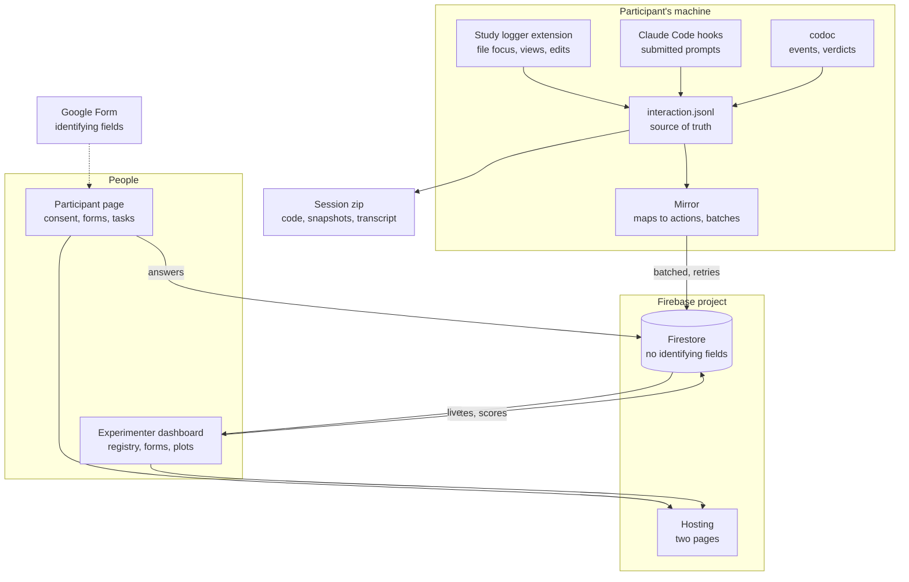
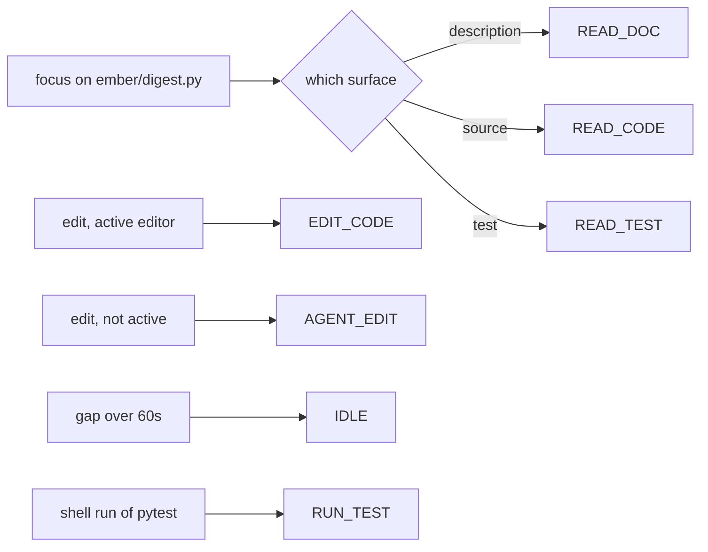

# feat: Study web apps, live data, and usage-pattern analysis

Two small web apps over one Firebase project, plus the recording design that makes
a session analyzable afterwards. The study design is
`docs/plans/2026-08-11-001-user-study-design-v2.md` and the measure list is
`docs/study-materials/analysis-plan.md`. This plan does not change either. It
changes how the data reaches us and what shape it arrives in.

---

## Summary

Today a session produces four things on the participant's machine and travels
back as a zip. That works, but nobody sees anything until afterwards, the forms
are on paper, and the interaction log is a flat event stream that no one can read.

This plan adds a participant page the extension opens for them, an experimenter
dashboard, and a live copy of the session in Firestore. Underneath both it defines
a small closed vocabulary of actions, so a session becomes a short sequence rather
than a pile of events. That vocabulary is what makes counting patterns possible at
all, and it is the main design decision here.

The first thing built is a thin slice that proves events reach Firestore and can be
plotted. Everything else follows once that works.

---

## Problem Frame

Four problems, in the order they hurt.

**Nothing is visible while it runs.** If the logger stops, or the daemon dies, or a
form is never filled in, we find out when we open the zip. `check-session-complete.py`
catches it at the end of the call, which is better than the next morning, but still
after the fact.

**The forms are manual.** Consent, the background questionnaire, the two in-session
questionnaires, the sign-off, and twenty question scores per participant. All of it
is currently paper or ad-hoc, and all of it has to be typed up before analysis.

**Setup is a conversation.** The participant runs a script and reads the output back
to us. It works, and the script is good, but it is not the experience we want on the
first five minutes of a call.

**The interaction log is not analyzable.** It records file paths, ranges and
durations, which is right for the measures in the analysis plan. It is the wrong
shape for "what patterns do people follow". A stream of a few thousand file-focus
events does not answer that question, and no amount of post-processing turns
arbitrary events into a readable grammar. That has to be designed in at write time.

---

## Requirements

| ID | Requirement | Source |
|---|---|---|
| R1 | Consent, background, and both in-session questionnaires are collected on the web and land against a participant code | user request |
| R2 | No name, email, or other identifying field is ever written to Firestore | user request, refined by the Google Form |
| R3 | A session's action stream reaches Firestore while the session is running | user request |
| R4 | A session survives the network or the site being unavailable | plan decision, see KTD3 |
| R5 | The experimenter can see, per participant, what has arrived and what is missing | user request |
| R6 | Usage patterns can be counted over sessions, including across conditions | user request |
| R7 | Prompt writing and description editing are recorded in a form a human can read | user request |
| R8 | Both apps are visually minimal, and every visualization is d3 | user request |
| R9 | The participant reaches their page from the extension, without being sent a link | user request |
| R10 | Nothing added here weakens the parity between the two conditions | study design, section 2.1 |

---

## Key Technical Decisions

### KTD1. Consent lives in Google Forms. Firestore holds only a code.

The form you supplied collects the identifying fields. Those responses stay in
Google's account, under whatever agreement your ethics approval already covers.
Firestore stores the participant code, the condition order, timings, answers, and
the action stream. Nothing in it identifies a person.

This removes the hardest question from the build. It also means the join between a
consenting human and their data is a code held in two places, which is what an
ethics board usually asks for anyway.

### KTD2. A closed action vocabulary, with a shared level and a codoc level.

The raw sources stay as they are. On top of them sits a fixed list of about
fifteen action names. Every recorded event maps to one of them or is dropped.

The vocabulary is split in two.

**Shared level**, present in both conditions: reading the description, reading code,
reading a test, editing each of those by hand, submitting a prompt, the agent
changing a file, running the tests, running a build, and going idle.

**codoc level**, present in one condition only: reviewing a proposal, accepting,
rejecting.

Cross-condition pattern comparison uses the shared level only. Using the codoc level
in a comparison would be counting an action the other condition cannot perform, and
would show a difference that is an artifact of the tool rather than of behavior.

This is the same trap as using codoc's own drift numbers as a measure, which
`analysis-plan.md` already refuses.

### KTD3. The local file stays the source of truth. Firestore is a live mirror.

The logger keeps writing its JSONL exactly as it does now. A separate step reads
that file and mirrors it upward. If the network drops, the session is unaffected and
the backlog uploads when it returns. If Firebase is unreachable for the whole
session, the zip still contains everything.

A study that cannot run without a website is worse than one that has no website.

### KTD4. Actions are written in batches, not one document per event.

A session produces a few thousand actions. One document each is slow to read, slow
to plot, and wasteful. Actions accumulate and flush as a single document every ten
seconds or every fifty actions, whichever comes first.

The dashboard reads a handful of documents per session instead of thousands.

### KTD5. Participants sign in anonymously. The experimenter signs in with Google.

Two things write under one participant: the page in their browser and the mirror
inside their editor. Neither can see the other's sign-in, so each signs in
anonymously and registers itself against a code we created in advance. The rules then
let those accounts write to that one participant's records and read nothing else. The
experimenter signs in with Google and is checked against a short list of allowed
addresses.

This makes the code itself the thing that must not leak. It is long, random, shown
only to the person it belongs to, and never reused.

The web configuration you pasted is meant to be public. It identifies the project
and protects nothing. The rules are the protection, so they are built and tested
first, in their own unit, against the emulator.

### KTD6. Composition is captured on pauses, not on keystrokes.

Recording every keypress produces something no one can read and that we would have
to reduce anyway. Recording only the final text loses the part we are curious about.

The middle: when someone stops typing for two seconds, the current draft is one
composition step. A prompt or a description edit becomes a handful of steps with
timings, and the sequence shows whether it was written straight through or worked
over. Each step also gets a one word label for what changed, chosen from a short
list rather than free text.

### KTD7. No framework. esbuild, plain modules, d3 for everything visual.

Two pages with a few views each. A framework would be more code than the apps. The
repo already builds the extension with esbuild, so the same tool bundles these and
pins the Firebase and d3 versions.

---

## High-Level Technical Design

Where the data comes from and where it goes.



How a raw event becomes a countable action. The alphabet is closed, so anything that
does not map is dropped rather than invented.



A session then reads as a short string, and the questions become counting questions.

```
READ_DOC READ_CODE PROMPT AGENT_EDIT READ_CODE RUN_TEST EDIT_CODE RUN_TEST READ_DOC
```

Directional only. The exact names are settled in U2.

---

## Output Structure

```
study-app/
  firebase.json            hosting and emulator config
  firestore.rules          the actual protection
  firestore.indexes.json
  shared/
    actions.js             the closed vocabulary and the mapping
    schema.js              Firestore paths and document shapes
    firebase.js            one initialized app, shared
  participant/
    index.html
    app.js                 consent, forms, setup, walkthrough, tasks
    style.css
  experimenter/
    index.html
    app.js                 registry, forms, live view
    charts.js              every d3 visual
    style.css
  analysis/
    sequences.js           builds action strings from a session
    ngrams.js              counting, with idle handling and trimming
  test/
    rules.test.js          against the emulator
    actions.test.js
    ngrams.test.js
  build.mjs                esbuild
```

---

## Implementation Units

### Phase A. Prove the pipe

### U1. Firebase project, security rules, and rule tests

**Goal.** A locked-down project that a participant can write to only under their own
code, and that only allowed experimenters can read.

**Requirements.** R2, R5.

**Dependencies.** None.

**Files.**
- `study-app/firebase.json`
- `study-app/firestore.rules`
- `study-app/firestore.indexes.json`
- `study-app/shared/firebase.js`
- `study-app/test/rules.test.js`

**Approach.** Anonymous auth for participants, Google auth for experimenters checked
against an allowlist held in the rules. A participant document is created in advance
by the experimenter and claimed once. After claiming, that account may append to its
own session records and read nothing else. Experimenters may read everything and
write notes and scores.

Two accounts need to write under one code, not one. The page runs in their browser
and the mirror runs inside the editor, and neither can see the other's sign-in. So a
code is claimed by *devices* rather than by a single account: an anonymous account may
register itself against an existing code, up to a small fixed number, and afterwards
may write only under that code. The code is long and random and is the only thing
standing between a stranger and a write, so it is never displayed anywhere public and
never reused between participants.

An anonymous sign-in is lost if the browser storage is cleared, which would strand a
participant mid-session. The dashboard can release a code's devices so it can be
claimed again, and that is the recovery path rather than loosening the rules.

**Execution note.** Write the rule tests first. The rules are the only thing standing
between this project and an open database, and they are cheap to get subtly wrong.

**Test scenarios.**
- An anonymous account registered against `p04` can write an action batch under `p04`.
- The same account cannot write under `p05`.
- The same account cannot read `p05`, including by listing the collection.
- A code that does not exist cannot be registered against or written to.
- Two accounts, the browser and the mirror, can both register against one code and
  both write.
- Registration past the device limit is refused.
- An account that never registered cannot write, even with a valid code.
- After the dashboard releases a code, the old accounts can no longer write and a new
  one can register.
- A signed-in address that is not on the allowlist can read nothing.
- An allowlisted address can read every participant and write notes.
- No rule permits writing a field named in the forbidden list from U2's schema, so a
  future page cannot start sending names.

**Verification.** The emulator suite passes, and a deployed rules dry run against the
real project reports no broader access than the tests describe.

### U2. The action vocabulary and the mapper

**Goal.** One place that defines every action name and turns raw events into them.

**Requirements.** R6, R10.

**Dependencies.** None.

**Files.**
- `study-app/shared/actions.js`
- `study-app/shared/schema.js`
- `study-app/test/actions.test.js`

**Approach.** A frozen list of action names split into the shared level and the codoc
level, per KTD2. A pure function from a logger event, a codoc event, or a hook record
to either one action or nothing. The schema module owns the Firestore paths, the
batch document shape, and the list of field names that must never be written.

**Test scenarios.**
- Every action name in the list is produced by at least one input, so no name is dead.
- An event that maps to nothing returns nothing rather than an "other" action, so the
  vocabulary stays closed.
- A focus event on the description maps to reading the description in both conditions,
  whether the file is `tree.codoc` or `CLAUDE.md`.
- An edit in the active editor and an edit outside it map to different actions.
- A gap longer than the idle threshold produces exactly one idle action, not one per
  second.
- The shared level contains no action that only one condition can produce.
- The forbidden field list rejects a document carrying a name or an email.

**Verification.** A recorded sample session maps to a sequence a person can read
aloud and recognize.

### U3. Mirror the local log to Firestore

**Goal.** Actions arrive while the session runs, and nothing is lost when the network
is not there.

**Requirements.** R3, R4.

**Dependencies.** U1, U2.

**Files.**
- `docs/study-materials/logger/mirror.js`
- `docs/study-materials/logger/extension.js`
- `docs/study-materials/logger/test-mirror.js`

**Approach.** The logger keeps writing its file unchanged. A mirror reads what it has
written, maps it through U2, batches per KTD4, and sends. Unsent batches persist next
to the log so a crash or a restart resumes rather than loses. Failure is silent to the
participant and visible in the output channel.

The mirror signs in anonymously on first run and registers itself as a device against
the configured code, per U1. Its sign-in is cached with the pending batches, so
restarting the editor does not consume another device slot.

**Test scenarios.**
- Fifty actions with no network produce a pending file and no data loss.
- When the network returns, the backlog uploads in order and the pending file empties.
- A batch flushes on the size threshold and on the time threshold.
- A crash between writing the local file and sending leaves the batch pending, and a
  restart sends it exactly once.
- Restarting the editor reuses the cached sign-in rather than registering a second
  device.
- With no code configured, the mirror stays off and the logger still writes its file.
- The local file is byte-identical to what the logger writes today, so the existing
  measures are unaffected.
- No document leaves the machine carrying a file's contents.

**Verification.** Run a real session, watch documents appear, pull the plug halfway
and confirm the session continues and the gap fills in afterwards.

### U4. Experimenter dashboard, first view

**Goal.** The proof the user asked for: data arrives and is plotted.

**Requirements.** R3, R5, R8.

**Dependencies.** U1, U3.

**Files.**
- `study-app/experimenter/index.html`
- `study-app/experimenter/app.js`
- `study-app/experimenter/charts.js`
- `study-app/experimenter/style.css`
- `study-app/build.mjs`

**Approach.** Sign in, list participants, open one, and see the session as a d3
timeline with one band per surface. Live, because the dashboard subscribes rather than
polls. A status strip says whether actions are still arriving.

**Test scenarios.**
- With no participants, the page explains what to do rather than showing an empty grid.
- A session that is still running shows new actions without a reload.
- A session with a five minute gap shows the gap rather than compressing it away.
- Signing in with an address that is not allowed shows a refusal, not a blank page.
- The timeline stays readable at both fifteen minutes and one hundred minutes.

**Verification.** A session recorded on one machine is watched from another.

### Phase B. Record the things that are hard to record

### U5. Prompts and composition steps

**Goal.** What people wrote to the agent, how they revised it, and the same for the
description, in a form a person can read.

**Requirements.** R7, R10.

**Dependencies.** U2.

**Files.**
- `docs/study-materials/logger/prompt-hook.py`
- `docs/study-materials/logger/composition.js`
- `docs/study-materials/scripts/setup.sh`
- `docs/study-materials/logger/test-composition.js`

**Approach.** A study-owned Claude Code hook records each submitted prompt with its
time and length. It is installed in **both** conditions. codoc's own hook already
captures prompts through `record_intent`, but it exists in one condition only, so
relying on it would leave the comparison one-sided in exactly the way the logger was
built to avoid.

Composition steps follow KTD6. Typing that pauses for two seconds closes a step. Each
step carries elapsed time, the change in length, and one label from a short list such
as extended, shortened, replaced, or restructured. The labels are computed, not typed.

The description side reuses what codoc already records, since its edit channel
carries the text before and after each change.

**Test scenarios.**
- A prompt typed straight through produces one composition step.
- A prompt written, half deleted, and rewritten produces steps whose labels show it.
- A pause shorter than the threshold does not close a step.
- Prompt text is recorded once, at submission, and never per keystroke.
- The hook is present and produces the same records in both conditions.
- The hook never delays or blocks a turn, including when the network is down.

**Verification.** Read one participant's prompt history end to end and follow how the
instruction changed. If it does not read as a story, the labels are wrong.

### Phase C. The participant's experience

### U6. Participant page

**Goal.** One page that carries them from consent to the end of the second condition.

**Requirements.** R1, R2, R8, R9.

**Dependencies.** U1.

**Files.**
- `study-app/participant/index.html`
- `study-app/participant/app.js`
- `study-app/participant/style.css`

**Approach.** Steps in order, one at a time, with the current step the only thing on
screen. Consent is the Google Form embedded as supplied. Everything after it writes to
Firestore under the code. The background questionnaire, the setup check result, the
walkthrough, the task card as an image that cannot be selected, and the two
questionnaires from the design doc.

The task card is shown as an image on purpose. That rule already exists in the guide
and moving the card onto a web page must not quietly break it.

**Test scenarios.**
- A code in the address opens that participant's flow and no one else's.
- An unknown or already claimed code refuses rather than creating a record.
- Answers save as they are given, and a reload returns to the same step with answers
  intact.
- The task card cannot be selected or copied as text.
- The consent step cannot be skipped, and nothing is written before it is done.
- Reverse-keyed questionnaire items store the raw answer, not a flipped one, so the
  flipping happens once during analysis.
- With Firestore unreachable, the page says so plainly and the session can continue
  on the scripts alone.

**Verification.** Walk the whole flow as a participant, on a machine that has never
seen the study.

### U7. The extension opens the page

**Goal.** They open the project and the page is there. Nobody sends a link.

**Requirements.** R9.

**Dependencies.** U6.

**Files.**
- `docs/study-materials/logger/extension.js`
- `docs/study-materials/logger/package.json`
- `docs/study-materials/scripts/setup.sh`

**Approach.** The logger already activates on startup and knows the workspace. On
first open of a study project it offers to open the participant page, with the code it
was configured with, using the editor's external browser. A command repeats it.

The code is set once during setup, so it is in place before the session.

**Test scenarios.**
- Opening a study project for the first time offers the page exactly once.
- Declining does not ask again in that session, and the command still works.
- Opening a project that is not part of the study offers nothing.
- With no code configured, it explains how to set one rather than opening a broken page.

**Verification.** Unpack the bundle, run setup, open the project, and land on the page.

### Phase D. The experimenter's working surface

### U8. Registry, forms, and what is missing

**Goal.** Everything currently on paper, typed once, in the place it is used.

**Requirements.** R1, R5.

**Dependencies.** U4.

**Files.**
- `study-app/experimenter/app.js`
- `study-app/experimenter/charts.js`
- `study-app/shared/schema.js`

**Approach.** Create a participant, get a code, and see which of the four combinations
are filled so far. During a session, the sign-off box, the who-settled-each-decision
notes, and the ten questions with their scoring tables beside them. After a session, a
per-participant view of what arrived and what did not, using the same measure list as
`check-session-complete.py` so the two never disagree.

**Test scenarios.**
- Creating a participant assigns the combination that is least represented so far.
- Scores save as they are clicked and survive a reload mid-session.
- The missing-data view names the same gaps the command line checker names for the
  same session.
- Two experimenters editing one participant do not overwrite each other silently.
- Nothing in this view can write an identifying field, per U1's rules.

**Verification.** Run a pilot end to end using only the dashboard for notes.

### Phase E. Reading the result

### U9. Sequences, patterns, and plots

**Goal.** Turn sessions into sequences and count what recurs.

**Requirements.** R6, R8.

**Dependencies.** U2, U4.

**Files.**
- `study-app/analysis/sequences.js`
- `study-app/analysis/ngrams.js`
- `study-app/experimenter/charts.js`
- `study-app/test/ngrams.test.js`

**Approach.** A session becomes a string over the shared vocabulary. Long idles split
it into episodes, so a coffee break does not read as a transition. Counts of two and
three action sequences, compared between conditions and against what would be expected
if order did not matter, so that common-because-everything-is-common is separated from
genuinely recurring.

Rare sequences are trimmed rather than plotted, and the amount trimmed is displayed,
because silently dropping the tail is how a pattern gets invented.

Plots: the session timeline from U4, a transition matrix, and the sequences that
differ most between conditions.

**Test scenarios.**
- A session of known shape produces the sequence a person would write by hand.
- An idle longer than the episode threshold splits, and one shorter does not.
- A sequence that is common only because its parts are common does not rank highly.
- With one participant, the view says the sample is too small rather than plotting it.
- The comparison refuses to include the codoc-only actions, per KTD2.
- Trimmed counts are reported, not hidden.

**Verification.** Run it over the pilot sessions. If the top patterns are not
recognizable from having watched the recordings, the vocabulary is wrong and U2 needs
another pass.

### U10. Join the live data back to the zip

**Goal.** One dataset, and a check that the two halves agree.

**Requirements.** R4, R5.

**Dependencies.** U3, U8.

**Files.**
- `study-app/analysis/export.js`
- `docs/study-materials/scoring/check-session-complete.py`
- `docs/study-materials/analysis-plan.md`

**Approach.** Export a participant's Firestore records as files that sit beside the
collected zip. Extend the existing checker to compare the two and report anything that
is in one and not the other. Update the analysis plan so every measure names its source
after this change.

**Test scenarios.**
- A session with both halves reports agreement.
- A session where the mirror missed a stretch reports the gap and its length.
- A session with no Firestore data at all still passes on the zip alone, since the
  local file remains the source of truth.
- The export carries no identifying field.

**Verification.** Export a pilot, run the checker, and confirm the numbers match what
the dashboard showed on the day.

---

## Scope Boundaries

**In scope.** The two pages, the rules, the mirror, the vocabulary, prompt and
composition capture, and the first round of pattern analysis.

### Deferred to Follow-Up Work

- Statistical testing of the pattern differences. This plan produces the sequences and
  the counts. Which test to run belongs with the pre-registration.
- Automatic scoring of the ten questions. They stay hand-scored against the frozen
  tables.
- Any replay or playback view of a session. The screen recording covers it.

### Not doing

- Controlling the participant's screen or pace. They share the screen and you can see
  what is happening.
- Replacing the file-based scripts. They remain the path that works when nothing else
  does.
- Storing screen recordings or project code in Firestore. Both travel as they do now.
- Changing any measure, question, or scoring table in the study design.

---

## Risks and Dependencies

| Risk | Consequence | Mitigation |
|---|---|---|
| Security rules are wrong | A database of study data is readable by anyone with the config | Rules are U1, tested against the emulator before anything writes real data, and the tests include the negative cases |
| The institution does not allow this data in Firestore | The whole thing is unusable | Confirm before U1. No identifying field is stored either way, which is usually the question they ask |
| The site is down during a session | A session is lost | KTD3. The local file is the source of truth and the scripts still work alone |
| The vocabulary turns out to be wrong | Patterns are meaningless | U9's verification is explicitly "does this match what you watched". Expect one revision of U2 after the pilots |
| Firestore free tier limits | Writes start failing mid-study | Batching in KTD4 keeps a session in the low hundreds of writes. Check the quota against the participant count before recruiting |
| A participant code leaks | Someone could append junk actions to that participant | Codes are long, random, never shown publicly, and never reused. The damage is bounded to one participant's action stream and is visible in the dashboard as activity at the wrong time |
| A participant clears browser storage mid-session | They cannot write, and the page looks broken | The dashboard can release the code and they re-claim. Rehearse this once during a pilot so it is not discovered live |
| A participant's machine blocks the site | They cannot reach their page | The scripts remain a complete path, and setup reports reachability before the day |

---

## Open Questions

Deferred to implementation, not blocking:

- Which addresses go on the experimenter allowlist.
- Whether the two questionnaires are transcribed into the participant page or embedded
  as further Google Forms. Embedding is faster to build and keeps the answers next to
  consent. Transcribing puts them in Firestore where the dashboard can use them live.
  Worth deciding at U6, not now.
- The idle threshold and the episode threshold in U9. Both should be set from the pilot
  data rather than guessed, and both must be fixed before the real sessions.

Needs an answer before U1:

- Does your ethics approval cover storing coded study data with a cloud provider in
  the United States. If not, the mirror is dropped and the dashboard reads from
  uploaded exports instead. The rest of the plan is unchanged.

---

## System-Wide Impact

The study logger gains a mirror and a prompt hook. Its local behavior does not change,
which matters because the measures in `analysis-plan.md` are computed from that file.

`setup.sh` gains two steps: set the participant code, and install the prompt hook in
both conditions. `check-session-complete.py` gains the comparison in U10.

The codoc extension itself is untouched. Nothing here changes what a participant
experiences inside the tool being studied, which is the point.

---

## Sources and Research

- `docs/plans/2026-08-11-001-user-study-design-v2.md` for the measures, the conditions,
  and the parity argument in section 2.1.
- `docs/study-materials/analysis-plan.md` for the current measure-to-source mapping,
  which U10 updates.
- `codoc/agent/hook.py`, where `handle_user_prompt` already captures prompt text
  through `record_intent`. This is why U5 builds a study-owned hook rather than reusing
  it: codoc's hook exists in one condition only.
- `docs/study-materials/logger/`, the existing logger, whose file format U3 must not
  change.
- The Firebase configuration supplied in the request, and the Google Form supplied for
  consent.

No external research was run. The Firebase pieces are stable and well within known
ground, and the one genuinely uncertain question is what your institution permits,
which no amount of reading answers.
